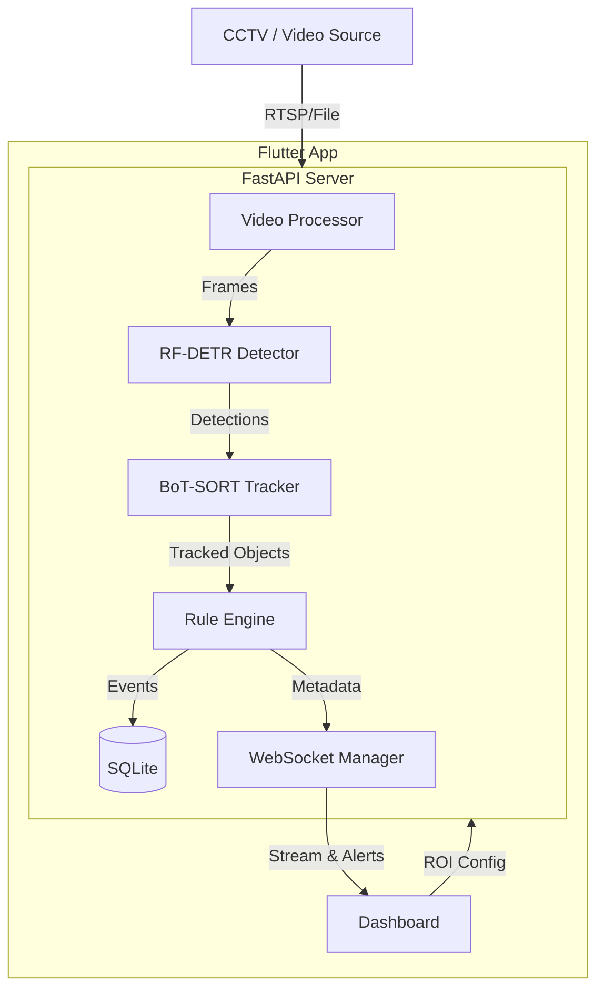

# 🛡️ CCTV AI Safety Monitoring System (화기작업 안전관제)

A real-time safety monitoring system for hazardous work zones, powered by **RF-DETR** (Object Detection) and **BoT-SORT** (Tracking). This system automatically detects workers, PPE (Personal Protective Equipment), and fire safety equipment to prevent accidents.


## 🌟 Key Features

- **Real-time Monitoring**: Low-latency video streaming via WebSocket.
- **Advanced AI Detection**: Utilizes **RF-DETR** for high-accuracy detection of small objects (helmets, masks).
- **Robust Tracking**: INTEGRATED **BoT-SORT** to track workers even during occlusion or fast movement.
- **Smart ROI (Region of Interest)**:
    - Drag & Drop zone creation.
    - **Stay Time Analysis**: Tracks how long a worker stays in a hazardous zone.
    - **Zone Types**: Warning (Yellow) vs Danger (Red).
- **Safety Rules Engine**:
    - **PPE Compliance**: Detects missing helmets, masks, or vests.
    - **Fire Safety**: Alerts if fire extinguishers are missing in key areas.
    - **Intrusion Detection**: Alerts when unauthorized personnel enter danger zones.
- **Korean Localization**: Full UI and event logs localized for Korean industrial environments.

## 🏗️ System Architecture



## 🚀 Getting Started

### Prerequisites

- Python 3.10+
- Flutter SDK
- CUDA 11.8+ (Recommended for real-time inference)

### 1. Backend Setup

```bash
cd backend
# Create Conda environment
conda create -n cctv_yolo python=3.10
conda activate cctv_yolo

# Install dependencies (including RF-DETR requirements)
pip install -r requirements.txt
```

### 2. Model Weights

Place your trained model weights in `backend/models/`:
- `best.pt` (or your checkpoint)

### 3. Run Backend

```bash
cd backend
# Runs on port 8001
uvicorn app.main:app --reload --host 0.0.0.0 --port 8001
```

### 4. Run Frontend

```bash
cd frontend
flutter pub get
flutter run -d windows
```

## 📚 API Documentation

Once the backend is running, access the interactive API docs:
- **Swagger UI**: `http://localhost:8001/docs`
- **ReDoc**: `http://localhost:8001/redoc`

### WebSocket Endpoints
- Stream: `ws://localhost:8001/ws/stream/{camera_id}`
- Events: `ws://localhost:8001/ws/events`

## 🛠️ Technology Stack

| Component | Tech |
|-----------|------|
| **Backend** | Python, FastAPI, SQLAlchemy, SQLite |
| **AI Core** | RF-DETR (Detection), BoT-SORT (Tracking), PyTorch |
| **Frontend** | Flutter (Windows), Riverpod, WebSocket |
| **Video** | OpenCV, FFMPEG |

## 📝 License

Proprietary / Internal Use Only.
