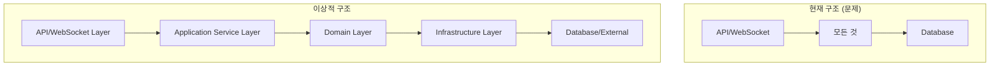
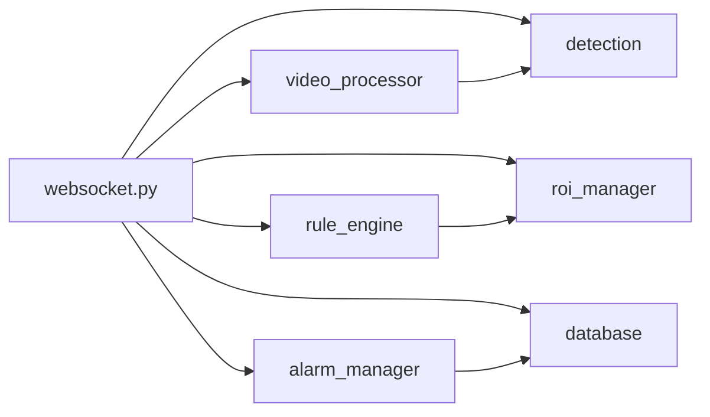
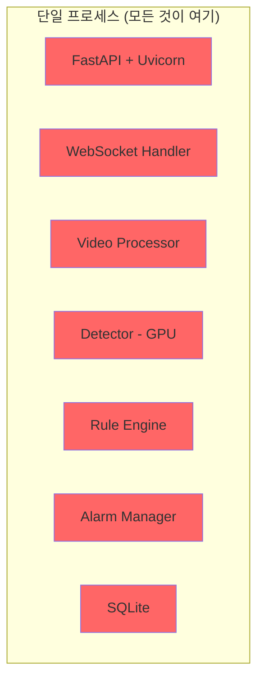
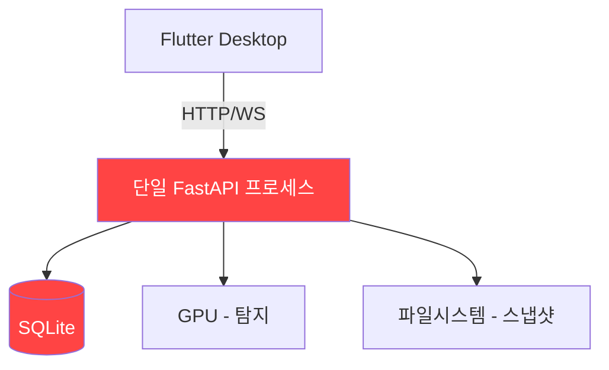
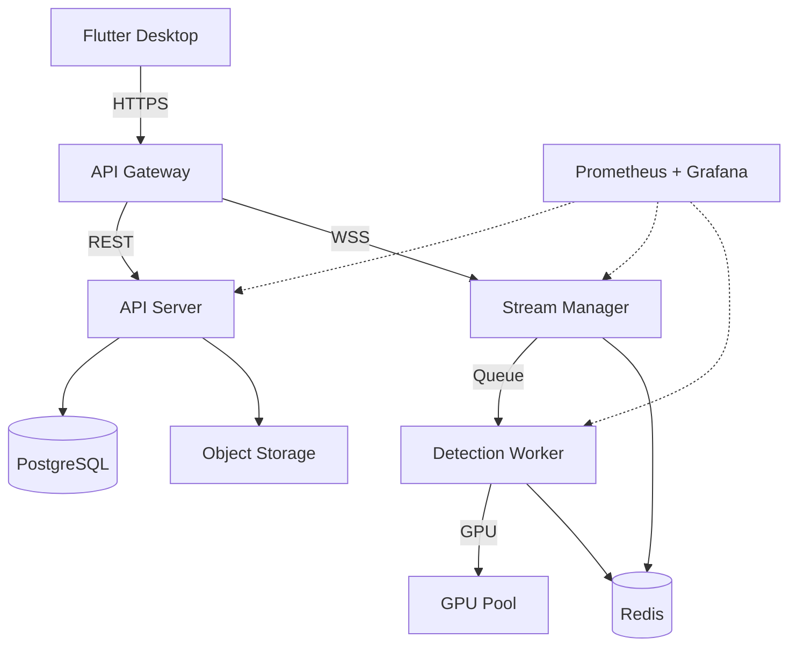

# G. 아키텍처 비평 (Architecture Critique)

> 작성 기준: 30년 경력 시니어 아키텍트 관점의 가혹한 평가
> 대상 시스템: CCTV SAFE-YOLO Industrial Monitoring System
> 평가일: 2026-02-11

---

## 종합 아키텍처 점수: 2.0 / 10.0

| 카테고리 | 점수 | 등급 |
|---------|------|------|
| 계층화 (Layering) | 3/10 | ❌ 불합격 |
| 결합도 (Coupling) | 2/10 | ❌ 심각 |
| 확장성 (Extensibility) | 3/10 | ❌ 불합격 |
| 테스트 용이성 (Testability) | 1/10 | ❌ 치명적 |
| 장애 격리 (Fault Isolation) | 1/10 | ❌ 치명적 |
| 관측 가능성 (Observability) | 2/10 | ❌ 심각 |

**총평: 이 시스템은 프로토타입 수준의 코드가 프로덕션으로 배포된 전형적인 사례다. 안전 모니터링이라는 미션 크리티컬한 도메인에서 이 수준의 아키텍처는 심각한 리스크를 내포한다.**

---

## 1. 계층화 (Layering) — 3/10

### 현황 분석

이 시스템에는 명확한 계층 분리가 존재하지 않는다. 전형적인 "모든 것이 모든 것을 안다" 구조다.

#### 1.1 백엔드 계층 위반

```
[문제점: websocket.py가 모든 비즈니스 로직을 직접 수행]

websocket.py (API 계층)
  ├── VideoProcessor 직접 생성/관리 (인프라 계층)
  ├── ROIManager 직접 생성 (도메인 계층)
  ├── RuleEngine 직접 생성/호출 (비즈니스 로직 계층)
  ├── AlarmManager 직접 호출 (이벤트 계층)
  ├── Database 직접 접근 (데이터 계층)
  └── Event 직접 생성/저장 (도메인 계층)
```

`websocket.py`의 `websocket_stream()` 함수는 약 150줄의 단일 함수로, 다음을 모두 수행한다:
- WebSocket 연결 관리
- 비디오 프로세서 생명주기 관리
- 탐지 실행
- 규칙 엔진 평가
- 이벤트 생성 및 저장
- 알람 브로드캐스트
- 프레임 인코딩 및 전송

**이것은 계층화의 부재가 아니라, 계층의 개념 자체가 설계에 없었음을 의미한다.**

#### 1.2 video_processor.py의 책임 과부하

```
VideoProcessor (단일 클래스에 6개 이상의 책임)
  ├── 비디오 캡처 (cv2.VideoCapture 관리)
  ├── 프레임 읽기/시킹 (I/O 계층)
  ├── 탐지 결과 그리기 (프레젠테이션 계층)
  ├── ROI 그리기 (프레젠테이션 계층)
  ├── 한국어 텍스트 렌더링 (유틸리티)
  ├── JPEG 인코딩 (인코딩 계층)
  ├── base64 변환 (전송 계층)
  └── 스냅샷 생성 (스토리지 계층)
```

Single Responsibility Principle 완전 위반이다. 이 클래스를 수정할 이유가 6개 이상이다.

#### 1.3 프론트엔드 계층 위반

```
StreamNotifier (Provider 계층에서 비즈니스 로직 수행)
  ├── WebSocket 스트림 관리 (인프라)
  ├── 프레임 처리 (데이터)
  ├── 이벤트 파싱 (비즈니스)
  ├── SafetyEvent 생성 (도메인)
  └── 알람 트리거 (UI 로직)
```

Provider가 Repository나 UseCase 계층 없이 직접 서비스를 호출하고 비즈니스 로직을 수행한다.

### 이상적 계층 구조와의 비교



---

## 2. 결합도 (Coupling) — 2/10

### 현황 분석

**전역 싱글턴이 모든 모듈을 강결합시킨다.** 이것은 객체지향 설계의 가장 기본적인 원칙을 위반한다.

#### 2.1 전역 싱글턴 결합

```python
# detection.py - 전역 변수로 관리되는 싱글턴
_detector_instance: Optional[BaseDetector] = None

def get_detector() -> BaseDetector:
    global _detector_instance
    if _detector_instance is not None:
        return _detector_instance
    ...
```

```python
# roi_manager.py - 동일한 패턴
_roi_manager_instance: Optional[ROIManager] = None

def get_roi_manager() -> ROIManager:
    global _roi_manager_instance
    ...
```

```python
# alarm_manager.py - 동일한 패턴
_alarm_manager_instance: Optional[AlarmManager] = None

def get_alarm_manager() -> AlarmManager:
    global _alarm_manager_instance
    ...
```

이 세 개의 전역 싱글턴은:
- 테스트에서 모킹이 불가능하다
- 생명주기 관리가 불가능하다
- 의존성 방향을 제어할 수 없다
- 동시성 문제의 근본 원인이다

#### 2.2 순환 의존성 위험



websocket.py가 모든 모듈에 의존하는 "God Module" 패턴이다. 모든 변경이 이 파일에 영향을 준다.

#### 2.3 프론트엔드 결합도

```dart
// stream_provider.dart - 구체적 서비스에 직접 의존
class StreamNotifier extends StateNotifier<StreamState> {
  final WebSocketService _ws;  // 추상화 없이 구체 클래스에 의존
  ...
}
```

```dart
// api_service.dart - 하드코딩된 URL
class ApiService {
  final Dio _dio = Dio(BaseOptions(
    baseUrl: 'http://localhost:8001',  // 하드코딩
  ));
}
```

인터페이스 추상화가 전혀 없다. 모든 Provider가 구체 서비스 클래스에 직접 의존한다.

#### 2.4 결합도 메트릭

| 모듈 | Fan-In | Fan-Out | 불안정도 |
|------|--------|---------|---------|
| websocket.py | 1 | 7 | 0.88 (매우 불안정) |
| video_processor.py | 2 | 3 | 0.60 |
| detection.py | 2 | 2 | 0.50 |
| rule_engine.py | 1 | 2 | 0.67 |
| alarm_manager.py | 2 | 2 | 0.50 |

websocket.py의 불안정도 0.88은 모든 변경의 영향을 받는다는 의미다.

---

## 3. 확장성 (Extensibility) — 3/10

### 긍정적 측면 (유일하게)

- `BaseDetector` ABC 패턴으로 탐지기 확장 가능
- `get_detector()` 팩토리 패턴 사용

### 근본적 문제점

#### 3.1 팩토리 함수의 if/else 분기

```python
def get_detector() -> BaseDetector:
    if settings.DETECTOR_TYPE == "rfdetr":
        _detector_instance = RFDETRDetector()
    else:
        _detector_instance = YOLODetector()
```

새 탐지기를 추가하려면 이 if/else를 수정해야 한다. Open-Closed Principle 위반이다. Registry 패턴이나 플러그인 시스템이 필요하다.

#### 3.2 규칙 엔진의 하드코딩된 규칙

```python
class RuleEngine:
    def evaluate(self, ...):
        # 모든 규칙이 하나의 메서드에 하드코딩
        # ROI 침입 규칙
        # PPE 헬멧 규칙
        # PPE 마스크 규칙
        # 소화기 규칙
        # 입/퇴장 규칙
```

새 안전 규칙을 추가하려면 `evaluate()` 메서드를 직접 수정해야 한다. Strategy 패턴이나 Rule DSL이 필요하다.

#### 3.3 카테고리 매핑의 중복

`_map_category()` 메서드가 YOLODetector와 RFDETRDetector에 각각 다른 구현으로 존재한다. 공통 로직이 상위 클래스에 추출되지 않았다.

#### 3.4 이벤트 타입 확장 불가

```python
class EventTypes:
    ROI_INTRUSION = "roi_intrusion"
    PPE_HELMET_MISSING = "ppe_helmet_missing"
    # ... 하드코딩된 이벤트 타입들
```

새 이벤트 타입을 추가하면 RuleEngine, 프론트엔드 필터, 이벤트 히스토리 화면 등 여러 곳을 동시에 수정해야 한다.

---

## 4. 테스트 용이성 (Testability) — 1/10

### 현황: 사실상 테스트 불가능한 시스템

#### 4.1 테스트 커버리지: ~0.5%

전체 프로젝트에 **단 1개의 테스트 파일**, **단 1개의 테스트 함수**만 존재한다.

```python
# test_rule_engine_tracking.py - 유일한 테스트
def test_stay_time_calculation():
    ...
```

이것은 안전 모니터링 시스템에서 용납될 수 없는 수준이다.

#### 4.2 전역 싱글턴으로 인한 단위 테스트 불가

```python
# 테스트에서 detector를 모킹하려면?
# 현재 구조에서는 불가능하다:
from app.core.detection import get_detector  # 전역 상태에 의존
detector = get_detector()  # 실제 모델을 로드한다
```

의존성 주입이 없으므로 테스트 더블(mock, stub)을 주입할 수 없다.

#### 4.3 데이터베이스 테스트 인프라 부재

- 테스트용 DB 팩토리 없음
- 테스트 픽스처 없음
- 테스트 후 정리(cleanup) 메커니즘 없음

#### 4.4 WebSocket 핸들러 테스트 불가

`websocket_stream()`이 모든 로직을 포함하므로, 개별 비즈니스 로직을 격리해서 테스트할 수 없다.

#### 4.5 프론트엔드 테스트 완전 부재

- Widget 테스트 0개
- Provider 테스트 0개
- Integration 테스트 0개
- Golden 테스트 0개

---

## 5. 장애 격리 (Fault Isolation) — 1/10

### 현황: 단일 장애점이 전체 시스템을 중단시킨다

#### 5.1 단일 프로세스 아키텍처



**모든 컴포넌트가 단일 프로세스에서 실행된다.** 탐지기가 CUDA OOM으로 크래시하면 전체 API 서버가 죽는다.

#### 5.2 서킷 브레이커 부재

어떤 컴포넌트에도 서킷 브레이커가 없다:
- 탐지기 실패 → 계속 시도 (무한 반복)
- DB 쓰기 실패 → 에러 삼킴 (데이터 유실)
- RTSP 연결 실패 → 사용자가 수동 재연결해야 함
- WebSocket 끊김 → 자동 재연결 없음

#### 5.3 그레이스풀 디그레이데이션 없음

탐지기가 실패하면 "탐지 없이 스트리밍만 계속"하는 폴백이 없다. 전부 아니면 전무(all-or-nothing)다.

#### 5.4 헬스체크 없음

```python
# 없음: /health, /ready, /live 엔드포인트
# 없음: 컴포넌트별 상태 확인
# 없음: 자동 복구 메커니즘
```

#### 5.5 벌크헤드 패턴 부재

카메라 1의 처리가 느려지면 카메라 2도 영향을 받는다. 리소스 격리가 전혀 없다.

---

## 6. 관측 가능성 (Observability) — 2/10

### 현황: 장님이 운전하는 것과 같다

#### 6.1 로깅

```python
logger = logging.getLogger(__name__)
# 기본 Python 로깅만 사용
# 구조화된 로깅(JSON) 없음
# 로그 레벨 동적 변경 불가
# 요청별 상관관계 ID 없음
```

로그 파일이 리포지토리에 커밋되어 있다 (`server.log`, `seek_debug.log`). 로그 로테이션이 없다.

#### 6.2 메트릭

- Prometheus/StatsD 메트릭 수집: **없음**
- 프레임 처리 시간 측정: **없음**
- 탐지 지연 시간 측정: **없음**
- WebSocket 연결 수 모니터링: **없음**
- GPU 사용률 모니터링: **없음**
- 메모리 사용량 모니터링: **없음**

#### 6.3 분산 추적

- OpenTelemetry: **없음**
- 요청 추적: **없음**
- 프레임 파이프라인 추적: **없음**

#### 6.4 프론트엔드 관측

- 에러 리포팅 서비스: **없음**
- 성능 모니터링: **없음**
- 사용자 행동 분석: **없음**
- 크래시 리포팅: **없음**

---

## 아키텍처 안티패턴 목록

| # | 안티패턴 | 위치 | 심각도 |
|---|---------|------|--------|
| 1 | God Object | websocket.py의 websocket_stream() | CRITICAL |
| 2 | Global State | detection.py, roi_manager.py, alarm_manager.py의 전역 싱글턴 | CRITICAL |
| 3 | Spaghetti Code | websocket.py의 중첩 try/except/async 구조 | HIGH |
| 4 | Big Ball of Mud | 전체 백엔드 아키텍처 | CRITICAL |
| 5 | Feature Envy | stream_provider.dart가 이벤트 처리까지 수행 | HIGH |
| 6 | Primitive Obsession | 설정값이 원시 타입으로 산재 | MEDIUM |
| 7 | Shotgun Surgery | 이벤트 타입 추가 시 5+개 파일 수정 필요 | HIGH |
| 8 | Inappropriate Intimacy | VideoProcessor가 탐지, 인코딩, 렌더링 모두 수행 | HIGH |
| 9 | Dead Code | safety_regulation_panel.dart - API 대신 하드코딩 | MEDIUM |
| 10 | Magic Numbers | rule_engine.py의 100px 헬멧 거리, 40% 상체 비율 | MEDIUM |
| 11 | Copy-Paste Programming | _map_category()가 두 탐지기에 중복 구현 | MEDIUM |
| 12 | Singleton Abuse | 3개 전역 싱글턴의 테스트/확장 차단 | CRITICAL |

---

## 이상적 아키텍처와의 비교

### 현재 아키텍처



### 목표 아키텍처 (최소 수준)



---

## 개선 권고사항 요약

### 즉시 실행 (1주 이내)
1. 전역 싱글턴을 FastAPI 의존성 주입으로 교체
2. websocket.py의 비즈니스 로직을 서비스 계층으로 분리
3. 기본 테스트 인프라 구축 (pytest, fixtures)

### 단기 (1개월 이내)
4. VideoProcessor를 캡처/인코딩/렌더링으로 분리
5. RuleEngine에 Strategy 패턴 적용
6. 구조화된 로깅 도입
7. 헬스체크 엔드포인트 추가

### 중기 (3개월 이내)
8. 탐지 프로세스 분리 (multiprocessing 또는 별도 서비스)
9. PostgreSQL 마이그레이션
10. 모니터링/메트릭 인프라 구축
11. CI/CD 파이프라인 구축

### 장기 (6개월 이내)
12. 마이크로서비스 아키텍처 전환
13. 메시지 큐 도입
14. GPU 리소스 오케스트레이션
15. 자동 스케일링

---

## 최종 평가

**이 시스템은 "동작하는 프로토타입"이지, "프로덕션 시스템"이 아니다.**

안전 모니터링이라는 도메인에서 이 수준의 아키텍처 품질은 다음을 의미한다:
- 탐지 실패를 인지할 수 없다 (관측 가능성 부재)
- 장애가 전체 시스템을 중단시킨다 (격리 부재)
- 변경이 예측 불가능한 부작용을 유발한다 (결합도 과다)
- 버그 수정과 기능 추가가 기하급수적으로 어려워진다 (테스트 부재)

**프로덕션 배포 전 최소 3개월의 아키텍처 리팩토링이 필요하다.**
