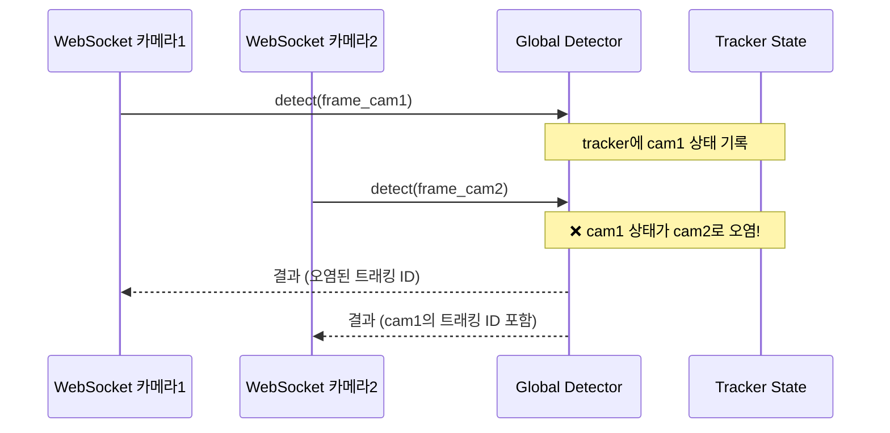

# J. 동시성 및 스레딩 분석 (Concurrency & Threading Analysis)

> 작성 기준: 30년 경력 시니어 아키텍트
> 대상 시스템: CCTV SAFE-YOLO Industrial Monitoring System
> 작성일: 2026-02-11

---

## 종합 평가: 1.5/10 — 동시성 설계가 사실상 존재하지 않는다

이 시스템은 asyncio 기반 FastAPI를 사용하면서, 핵심 연산의 대부분이 동기(sync) 블로킹 호출이다. 이는 async의 이점을 완전히 무효화하며, 오히려 동시성 관련 버그를 유발하는 최악의 조합이다.

---

## 1. Async vs Sync 분석

### 1.1 현재 호출 분류

| 호출 | 유형 | 블로킹 시간 | 이벤트 루프 영향 |
|------|------|-----------|----------------|
| `cv2.VideoCapture.read()` | **SYNC** | 5~30ms | 블로킹 |
| `detector.detect()` / `model.track()` | **SYNC (CPU/GPU)** | 30~100ms | **심각한 블로킹** |
| `cv2.imencode()` | **SYNC** | 2~5ms | 블로킹 |
| `base64.b64encode()` | **SYNC** | 1~2ms | 경미한 블로킹 |
| `rule_engine.evaluate()` | **SYNC** | 1~5ms | 경미한 블로킹 |
| `roi_manager.check_detection()` | **SYNC** | < 1ms | 무시 가능 |
| `alarm_manager.process_event()` | **ASYNC** | < 1ms | 정상 |
| `db session 쿼리` | **ASYNC** (aiosqlite) | 1~10ms | 정상 |
| `websocket.send_json()` | **ASYNC** | 1~5ms | 정상 |
| `PIL Image.open() / draw()` | **SYNC** | 5~10ms | 블로킹 |

### 1.2 핵심 문제: stream_frames()의 블로킹 체인

```python
# video_processor.py의 stream_frames() - 의사 코드
async def stream_frames(self):
    while True:
        frame = self.read_frame()          # ❌ SYNC: 5~30ms 블로킹
        if frame is None:
            continue

        detection = detector.detect(frame)  # ❌ SYNC: 30~100ms 블로킹!!!
        # 이 시점에서 이벤트 루프가 30~100ms 동안 완전히 정지

        encoded = self.encode_frame(frame)  # ❌ SYNC: 2~5ms 블로킹
        b64 = base64.b64encode(encoded)     # ❌ SYNC: 1~2ms 블로킹

        yield frame_data                    # ✅ ASYNC yield

        await asyncio.sleep(delay)          # ✅ ASYNC 양보
```

**프레임당 총 블로킹 시간: 38~137ms**

15fps 목표에서 프레임 예산은 66.7ms다. 탐지만으로 예산을 초과할 수 있다.

### 1.3 이벤트 루프 타임라인 (시각화)

```
시간 →
이벤트 루프: ═══╗          ╔═══╗               ╔════
              ║ 블로킹     ║   ║  블로킹         ║
              ║ detect()  ║   ║  detect()       ║
              ║ 80ms      ║   ║  80ms          ║
              ╚═══════════╝   ╚═════════════════╝

WS 연결 2:  ─── 대기 ────── 처리 ── 대기 ──────── 처리 ──
                 80ms 지연!          80ms 지연!

WS 명령:    ────── 처리 불가 ──────── 처리 불가 ──────
```

카메라 1의 탐지가 80ms 걸리면, 그 동안 카메라 2의 프레임 전송, WebSocket 명령 수신, API 요청 처리 모두 중단된다.

---

## 2. 이벤트 루프 차단 상세 분석

### 2.1 websocket.py의 이중 루프 구조

```python
async def websocket_stream(websocket, camera_id):
    # 외부 루프: 명령 대기
    while True:
        data = await websocket.receive_json()  # ✅ ASYNC

        if action == 'start':
            # 내부 루프: 프레임 스트리밍
            async for frame_data in processor.stream_frames():
                # 프레임 전송
                await websocket.send_json(frame_data)  # ✅ ASYNC

                # 명령 폴링 (문제!)
                try:
                    cmd = await asyncio.wait_for(
                        websocket.receive_json(),
                        timeout=0.01  # 10ms 타임아웃
                    )
                except asyncio.TimeoutError:
                    continue  # 명령 없으면 계속
```

**문제점:**
1. `stream_frames()` 내부의 sync 호출이 `wait_for`의 10ms 타임아웃을 무의미하게 만든다
2. 탐지 80ms 동안 명령을 수신할 수 없다 (stop, seek 명령 무시)
3. 사용자가 stop 버튼을 눌러도 현재 프레임 처리가 끝날 때까지 반응 없음

### 2.2 `asyncio.to_thread()` 미사용

Python 3.9+ 에서 사용 가능한 `asyncio.to_thread()`를 전혀 사용하지 않는다. 최소한 이것만 적용해도 상황이 개선된다:

```python
# 현재 (잘못된 방식)
frame = self.read_frame()  # 블로킹!

# 개선 (최소 수정)
frame = await asyncio.to_thread(self.read_frame)  # 스레드 풀에서 실행
```

하지만 `to_thread()`도 완전한 해결책은 아니다:
- GIL로 인해 CPU-bound 작업은 여전히 단일 코어로 제한
- 스레드 풀 크기 제한 (기본 min(32, os.cpu_count() + 4))
- 공유 상태(detector, tracker)에 대한 스레드 안전성 보장 필요

---

## 3. GIL 영향 분석

### 3.1 GIL과 이 시스템의 관계

```
Python GIL (Global Interpreter Lock)
├── GIL 해제하는 호출 (진정한 병렬 가능)
│   ├── NumPy 연산 (C 확장)
│   ├── OpenCV 연산 (C++ 확장)
│   ├── CUDA 커널 실행 (GPU 전송 후)
│   └── I/O 대기 (파일, 네트워크)
│
└── GIL 유지하는 호출 (병렬 불가)
    ├── Python 순수 코드 (for 루프, 딕셔너리 조작)
    ├── JSON 직렬화/역직렬화
    ├── Pydantic 모델 생성/검증
    ├── Shapely 일부 연산
    └── 탐지 전/후처리 (Python 레벨)
```

### 3.2 탐지 파이프라인의 GIL 분석

```
detector.detect(frame) 실행 흐름:

1. [GIL 유지] Python 함수 호출 오버헤드 (~0.1ms)
2. [GIL 유지] NumPy 전처리 (리사이즈, 정규화) (~2ms)
   - 실제로 NumPy C 코드는 GIL 해제하지만,
   - Python 래퍼 호출과 메모리 할당은 GIL 유지
3. [GIL 해제] CUDA 추론 (~20~50ms)
   - GPU에서 실행되므로 이론적으로 GIL 해제
   - 하지만 ultralytics/rfdetr가 이를 올바르게 구현하는지 미확인
4. [GIL 유지] 결과 후처리 (~5~10ms)
   - 바운딩 박스 파싱 (Python 루프)
   - DetectionBox 생성 (Pydantic)
   - 트래커 업데이트 (Python + NumPy 혼합)
5. [GIL 유지] DetectionResult 생성 (~1ms)

GIL 유지 시간: ~8~13ms / 총 ~28~63ms = ~30~50%
```

### 3.3 다중 카메라 시 GIL 경합

카메라 2대를 `to_thread()`로 병렬 처리한다고 가정:
- 스레드 1: 카메라 1 탐지 (GIL 유지 ~10ms, 해제 ~30ms)
- 스레드 2: 카메라 2 탐지 (GIL 유지 ~10ms, 해제 ~30ms)

**이론적 병렬**: GPU 추론은 병렬 가능하나, Python 전/후처리는 순차 실행.
**실제 병렬**: YOLO model.track(persist=True)의 내부 상태가 스레드 안전하지 않아 **사용 불가**.

### 3.4 GIL 우회 전략

| 전략 | 적합성 | 비고 |
|------|--------|------|
| asyncio.to_thread() | 중간 | I/O에 효과적, CPU-bound에 제한적 |
| multiprocessing | 높음 | GIL 완전 우회, IPC 오버헤드 |
| subprocess | 높음 | 완전 격리, 통신 복잡 |
| C Extension | 낮음 | 개발 비용 높음 |
| free-threading (3.13+) | 미래 | 아직 실험적 |

---

## 4. 데드락/레이스 컨디션 분석

### 4.1 CRITICAL: 전역 탐지기 공유

```python
# detection.py
_detector_instance: Optional[BaseDetector] = None  # 전역 단일 인스턴스

# websocket.py - 여러 WebSocket 연결이 동시에 접근
async def websocket_stream(websocket, camera_id):
    detector = get_detector()  # 모든 연결이 같은 인스턴스
    ...
    detection = detector.detect(frame)  # 동시 호출 가능!
```

**문제:**
- YOLO `model.track(persist=True)`: 내부 트래킹 상태 유지. 다른 카메라의 프레임이 들어오면 트래킹 상태가 오염된다.
- BoT-SORT `tracker.update()`: 내부 버퍼(칼만 필터 상태 등)를 수정. 동시 호출 시 데이터 경합.

**영향: 카메라 A의 트래킹 ID가 카메라 B에 의해 덮어쓰여질 수 있다.**

### 4.2 HIGH: AlarmManager 구독자 목록

```python
class AlarmManager:
    def __init__(self):
        self._subscribers = []  # 리스트 직접 수정

    def subscribe(self, callback):
        self._subscribers.append(callback)  # 동시 수정 가능

    async def _process_event(self, event):
        for sub in self._subscribers:  # 반복 중 수정 가능
            await sub(event)
```

asyncio는 단일 스레드이므로 `_process_event` 루프 내에서 `subscribe`가 호출되지는 않지만, `await sub(event)` 중에 다른 코루틴이 `subscribe`를 호출할 수 있다.

### 4.3 HIGH: ROI Manager 이중 인스턴스

```python
# websocket.py - 연결별 로컬 ROI Manager
roi_manager = ROIManager()
await roi_manager.load_rois(camera_id, db)

# routes/rois.py - REST API에서는 전역 ROI Manager
from app.core.roi_manager import get_roi_manager
manager = get_roi_manager()
```

**문제:** REST API로 ROI를 추가/수정해도 실행 중인 WebSocket 스트림의 ROI Manager에 반영되지 않는다. `reload_rois` 명령을 명시적으로 보내야만 업데이트된다.

### 4.4 MEDIUM: RuleEngine 상태 누적

```python
class RuleEngine:
    def __init__(self):
        self._detection_states = {}  # 이벤트별 상태
        self._person_states = {}     # 사람별 상태 (track_id → PersonState)
```

`_person_states`는 한번 추가된 track_id가 영원히 삭제되지 않는다. 24시간 스트리밍에서 수천 개의 PersonState가 누적될 수 있다.

### 4.5 MEDIUM: VideoProcessor 리소스 경합

같은 카메라에 대해 두 개의 WebSocket 연결이 생기면:
```
연결 1: VideoProcessor(camera_id=1) → cv2.VideoCapture("rtsp://...")
연결 2: VideoProcessor(camera_id=1) → cv2.VideoCapture("rtsp://...")
```

같은 RTSP 스트림에 두 번 접속하여 대역폭 2배 사용, 카메라 부하 2배.

### 4.6 레이스 컨디션 시퀀스 다이어그램



---

## 5. 동시성 패턴 위반

### 5.1 Actor 모델 부재

탐지기, ROI Manager, 알람 매니저 등 상태를 가진 컴포넌트는 Actor로 구현해야 한다:

```python
# 현재 (전역 공유 상태)
detector = get_detector()
result = detector.detect(frame)  # 누구나 직접 호출

# 권장 (Actor 패턴)
class DetectorActor:
    def __init__(self):
        self._queue = asyncio.Queue()

    async def run(self):
        while True:
            frame, future = await self._queue.get()
            result = await asyncio.to_thread(self._detect, frame)
            future.set_result(result)

    async def request_detection(self, frame):
        future = asyncio.Future()
        await self._queue.put((frame, future))
        return await future
```

### 5.2 백프레셔 메커니즘 부재

프레임 생산 속도 > 소비 속도일 때 제어 메커니즘이 없다:
- VideoProcessor가 15fps로 프레임 생산
- 탐지가 10fps밖에 처리 못하면 → 프레임 누적 또는 드롭
- 현재: asyncio.sleep()으로 조절하지만, 탐지 시간 변동 미고려

### 5.3 구독/발행 동기화 부재

AlarmManager의 이벤트 발행과 WebSocket 구독자의 소비 사이에 동기화가 없다:
- 구독자가 느리면 다른 구독자도 차단될 수 있다
- 구독자 에러가 발행자에게 전파된다

---

## 6. 개선 방안

### 6.1 즉시 적용 (1주)

```python
# 1. asyncio.to_thread()로 블로킹 호출 래핑
async def stream_frames(self):
    while True:
        frame = await asyncio.to_thread(self.read_frame)
        detection = await asyncio.to_thread(detector.detect, frame)
        encoded = await asyncio.to_thread(self.encode_frame, frame)
        yield frame_data
```

### 6.2 단기 개선 (1개월)

```python
# 2. 카메라별 탐지기 인스턴스 (트래킹 상태 격리)
class DetectorPool:
    def __init__(self):
        self._detectors = {}

    def get_for_camera(self, camera_id) -> BaseDetector:
        if camera_id not in self._detectors:
            self._detectors[camera_id] = create_detector()
        return self._detectors[camera_id]
```

### 6.3 중기 개선 (3개월)

```python
# 3. 프로세스 격리 (multiprocessing)
import multiprocessing as mp

class DetectionProcess:
    def __init__(self):
        self.input_queue = mp.Queue()
        self.output_queue = mp.Queue()
        self.process = mp.Process(target=self._run)

    def _run(self):
        detector = create_detector()
        while True:
            camera_id, frame = self.input_queue.get()
            result = detector.detect(frame)
            self.output_queue.put((camera_id, result))
```

### 6.4 장기 개선 (6개월)

- 마이크로서비스 기반 완전 분리
- gRPC / Redis Streams 기반 프레임 파이프라인
- GPU 워커 풀 + 배치 추론
- 서킷 브레이커 + 백프레셔

---

## 최종 평가

**이 시스템의 동시성 설계는 "우연히 동작하는" 수준이다.**

현재 단일 카메라/단일 사용자 환경에서만 문제가 드러나지 않을 뿐, 카메라 2대 이상 동시 스트리밍 시 트래킹 상태 오염, 이벤트 루프 블로킹으로 인한 프레임 드롭, 명령 지연 등이 즉시 발생할 것이다.

**async를 사용하면서 sync 블로킹 호출을 그대로 두는 것은, async를 사용하지 않는 것보다 더 나쁘다.** 적어도 동기 서버에서는 스레드 풀이 자동으로 동시성을 제공하기 때문이다.
