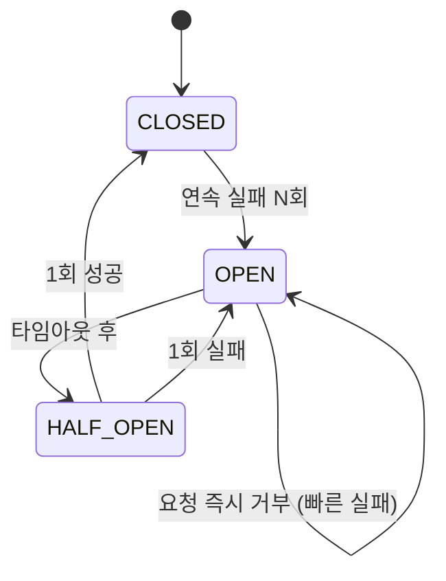
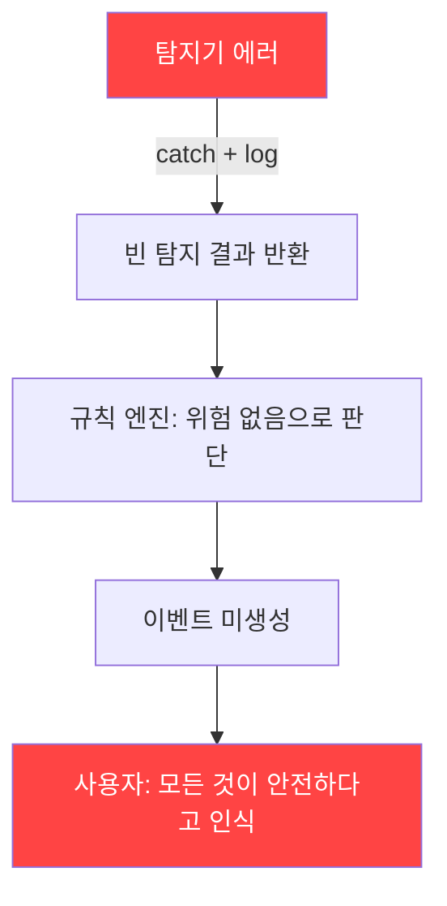
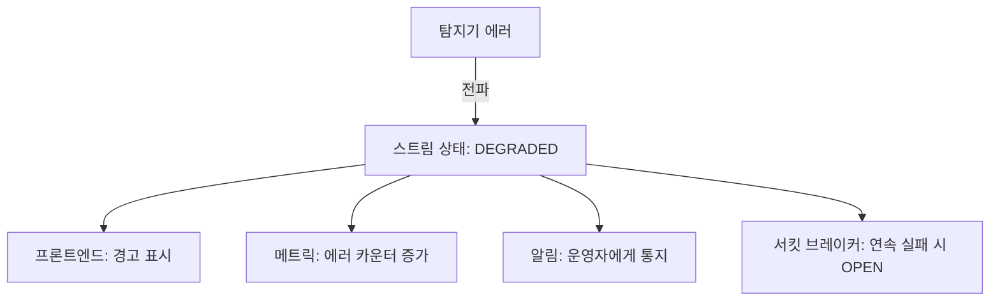

# L. 에러 처리 및 안정성 분석 (Error Handling & Stability)

> 작성 기준: 30년 경력 시니어 아키텍트 — 안전 크리티컬 시스템 관점
> 대상 시스템: CCTV SAFE-YOLO Industrial Monitoring System
> 작성일: 2026-02-11

---

## 종합 안정성 등급: 2/10

**이 시스템은 "안전 모니터링"을 하면서 자체적으로 안전하지 않다.** 에러가 발생하면 침묵하고, 장애가 발생하면 전체가 멈추고, 복구 메커니즘이 존재하지 않는다.

---

## 1. 예외 처리 갭 분석

### 1.1 "삼킴 패턴" (Exception Swallowing) — 시스템 전반

| 위치 | 코드 패턴 | 심각도 |
|------|----------|--------|
| video_processor.py stream_frames() | `except Exception: pass` | CRITICAL |
| detection.py YOLODetector.detect() | `except Exception as e: logger.error(...)` (결과 반환 없이 빈 리스트) | HIGH |
| detection.py RFDETRDetector.detect() | `except Exception as e: logger.error(...)` (빈 결과 반환) | HIGH |
| websocket.py 프레임 루프 | `except Exception: continue` | CRITICAL |
| rule_engine.py 이벤트 파싱 | `except: pass` (bare except!) | HIGH |
| alarm_manager.py 스냅샷 저장 | `except Exception: pass` | MEDIUM |
| websocket_service.dart 메시지 파싱 | `catch (e) { }` (빈 catch) | HIGH |
| video_player_widget.dart base64 디코딩 | `catch (e) { }` (빈 catch) | HIGH |
| stream_provider.dart 이벤트 파싱 | `catch (e) { }` (빈 catch) | MEDIUM |

**총 9개 이상의 에러 삼킴 지점이 존재한다.**

이것의 의미: **안전 이벤트가 발생했는데 탐지기가 예외를 던지면, 아무런 경고 없이 해당 프레임의 탐지가 무시된다.** 작업자가 위험 구역에 있는데 시스템이 "모든 것이 정상"이라고 표시할 수 있다.

### 1.2 구체적 문제 코드

**backend/app/core/video_processor.py:**
```python
async def stream_frames(self):
    while True:
        try:
            frame = self.read_frame()
            # ... 처리 ...
        except Exception:
            continue  # ❌ 모든 에러를 무시하고 다음 프레임으로
```

**backend/app/core/detection.py:**
```python
def detect(self, frame, ...):
    try:
        results = self.model.track(frame, ...)
    except Exception as e:
        logger.error(f"YOLO Detection error: {e}")
    # ❌ 예외 발생 시 빈 detections로 계속 진행
    return DetectionResult(frame_number=frame_number, ...)
```

**frontend/lib/widgets/video_player_widget.dart:**
```dart
if (streamState.currentFrame != null) {
  try {
    _currentFrameBytes = base64Decode(streamState.currentFrame!.frameBase64);
  } catch (e) {
    // ❌ 잘못된 프레임 데이터를 완전히 무시
  }
}
```

---

## 2. 크래시 포인트 분석

### 2.1 복구 불가능한 크래시

| 크래시 원인 | 영향 범위 | 현재 핸들링 | 필요한 핸들링 |
|------------|----------|-----------|-------------|
| CUDA OOM (GPU 메모리 부족) | **전체 프로세스 종료** | 없음 | try/except → GPU 캐시 정리 → 재시도 |
| 모델 파일 손상/부재 | 탐지 불가 | YOLO: fallback to yolov8n.pt, RF-DETR: False 반환 | 명시적 에러 상태 + 알림 |
| SQLite DB 락 | 이벤트 저장 실패 | aiosqlite 내부 처리 | 재시도 + 백오프 |
| RTSP 스트림 끊김 | 해당 카메라 스트림 중단 | onDone → isConnected=false | 자동 재연결 + 지수 백오프 |
| WebSocket 비정상 종료 | 클라이언트 연결 끊김 | WebSocketDisconnect 처리 | 리소스 정리 보장 |
| 디스크 풀 (스냅샷) | 스냅샷 저장 실패 | except pass | 디스크 모니터링 + 경고 |
| uvicorn 워커 크래시 | **전체 서비스 중단** | 없음 | 프로세스 매니저 (systemd/supervisor) |

### 2.2 무한 루프 위험

```python
# video_processor.py - 파일 소스 루프백
def read_frame(self):
    ret, frame = self._cap.read()
    if not ret:
        if self._source_type == 'file':
            self._cap.set(cv2.CAP_PROP_POS_FRAMES, 0)  # 처음으로
            ret, frame = self._cap.read()
```

파일이 손상되어 모든 프레임 읽기가 실패하면, `read_frame()`이 무한 루프에 빠질 수 있다 (반복적으로 처음으로 돌아가면서 계속 실패).

### 2.3 메모리 소진 크래시

`_person_states`와 `_detection_states`의 무한 누적, 스냅샷 파일의 무한 누적이 결합되면 시간이 지남에 따라 메모리와 디스크가 소진되어 크래시한다.

---

## 3. 재시도 전략 분석

### 현재 상태: 재시도 전략 완전 부재

| 작업 | 재시도 | 필요한 전략 |
|------|--------|-----------|
| DB 쓰기 (이벤트 저장) | ❌ 없음 | 3회 재시도, 지수 백오프 (100ms, 500ms, 2s) |
| WebSocket 연결 | ❌ 수동 재연결만 | 자동 재연결, 지수 백오프 (1s → 2s → 4s → max 30s) |
| 모델 추론 | ❌ 없음 | 1회 재시도 (GPU 캐시 정리 후), 실패 시 스킵 |
| RTSP 연결 | ❌ 없음 | 자동 재연결, 5회까지 시도, 실패 시 알림 |
| 비디오 프레임 읽기 | △ 부분적 (파일 루프백) | 최대 3회 연속 실패 시 중단 |
| 스냅샷 저장 | ❌ 없음 | 1회 재시도, 실패 시 메모리 버퍼링 |

### 권장 재시도 패턴

```python
# tenacity 라이브러리 활용
from tenacity import retry, stop_after_attempt, wait_exponential

@retry(
    stop=stop_after_attempt(3),
    wait=wait_exponential(multiplier=0.1, max=2),
    reraise=True
)
async def save_event(db, event):
    async with db.begin():
        db.add(event)
```

---

## 4. 서킷 브레이커 분석

### 현재 상태: 서킷 브레이커 완전 부재

| 컴포넌트 | 현재 | 필요한 서킷 브레이커 |
|---------|------|-------------------|
| 탐지기 | 실패해도 계속 시도 | 5회 연속 실패 → 30초 OPEN → HALF-OPEN 1회 시도 |
| DB 쓰기 | 실패해도 계속 시도 | 10회 연속 실패 → 60초 OPEN |
| RTSP 연결 | 실패 시 수동 재연결 | 3회 연속 실패 → 120초 OPEN + 알림 |
| WebSocket 전송 | 실패 시 연결 종료 | 이미 적절 (단, 재연결 필요) |
| 스냅샷 저장 | 실패 무시 | 5회 연속 실패 → 디스크 체크 알림 |

### 서킷 브레이커 상태 다이어그램



---

## 5. 에러 전파 경로 분석

### 5.1 현재: 에러가 사라지는 경로



**이것이 가장 위험한 패턴이다.** 안전 시스템에서 탐지 실패를 "안전"으로 해석한다.

### 5.2 권장: 에러가 가시화되는 경로



---

## 6. 안정성 개선 권고

### 6.1 즉시 (1주)

1. **모든 빈 catch/except 블록에 로깅 추가**
```python
# 전:
except Exception:
    pass

# 후:
except SpecificException as e:
    logger.warning(f"Frame processing failed: {e}", exc_info=True)
    metrics.increment("frame_processing_errors")
```

2. **탐지 실패 시 "DEGRADED" 상태 표시**
```python
if detection_failed:
    state = state.copyWith(status="DEGRADED")
    # 프론트엔드에 경고 배너 표시
```

3. **WebSocket 자동 재연결 (프론트엔드)**
```dart
void _handleDisconnect() {
    Future.delayed(Duration(seconds: _reconnectDelay), () {
        connect(cameraId);
        _reconnectDelay = min(_reconnectDelay * 2, 30);
    });
}
```

### 6.2 단기 (1개월)

4. **커스텀 예외 계층 도입**
```python
class AppException(Exception): pass
class DetectionError(AppException): pass
class ModelNotLoadedError(DetectionError): pass
class InferenceError(DetectionError): pass
class StreamError(AppException): pass
class CaptureError(StreamError): pass
class EncodingError(StreamError): pass
class StorageError(AppException): pass
class DatabaseError(StorageError): pass
class SnapshotError(StorageError): pass
```

5. **tenacity 기반 재시도 전략 추가**

6. **헬스체크 엔드포인트 구현**
```python
@app.get("/health")
async def health():
    return {
        "status": "healthy",
        "detector": detector.is_loaded,
        "database": await check_db(),
        "gpu": check_gpu_available(),
        "uptime": get_uptime(),
    }
```

### 6.3 중기 (3개월)

7. **서킷 브레이커 패턴 도입** (pybreaker 라이브러리)
8. **구조화된 에러 응답 표준화**
9. **에러 텔레메트리** (Sentry 또는 자체 수집)
10. **그레이스풀 디그레이데이션 패턴**
    - 탐지 실패 → 프레임만 스트리밍 (탐지 오버레이 없이)
    - DB 실패 → 이벤트 메모리 버퍼링 + 복구 시 플러시
    - GPU 실패 → CPU 모드 폴백 (느리지만 동작)

---

## 최종 평가

**이 시스템에서 가장 위험한 것은 "실패해도 아무 일도 일어나지 않는다"는 점이다.**

안전 모니터링 시스템에서 침묵하는 실패(silent failure)는 잘못된 안전감(false sense of security)을 제공한다. 탐지기가 죽었는데 화면에는 "LIVE"가 표시되고, 이벤트가 저장 안 되는데 "이상 없음"으로 보이는 상황은 시스템이 없는 것보다 더 위험하다.

**모든 실패는 가시적이어야 하고, 모든 예외는 추적 가능해야 하며, 모든 장애는 알려져야 한다.**

---

## 7. 프론트엔드 안정성 분석

### 7.1 Riverpod 상태 에러 전파 경로

```dart
// stream_provider.dart — StreamNotifier
class StreamNotifier extends StateNotifier<StreamState> {
  void _onData(dynamic data) {
    try {
      final frame = StreamFrame.fromJson(jsonDecode(data));
      // ... 상태 업데이트 ...
    } catch (e) {
      // ❌ 에러가 삼켜짐. 사용자에게 알림 없음.
    }
  }
}
```

| 에러 발생 위치 | 현재 처리 | 사용자에게 보이는 상태 | 실제 상태 |
|---------------|----------|---------------------|----------|
| WebSocket 메시지 파싱 실패 | 빈 catch | "LIVE" 표시 유지 | 프레임 업데이트 중단 |
| base64 디코딩 실패 | 빈 catch | 마지막 프레임 정지 | 새 프레임 없음 |
| JSON 직렬화 에러 | 빈 catch | 탐지 오버레이 사라짐 | 탐지 결과 유실 |
| WebSocket 연결 끊김 | isConnected=false | "연결 끊김" 표시 | **유일하게 올바른 처리** |

### 7.2 Flutter 위젯 크래시 분석

```dart
// video_player_widget.dart — build() 메서드 내에서 base64 디코딩
@override
Widget build(BuildContext context) {
  // ❌ build()는 순수 함수여야 하지만 base64Decode 수행
  if (streamState.currentFrame != null) {
    try {
      _currentFrameBytes = base64Decode(streamState.currentFrame!.frameBase64);
    } catch (e) {
      // 잘못된 base64 → 빈 catch → 이전 프레임 바이트 유지
    }
  }
  // _currentFrameBytes가 null이면 → Image.memory() 크래시 가능
  return Image.memory(_currentFrameBytes!);  // ← null이면 앱 크래시
}
```

**build() 내의 부수 효과와 null 강제 언래핑의 조합은 앱 전체 크래시를 유발할 수 있다.**

### 7.3 비동기 상태 경합 (Race Condition)

```dart
// 카메라 변경 시 시퀀스
// 1. selectedCameraProvider 변경
// 2. StreamNotifier: 이전 WebSocket 닫기
// 3. StreamNotifier: 새 WebSocket 열기
// 4. RoisNotifier: 새 카메라 ROI 로드
// 5. EventsNotifier: 새 카메라 이벤트 로드

// 문제: 2~3 사이에 이전 카메라의 프레임이 도착할 수 있음
// 문제: 3~4 사이에 ROI 없이 탐지가 시작될 수 있음
```

**순서 보장이 없기 때문에 카메라 전환 시 잠깐 동안 잘못된 ROI가 표시되거나, 이전 카메라의 이벤트가 새 카메라의 것으로 표시될 수 있다.**

---

## 8. 장애 시나리오 시뮬레이션

### 시나리오 1: GPU 메모리 부족 (CUDA OOM)
```
[T+0s] 3대 카메라 동시 스트리밍 중, 고해상도 프레임 연속 처리
[T+1s] CUDA OOM 발생: torch.cuda.OutOfMemoryError
[T+1s] detection.py: except Exception → logger.error → 빈 결과 반환
[T+1s] websocket.py: 탐지 없는 프레임 전송 (탐지 결과: 빈 리스트)
[T+1s] 프론트엔드: "인원: 0명, 헬멧: 0개" 표시 (실제로 작업자 있음)
[T+1s~∞] CUDA OOM이 반복되지만 매번 같은 패턴으로 무시됨
[결과] 시스템이 "정상 작동" 중이지만 탐지 기능이 완전히 상실
```

### 시나리오 2: 디스크 풀 상태
```
[T+0s] snapshots/ 디렉토리에 스냅샷 무한 누적
[T+Xday] 디스크 100% 도달
[T+Xday] alarm_manager.py: PIL.save() 실패 → except pass → 스냅샷 미저장
[T+Xday] SQLite WAL 파일 쓰기 실패 → DB 트랜잭션 실패
[T+Xday] 이벤트 저장 불가, 하지만 에러는 삼켜짐
[T+Xday] 탐지는 계속되지만 모든 안전 이벤트가 유실됨
[결과] 감사 기록(audit trail) 완전 소실, 규정 위반 상태
```

### 시나리오 3: 네트워크 불안정
```
[T+0s] RTSP 카메라의 네트워크 간헐적 끊김
[T+1s] cv2.VideoCapture.read() → ret=False
[T+1s] video_processor.py: RTSP 모드에서 ret=False → 빈 프레임 또는 예외
[T+2s] WebSocket에 빈 프레임 전송 또는 연결 유지만 데이터 없음
[T+2s] 프론트엔드: 마지막 유효 프레임에서 정지 (라이브 피드처럼 보임)
[T+∞] 재연결 메커니즘 없음 → 영구적으로 정지 프레임
[결과] 사용자는 라이브 피드를 보고 있다고 생각하지만 실제로는 과거 프레임
```

---

## 9. 안정성 점수 상세

| 카테고리 | 점수 | 근거 |
|---------|------|------|
| 예외 처리 성숙도 | 1/10 | 9개+ 빈 catch, bare except 사용, 구체적 예외 미사용 |
| 장애 감지 능력 | 1/10 | 헬스체크 없음, 상태 모니터링 없음, 탐지 실패 감지 불가 |
| 장애 복구 능력 | 1/10 | 재시도 없음, 서킷 브레이커 없음, 자동 재연결 없음 |
| 장애 격리 능력 | 2/10 | 단일 프로세스 모놀리스, 한 컴포넌트 실패가 전체에 영향 |
| 그레이스풀 디그레이드 | 0/10 | 완전히 부재. 탐지 실패 = 안전 상태로 표시 |
| 에러 가시성 | 2/10 | 일부 logger.error 존재하나 대부분 삼킴. 메트릭/알림 없음 |
| 에러 추적 가능성 | 1/10 | 상관 ID 없음, 구조화된 로깅 없음, 분산 추적 없음 |
| **종합** | **2/10** | **안전 크리티컬 시스템으로서 허용 불가능한 수준** |
