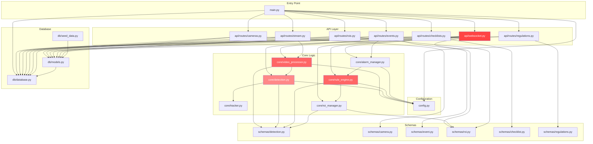
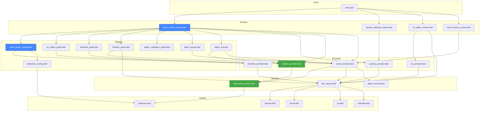

# CCTV YOLO 산업안전 관제 시스템 - 파일 인덱스

> **작성자**: 시니어 아키텍트 리뷰
> **최종 갱신**: 2026-02-11
> **대상 버전**: v1.0.0 (main 브랜치, 커밋 68d5e67)
> **총 소스 라인**: Backend 4,213 LOC / Frontend 5,178 LOC = **9,391 LOC**

---

## 경고 및 총평

이 프로젝트는 "산업 현장 안전관제"라는 생명과 직결된 도메인을 다루고 있음에도 불구하고,
아키텍처 성숙도가 프로토타입 수준에 머물러 있다. 30년간 산업용 시스템을 설계해 온 입장에서
다음 사항을 명확히 지적한다:

1. **테스트 커버리지 사실상 0%**: 테스트 파일이 단 1개(75줄)이며, 그마저도 unittest가 아닌 스크립트 수준
2. **로그/DB/모델 파일이 Git에 커밋됨**: `.gitignore`가 존재하지만 `server.log`, `seek_debug.log`가 이미 추적 중
3. **전역 싱글턴 남발**: `_detector_instance`, `_roi_manager_instance`, `_alarm_manager_instance` 등 모듈 레벨 전역 변수로 상태 관리 -- 테스트 불가능
4. **CORS `allow_origins=["*"]`**: 산업용 시스템에서 전체 오리진 허용은 보안 위반
5. **프론트엔드 safety_regulation_panel이 하드코딩**: API가 존재하는데도 사용하지 않음
6. **AlarmService 음원 파일 부재**: `assets/sounds/` 디렉토리가 `.gitkeep`만 존재, 실제 wav 파일 없음
7. **SQLite를 프로덕션 DB로 사용**: 동시성 제어 불가, WAL 모드조차 설정 안 됨

---

## 1. 전체 파일 트리 (Complete File Tree)

```
cctv_yolo/
|
|-- .gitignore
|-- README.md
|-- START_APP.bat
|-- run_backend.bat
|-- run_frontend.bat
|-- example.PNG
|
|-- backend/
|   |-- requirements.txt                  # Python 의존성 목록
|   |-- restart_server.py                 # 서버 재시작 유틸 스크립트
|   |-- test_seek.py                      # 시크 디버그 스크립트 (tracked)
|   |-- debug_ws_cam3.py                  # WebSocket 디버그 스크립트 (tracked)
|   |-- DEBUG_STATUS.md                   # 디버그 상태 문서
|   |-- server.log                        # [문제] 로그 파일이 Git에 추적됨
|   |-- seek_debug.log                    # [문제] 로그 파일이 Git에 추적됨
|   |-- safety_monitor.db                 # [문제] SQLite DB (gitignore 대상이나 디스크에 존재)
|   |-- rf-detr-medium.pth               # [문제] ~300MB ML 모델 (gitignore 대상이나 디스크에 존재)
|   |
|   |-- models/
|   |   |-- yolo_best.pt                  # [문제] YOLO 모델 바이너리
|   |   |-- checkpoint_best_ema.pth       # [문제] RF-DETR 체크포인트
|   |
|   |-- snapshots/                        # [문제] 이벤트 스냅샷 이미지 (디스크에 존재)
|   |   |-- 20260211/
|   |       |-- event_*.jpg               # 이벤트 발생 시 캡처된 프레임
|   |
|   |-- app/
|   |   |-- __init__.py
|   |   |-- main.py                       # FastAPI 엔트리포인트 (116줄)
|   |   |-- config.py                     # Pydantic Settings 설정 (74줄)
|   |   |
|   |   |-- core/                         # === 핵심 비즈니스 로직 ===
|   |   |   |-- __init__.py
|   |   |   |-- video_processor.py        # 영상 캡처/인코딩/드로잉 (554줄)
|   |   |   |-- detection.py              # YOLO/RF-DETR 탐지 엔진 (300줄)
|   |   |   |-- rule_engine.py            # 안전규칙 평가 엔진 (555줄)
|   |   |   |-- tracker.py               # BoT-SORT 트래커 래퍼 (102줄)
|   |   |   |-- roi_manager.py            # ROI 폴리곤 관리 (278줄)
|   |   |   |-- alarm_manager.py          # 알람 큐/구독/스냅샷 (305줄)
|   |   |
|   |   |-- api/                          # === REST/WebSocket API 계층 ===
|   |   |   |-- __init__.py
|   |   |   |-- websocket.py              # WS 연결관리/스트리밍 (410줄)
|   |   |   |-- routes/
|   |   |       |-- __init__.py           # 라우터 배럴 파일
|   |   |       |-- cameras.py            # 카메라 CRUD (159줄)
|   |   |       |-- stream.py             # 스냅샷/스트림 REST (126줄)
|   |   |       |-- events.py             # 이벤트 CRUD/통계 (249줄)
|   |   |       |-- rois.py               # ROI CRUD (224줄)
|   |   |       |-- checklists.py         # 체크리스트 CRUD (254줄)
|   |   |       |-- regulations.py        # 안전법령 조회 (24줄)
|   |   |
|   |   |-- db/                           # === 데이터베이스 계층 ===
|   |   |   |-- __init__.py
|   |   |   |-- database.py               # Async SQLAlchemy 엔진 (52줄)
|   |   |   |-- models.py                 # ORM 모델 6개 (114줄)
|   |   |   |-- seed_data.py              # 안전법령 시드 데이터 (66줄)
|   |   |
|   |   |-- schemas/                      # === Pydantic 스키마 ===
|   |   |   |-- __init__.py
|   |   |   |-- detection.py              # 탐지 결과 스키마 (52줄)
|   |   |   |-- camera.py                 # 카메라 스키마 (37줄)
|   |   |   |-- event.py                  # 이벤트 스키마 (41줄)
|   |   |   |-- roi.py                    # ROI 스키마 (46줄)
|   |   |   |-- checklist.py              # 체크리스트 스키마 (59줄)
|   |   |   |-- regulations.py            # 법령 스키마 (16줄)
|   |   |
|   |   |-- services/                     # === 서비스 계층 (비어있음) ===
|   |       |-- __init__.py               # [문제] 빈 디렉토리, 미사용
|   |
|   |-- tests/                            # === 테스트 (사실상 부재) ===
|       |-- __init__.py
|       |-- test_rule_engine_tracking.py   # 유일한 테스트 (75줄, pytest 아님)
|
|-- frontend/
|   |-- .gitignore
|   |-- .metadata
|   |-- README.md
|   |-- analysis_options.yaml
|   |-- pubspec.yaml                      # Flutter 의존성
|   |-- pubspec.lock
|   |
|   |-- assets/
|   |   |-- fonts/.gitkeep                # [문제] 폰트 파일 없음
|   |   |-- sounds/.gitkeep               # [문제] 알람 음원 파일 없음
|   |
|   |-- lib/
|   |   |-- main.dart                     # Flutter 엔트리포인트 (66줄)
|   |   |-- style_constants.dart          # 테마/색상/스타일 상수 (78줄)
|   |   |
|   |   |-- models/                       # === 데이터 모델 ===
|   |   |   |-- models.dart               # 배럴 파일 (5줄)
|   |   |   |-- camera.dart               # Camera 모델 (63줄)
|   |   |   |-- event.dart                # Event 모델 + Severity enum (101줄)
|   |   |   |-- detection.dart            # Detection/StreamFrame 모델 (123줄)
|   |   |   |-- roi.dart                  # ROI 모델 (94줄)
|   |   |   |-- checklist.dart            # Checklist 모델 (89줄)
|   |   |
|   |   |-- services/                     # === 외부 통신 서비스 ===
|   |   |   |-- services.dart             # 배럴 파일
|   |   |   |-- api_service.dart          # Dio REST 클라이언트 (186줄)
|   |   |   |-- websocket_service.dart    # WebSocket 스트림/이벤트 (209줄)
|   |   |   |-- alarm_service.dart        # AudioPlayer 알람 (66줄) [고장]
|   |   |
|   |   |-- providers/                    # === Riverpod 상태관리 ===
|   |   |   |-- providers.dart            # 배럴 + 공유 프로바이더 (5줄)
|   |   |   |-- camera_provider.dart      # 카메라 상태 (66줄)
|   |   |   |-- stream_provider.dart      # 스트림 상태 (186줄)
|   |   |   |-- event_provider.dart       # 이벤트/알람 상태 (124줄)
|   |   |   |-- roi_provider.dart         # ROI 상태 (152줄)
|   |   |   |-- checklist_provider.dart   # 체크리스트 상태 (88줄)
|   |   |
|   |   |-- screens/                      # === 화면 레이아웃 ===
|   |   |   |-- screens.dart              # 배럴 파일
|   |   |   |-- main_control_screen.dart  # 메인 관제 화면 70/30 (240줄)
|   |   |   |-- camera_settings_screen.dart # 카메라 설정 CRUD (272줄)
|   |   |   |-- roi_editor_screen.dart    # ROI 드로잉 에디터 (623줄)
|   |   |   |-- event_history_screen.dart # 이벤트 이력 조회 (358줄)
|   |   |
|   |   |-- widgets/                      # === UI 위젯 ===
|   |       |-- widgets.dart              # 배럴 파일
|   |       |-- video_player_widget.dart  # WebSocket 영상 표시+시크 (394줄)
|   |       |-- detection_overlay.dart    # 탐지 정보 오버레이 (183줄)
|   |       |-- roi_status_panel.dart     # 실시간 ROI 상태 패널 (221줄)
|   |       |-- alarm_popup.dart          # 모달 알람 팝업 (291줄)
|   |       |-- timeline_panel.dart       # 최근 이벤트 타임라인 (377줄)
|   |       |-- checklist_panel.dart      # 안전 체크리스트 (271줄)
|   |       |-- safety_regulation_panel.dart # 안전법령 패널 (120줄) [하드코딩]
|   |       |-- status_bar.dart           # 하단 상태바 (127줄)
|   |
|   |-- windows/                          # Windows 네이티브 빌드 설정
|       |-- CMakeLists.txt
|       |-- flutter/
|       |-- runner/
|           |-- main.cpp, flutter_window.cpp, utils.cpp, win32_window.cpp ...
|
|-- docs/
    |-- final_system_document.md          # 시스템 문서 (Git 추적 중)
```

---

## 2. 핵심 파일 TOP 20 (위험도 포함)

아래는 시스템 동작에 가장 결정적인 영향을 미치는 20개 파일이다.
위험도는 해당 파일의 장애가 시스템 전체에 미치는 영향을 기준으로 평가했다.

| 순위 | 파일 경로 | LOC | 역할 | 위험도 |
|:---:|:---|:---:|:---|:---:|
| 1 | `backend/app/api/websocket.py` | 410 | 실시간 스트리밍의 전체 오케스트레이션. 영상+탐지+규칙+알람을 모두 조합. **이 파일이 죽으면 시스템 전체가 죽는다.** | **CRITICAL** |
| 2 | `backend/app/core/rule_engine.py` | 555 | 안전규칙 평가의 핵심. 오탐 방지(persistence/cooldown), 체류시간 추적, 입퇴장 이벤트 발생. 로직 오류 시 실제 위험 상황을 놓칠 수 있다. | **CRITICAL** |
| 3 | `backend/app/core/video_processor.py` | 554 | 영상 캡처, 프레임 인코딩, ROI/탐지결과 드로잉. 스트리밍 파이프라인의 물리적 기반. | **CRITICAL** |
| 4 | `backend/app/core/detection.py` | 300 | YOLO/RF-DETR 이중 백엔드 탐지. 모델 로딩 실패 시 탐지 기능 전체 상실. 전역 싱글턴 캐싱 문제 있음. | **CRITICAL** |
| 5 | `backend/app/core/roi_manager.py` | 278 | ROI 폴리곤 관리 및 충돌 판정. 좌표 정규화 휴리스틱이 불안정(1280/1920 하드코딩 분기). | **HIGH** |
| 6 | `backend/app/core/alarm_manager.py` | 305 | 알람 큐, 구독자 알림, 스냅샷 저장, DB 이벤트 저장. 비동기 콜백 체인의 중심. | **HIGH** |
| 7 | `backend/app/core/tracker.py` | 102 | BoT-SORT 래퍼. 실패 시 fallback으로 인덱스 기반 가짜 ID 부여 -- 추적 정확도 급락. | **HIGH** |
| 8 | `backend/app/config.py` | 74 | 모든 설정 상수의 원천. 여기서 잘못된 값 하나가 전체 시스템 동작을 변경. | **HIGH** |
| 9 | `backend/app/main.py` | 116 | FastAPI 앱 생성, 미들웨어, 라우터 등록, lifespan. 진입점이므로 장애 시 서버 기동 불가. | **HIGH** |
| 10 | `backend/app/db/models.py` | 114 | 6개 ORM 모델 정의. 스키마 변경 시 마이그레이션 도구(Alembic) 미사용으로 수동 대응 필요. | **HIGH** |
| 11 | `frontend/lib/widgets/video_player_widget.dart` | 394 | 영상 표시+시크바의 핵심 위젯. base64 디코딩, 프레임 렌더링, 시크 로직 포함. | **HIGH** |
| 12 | `frontend/lib/services/websocket_service.dart` | 209 | WebSocket 연결/해제, 프레임 스트림 파싱. 연결 실패 시 프론트엔드 영상 표시 불가. | **HIGH** |
| 13 | `frontend/lib/providers/stream_provider.dart` | 186 | 스트림 상태 관리(연결, 재생, 일시정지, 시크). Riverpod StateNotifier 패턴. | **MEDIUM** |
| 14 | `frontend/lib/screens/roi_editor_screen.dart` | 623 | ROI 편집 화면. 프로젝트 내 최대 LOC 프론트 파일. 터치/클릭으로 폴리곤 드로잉. | **MEDIUM** |
| 15 | `frontend/lib/screens/main_control_screen.dart` | 240 | 메인 레이아웃(70/30 분할). 모든 위젯을 조합하는 컨테이너. | **MEDIUM** |
| 16 | `backend/app/api/routes/events.py` | 249 | 이벤트 CRUD + 통계 API. 필터링/집계 쿼리 포함. | **MEDIUM** |
| 17 | `backend/app/db/database.py` | 52 | Async SQLAlchemy 엔진 생성. 간결하지만 장애 시 전체 DB 접근 불가. | **MEDIUM** |
| 18 | `frontend/lib/services/api_service.dart` | 186 | Dio 기반 REST 클라이언트. 모든 HTTP 통신의 단일 진입점. | **MEDIUM** |
| 19 | `backend/app/schemas/detection.py` | 52 | DetectionBox, DetectionResult, StreamFrame 정의. 백엔드-프론트엔드 계약(contract). | **MEDIUM** |
| 20 | `frontend/lib/widgets/alarm_popup.dart` | 291 | 알람 모달 팝업. 안전 이벤트 발생 시 사용자 인지의 최전선. | **MEDIUM** |

---

## 3. 파일 분류 (File Classification)

### 3.1 Core Logic (핵심 비즈니스 로직) -- 6개 파일, 2,094 LOC

이 시스템의 존재 이유가 되는 파일들이다. 여기에 버그가 있으면 사람이 다친다.

| 파일 | LOC | 핵심 클래스/함수 | 비평 |
|:---|:---:|:---|:---|
| `core/video_processor.py` | 554 | `VideoProcessor`, `put_korean_text`, `draw_detections`, `draw_rois`, `stream_frames` | Windows 폰트 경로 하드코딩. 한글 렌더링을 위해 PIL 변환 왕복 발생 -- 프레임당 성능 비용 큼. `stream_frames`가 async generator인데 내부에서 동기 OpenCV `read()` 호출 -- 이벤트 루프 블로킹 가능. |
| `core/detection.py` | 300 | `BaseDetector`, `YOLODetector`, `RFDETRDetector`, `get_detector` | 전역 싱글턴 `_detector_instance` 사용. 두 디텍터의 `_map_category` 메서드가 중복(DRY 위반). RF-DETR 모델 로딩 시 `strict=False`로 state_dict 로딩 -- 누락된 가중치 무시됨. |
| `core/rule_engine.py` | 555 | `RuleEngine`, `EventType`, `SafetyEvent`, `DetectionState`, `PersonState` | 프로젝트 내 가장 복잡한 파일. persistence/cooldown/frame_window 3중 검증 구조. 마스크 감지 규칙이 주석 처리되어 비활성화. `_evaluate_roi` 메서드가 120줄 -- 분리 필요. |
| `core/tracker.py` | 102 | `BoTSORTTracker`, `get_tracker` | fallback 트래커가 단순 인덱스 부여 -- 프레임 간 ID 일관성 없음. 실 환경에서 ultralytics 버전 불일치 시 무조건 fallback으로 전환. |
| `core/roi_manager.py` | 278 | `ROIManager`, `get_roi_manager` | 좌표 정규화 휴리스틱이 위험: `px_maxx > 1300`이면 1920, 아니면 1280으로 가정. 실제 해상도와 무관한 매직넘버. Shapely `Polygon.contains`로 point-in-polygon 판정. |
| `core/alarm_manager.py` | 305 | `AlarmManager`, `get_alarm_manager` | `_next_event_id`가 메모리 내 카운터 -- 서버 재시작 시 초기화됨 (DB auto-increment와 불일치 가능). 스냅샷 저장 시 한글 메시지를 `cv2.putText`로 렌더링 -- 한글 깨짐 발생. |

### 3.2 API Layer (API 계층) -- 7개 파일, 1,446 LOC

| 파일 | LOC | 엔드포인트 | 비평 |
|:---|:---:|:---|:---|
| `api/websocket.py` | 410 | `WS /ws/stream/{camera_id}`, `WS /ws/events`, `GET /ws/status` | **God Object 문제**. 이 파일 하나가 WebSocket 연결관리 + 영상 스트리밍 + 탐지 + 규칙 평가 + 알람 처리 + ROI 로딩을 전부 수행. 단일 책임 원칙 완전 위반. |
| `api/routes/cameras.py` | 159 | `POST/GET/PUT/DELETE /api/cameras`, activate/deactivate | 비교적 정상적인 CRUD. 삭제 시 cascade를 위해 `selectinload`로 관계 사전 로딩 -- 올바른 접근. |
| `api/routes/events.py` | 249 | `GET /api/events`, recent, unacknowledged, statistics, acknowledge | 통계 API에서 `func.count`를 3번 별도 쿼리 -- 단일 쿼리로 최적화 가능. |
| `api/routes/rois.py` | 224 | `POST/GET/PUT/DELETE /api/rois` | ROI 생성/수정 시 `roi_manager` 전역 인스턴스 갱신 로직 포함. |
| `api/routes/checklists.py` | 254 | `POST/GET/PUT/DELETE /api/checklists`, 기본 템플릿 자동 생성 | 체크리스트 생성 시 기본 항목(PPE_HELMET 등) 자동 삽입. |
| `api/routes/stream.py` | 126 | `GET /api/stream/snapshot/{camera_id}` | 스냅샷 캡처 전용 REST 엔드포인트. WebSocket과 별도의 `VideoProcessor` 인스턴스 생성. |
| `api/routes/regulations.py` | 24 | `GET /api/regulations` | 최소 구현. seed_data에서 법령 데이터를 DB에 넣고 조회만. |

### 3.3 Database Layer (데이터베이스 계층) -- 3개 파일, 232 LOC

| 파일 | LOC | 역할 | 비평 |
|:---|:---:|:---|:---|
| `db/database.py` | 52 | Async SQLAlchemy 엔진, 세션 팩토리, `init_db`, `close_db` | `create_all`로 테이블 생성 -- Alembic 마이그레이션 미사용. 스키마 변경 시 기존 데이터 손실 위험. |
| `db/models.py` | 114 | `Camera`, `ROI`, `Event`, `Checklist`, `ChecklistItem`, `SafetyRegulation` (6개 모델) | Event 테이블에 3개 인덱스 정의(camera+created_at, acknowledged, severity) -- 적절함. 그러나 `detection_data`가 JSON 문자열로 Text 컬럼에 저장 -- 쿼리 불가. |
| `db/seed_data.py` | 66 | 산업안전보건법/중대재해처벌법 시드 데이터 | 하드코딩된 법령 데이터. 법률 개정 시 코드 수정 필요. |

### 3.4 Schemas (스키마 계층) -- 6개 파일, 251 LOC

| 파일 | LOC | 주요 클래스 |
|:---|:---:|:---|
| `schemas/detection.py` | 52 | `DetectionBox`, `DetectionResult`, `StreamFrame`, `SafetyStatus` |
| `schemas/checklist.py` | 59 | `ChecklistCreate`, `ChecklistResponse`, `ChecklistItemCreate`, `ChecklistItemResponse` |
| `schemas/roi.py` | 46 | `Point`, `ROICreate`, `ROIUpdate`, `ROIResponse` |
| `schemas/event.py` | 41 | `EventResponse`, `EventAcknowledge` |
| `schemas/camera.py` | 37 | `CameraCreate`, `CameraUpdate`, `CameraResponse` |
| `schemas/regulations.py` | 16 | `SafetyRegulationResponse` |

> **비평**: 스키마가 최소한으로 작성되어 있다. 입력 검증(Validator)이 거의 없다.
> 예를 들어 `CameraCreate`에서 `source`가 실제 파일 경로나 RTSP URL인지 검증하지 않는다.

### 3.5 Frontend - Services (프론트엔드 서비스) -- 3개 파일, 461 LOC

| 파일 | LOC | 역할 | 비평 |
|:---|:---:|:---|:---|
| `services/websocket_service.dart` | 209 | WebSocket 연결, 프레임 스트림 파싱, 명령 전송 | `_lastTotalDurationMs` 캐싱 로직이 복잡 -- 메타데이터와 프레임의 이중 소스. 에러 핸들링이 빈 catch 블록. |
| `services/api_service.dart` | 186 | Dio 기반 REST 클라이언트 (cameras, events, rois, checklists, regulations) | 타임아웃 설정 없음. 에러 시 throw만 -- 재시도 로직 없음. baseUrl `http://localhost:8001`로 하드코딩. |
| `services/alarm_service.dart` | 66 | AudioPlayer 알람 재생 | **고장 상태**. `AssetSource('sounds/alarm_critical.wav')` 참조하나 실제 파일 부재. catch에서 에러를 삼킴. |

### 3.6 Frontend - State Management (프론트엔드 상태관리) -- 5개 파일, 616 LOC

| 파일 | LOC | Provider 유형 | 비평 |
|:---|:---:|:---|:---|
| `providers/stream_provider.dart` | 186 | `StateNotifier<StreamState>` | 가장 복잡한 프로바이더. connect/disconnect/togglePlayPause/seek 관리. WebSocketService 인스턴스를 직접 생성. |
| `providers/roi_provider.dart` | 152 | `StateNotifier<RoiState>` | ROI CRUD + 선택 상태 관리. API 호출과 로컬 상태 동기화. |
| `providers/event_provider.dart` | 124 | `StateNotifier<EventState>`, `StateNotifier<AlarmState>` | 이벤트 목록 + 알람 팝업 상태. WebSocket 이벤트 수신 시 알람 트리거. |
| `providers/checklist_provider.dart` | 88 | `StateNotifier<ChecklistState>` | 체크리스트 CRUD. |
| `providers/camera_provider.dart` | 66 | `FutureProvider`, `StateProvider` | 카메라 목록 비동기 로딩 + 선택 카메라 상태. |

### 3.7 Frontend - Screens (프론트엔드 화면) -- 4개 파일, 1,493 LOC

| 파일 | LOC | 화면 | 비평 |
|:---|:---:|:---|:---|
| `screens/roi_editor_screen.dart` | 623 | ROI 폴리곤 편집기 | **프로젝트 최대 LOC**. 스냅샷 위에 클릭으로 다각형 그리기. CustomPainter 사용. 복잡도 높음. |
| `screens/event_history_screen.dart` | 358 | 이벤트 이력 조회/필터 | 날짜/심각도/유형 필터. 스냅샷 팝업 미리보기. |
| `screens/camera_settings_screen.dart` | 272 | 카메라 CRUD 폼 | 카메라 추가/수정/삭제. source_type(file/rtsp) 선택. |
| `screens/main_control_screen.dart` | 240 | 메인 관제 화면 | 70/30 레이아웃. 키보드 단축키(Space: 재생/정지, ESC: 알람 닫기). |

### 3.8 Frontend - Widgets (프론트엔드 위젯) -- 8개 파일, 1,984 LOC

| 파일 | LOC | 위젯 | 비평 |
|:---|:---:|:---|:---|
| `widgets/video_player_widget.dart` | 394 | 영상 플레이어 + 시크바 | base64 -> Uint8List 변환 매 프레임마다 수행. `gaplessPlayback: true`로 깜박임 방지. |
| `widgets/timeline_panel.dart` | 377 | 최근 이벤트 타임라인 | WebSocket 이벤트 실시간 수신 + REST API 초기 로딩 이중 구조. |
| `widgets/alarm_popup.dart` | 291 | 알람 모달 오버레이 | AnimationController로 슬라이드 인 애니메이션. CRITICAL/WARNING/INFO 색상 분리. |
| `widgets/checklist_panel.dart` | 271 | 안전 체크리스트 | 체크 항목 토글 + 자동 체크 표시. |
| `widgets/roi_status_panel.dart` | 221 | ROI 실시간 상태 | 구역별 인원수/체류시간 표시. 스트림 프레임의 `roi_metrics` 데이터 사용. |
| `widgets/detection_overlay.dart` | 183 | 탐지 정보 오버레이 | 인원수, 장비 감지 상태 표시. 영상 위 좌측 상단 배치. |
| `widgets/status_bar.dart` | 127 | 하단 상태바 | 서버 연결 상태, 현재 시간, 미확인 알람 수. |
| `widgets/safety_regulation_panel.dart` | 120 | 안전법령 패널 | **API를 사용하지 않고 하드코딩**. `regulations_router`가 백엔드에 존재하는데 프론트에서 호출하지 않음. |

### 3.9 Tests (테스트) -- 1개 파일, 75 LOC

| 파일 | LOC | 비평 |
|:---|:---:|:---|
| `tests/test_rule_engine_tracking.py` | 75 | pytest 프레임워크 미사용. `sys.path.append`로 경로 설정. `MagicMock`으로 ROI 판정 우회. 테스트 케이스 단 1개. **산업 안전 시스템에서 이 수준의 테스트 커버리지는 직무 유기에 가깝다.** |

### 3.10 Configuration & Build (설정/빌드) -- 기타

| 파일 | 역할 | 비평 |
|:---|:---|:---|
| `backend/requirements.txt` | Python 의존성 24줄 | `ultralytics>=8.3.0`으로 상한 미제한. 파이프라인 재현성 보장 안 됨. `rfdetr` 패키지 미포함(수동 설치 가정). |
| `frontend/pubspec.yaml` | Flutter 의존성 | Git에 추적 중이나 본 리뷰에서 미확인. |
| `.gitignore` | Git 제외 규칙 | `*.pth`, `*.pt`, `*.db` 패턴 존재하지만, `server.log`와 `seek_debug.log`는 패턴에 없어 추적됨. `docs/` 디렉토리를 통째로 gitignore -- 문서화 의지 의문. |
| `START_APP.bat` | 원클릭 실행 스크립트 | 백엔드+프론트엔드 동시 기동 배치 파일. |
| `run_backend.bat`, `run_frontend.bat` | 개별 실행 스크립트 | |

---

## 4. 의존성 그래프 (Dependency Graph)

### 4.1 백엔드 모듈 의존성



### 4.2 프론트엔드 모듈 의존성



---

## 5. 파일 복잡도 분석 (File Complexity Analysis)

### 5.1 LOC 기준 상위 10개 파일

| 순위 | 파일 | LOC | 계층 |
|:---:|:---|:---:|:---|
| 1 | `frontend/lib/screens/roi_editor_screen.dart` | 623 | Frontend/Screen |
| 2 | `backend/app/core/rule_engine.py` | 555 | Backend/Core |
| 3 | `backend/app/core/video_processor.py` | 554 | Backend/Core |
| 4 | `backend/app/api/websocket.py` | 410 | Backend/API |
| 5 | `frontend/lib/widgets/video_player_widget.dart` | 394 | Frontend/Widget |
| 6 | `frontend/lib/widgets/timeline_panel.dart` | 377 | Frontend/Widget |
| 7 | `frontend/lib/screens/event_history_screen.dart` | 358 | Frontend/Screen |
| 8 | `backend/app/core/alarm_manager.py` | 305 | Backend/Core |
| 9 | `backend/app/core/detection.py` | 300 | Backend/Core |
| 10 | `frontend/lib/widgets/alarm_popup.dart` | 291 | Frontend/Widget |

### 5.2 순환 복잡도(Cyclomatic Complexity) 추정 -- 상위 위험 파일

순환 복잡도는 분기(if/elif/else, for, while, try/except, and/or)의 수로 추정한다.
정적 분석 도구(radon, lizard)를 실행하지 않았으므로 코드 리뷰 기반 추정치이다.

| 파일 | 추정 CC | 위험 함수 | 판정 |
|:---|:---:|:---|:---|
| `rule_engine.py` | **35+** | `_evaluate_roi` (분기 15+), `evaluate`, `_check_persistence` | 즉시 리팩토링 필요. 하나의 메서드에 입퇴장/침입/PPE/소화기 규칙 전부. |
| `websocket.py` | **30+** | `websocket_stream` (중첩 while-async for-try 3단계) | God Function. 분리 시급. |
| `video_processor.py` | **20+** | `stream_frames`, `draw_rois`, `open` | 프레임 스킵 로직의 조건 분기가 복잡. |
| `detection.py` | **18+** | `RFDETRDetector.load_model` (체크포인트 포맷 분기 5개), `detect` | 모델 로딩의 방어적 분기가 과도. |
| `roi_manager.py` | **15+** | `add_roi` (좌표 정규화 분기), `is_point_in_roi` | 해상도 추론 휴리스틱이 취약. |
| `alarm_manager.py` | **12** | `process_event`, `_notify_subscribers` | 비동기 콜백 체인의 에러 전파 불확실. |

### 5.3 결합도(Coupling) 분석

| 파일 | Fan-In (의존받는 수) | Fan-Out (의존하는 수) | 판정 |
|:---|:---:|:---:|:---|
| `config.py` | **10+** | 0 | 안정적 중심. 변경 시 전체 영향. |
| `db/database.py` | **8** | 1 (config) | 안정적 기반. |
| `schemas/detection.py` | **6** | 0 | 계약(contract) 역할. |
| `core/roi_manager.py` | **4** | 2 | 적절한 수준. |
| `api/websocket.py` | **1** (main) | **9** | **최악의 Fan-Out**. 모든 core 모듈 + DB + Schema 직접 의존. |
| `core/rule_engine.py` | **2** | 3 | core 내부 의존은 적절하나 내부 복잡도 높음. |

### 5.4 문제 파일 목록 (즉시 조치 필요)

| 파일 | 문제 유형 | 심각도 | 설명 |
|:---|:---|:---:|:---|
| `backend/server.log` | Git 추적 | LOW | `.gitignore`에 `*.log` 패턴 미포함. `git rm --cached` 필요. |
| `backend/seek_debug.log` | Git 추적 | LOW | 동일. |
| `backend/debug_ws_cam3.py` | 디버그 코드 추적 | LOW | 프로덕션 레포에 디버그 스크립트 포함. |
| `backend/test_seek.py` | 디버그 코드 추적 | LOW | 동일. |
| `backend/restart_server.py` | 운영 스크립트 추적 | LOW | 운영 유틸이 소스 레포에 혼재. |
| `frontend/lib/services/alarm_service.dart` | 기능 고장 | **MEDIUM** | 음원 파일 부재로 알람 소리 미작동. 산업 안전 시스템에서 알람이 안 울린다. |
| `frontend/lib/widgets/safety_regulation_panel.dart` | 하드코딩 | MEDIUM | API 존재하나 미사용. 법령 데이터 변경 시 앱 재빌드 필요. |
| `backend/app/core/alarm_manager.py` | 한글 깨짐 | MEDIUM | `_draw_event_info`에서 `cv2.putText`로 한글 출력 시도 -- OpenCV는 한글 미지원. `put_korean_text` 사용해야 함. |
| `backend/app/api/websocket.py` | God Object | **HIGH** | 단일 함수 `websocket_stream`이 300줄+. 모든 로직 집중. |
| `backend/app/core/roi_manager.py` | 매직넘버 | HIGH | 해상도 추론에 1280/1920/720/1080 하드코딩. |
| `backend/app/services/__init__.py` | 미사용 | LOW | 빈 서비스 디렉토리. 패키지 구조만 있고 구현 없음. |

---

## 6. 파일별 외부 의존성 매핑

### 6.1 Backend 주요 외부 라이브러리

| 라이브러리 | 버전 | 사용 파일 | 용도 |
|:---|:---|:---|:---|
| `fastapi` | 0.109.0 | `main.py`, `websocket.py`, 모든 routes | HTTP/WS 프레임워크 |
| `uvicorn` | 0.27.0 | `main.py` | ASGI 서버 |
| `sqlalchemy` | 2.0.25 | `database.py`, `models.py`, 모든 routes | Async ORM |
| `aiosqlite` | 0.19.0 | `database.py` (간접) | SQLite 비동기 드라이버 |
| `ultralytics` | >=8.3.0 | `detection.py`, `tracker.py` | YOLO + BoT-SORT |
| `opencv-python` | 4.9.0.80 | `video_processor.py`, `alarm_manager.py` | 영상 처리 |
| `shapely` | 2.0.2 | `roi_manager.py` | 기하학 연산 |
| `pydantic` | 2.5.3 | 모든 schemas, `config.py` | 데이터 검증 |
| `torch` | (미명시) | `detection.py` | PyTorch (RF-DETR) |
| `rfdetr` | (미명시) | `detection.py` | RF-DETR 모델 |
| `numpy` | (미명시) | `detection.py`, `video_processor.py`, `tracker.py` | 수치 연산 |
| `Pillow` | (미명시) | `video_processor.py` | 한글 텍스트 렌더링 |

> **비평**: `torch`, `numpy`, `Pillow`, `rfdetr`이 `requirements.txt`에 명시되지 않았다.
> `ultralytics`가 torch/numpy를 끌어오기는 하지만, 명시적 선언 없이 암묵적 의존은 위험하다.
> `rfdetr` 패키지는 아예 빠져 있다. 새 환경에서 설치 시 반드시 실패한다.

### 6.2 Frontend 주요 외부 패키지

| 패키지 | 사용 파일 | 용도 |
|:---|:---|:---|
| `flutter_riverpod` | `main.dart`, 모든 providers, screens, widgets | 상태 관리 |
| `window_manager` | `main.dart` | Windows 창 관리 |
| `dio` | `api_service.dart` | HTTP 클라이언트 |
| `web_socket_channel` | `websocket_service.dart` | WebSocket 통신 |
| `audioplayers` | `alarm_service.dart` | 알람 소리 재생 (고장) |
| `intl` | `event_history_screen.dart` | 날짜 포맷팅 |

---

## 7. 개선 우선순위 권고

30년 경력의 관점에서, 이 시스템을 프로덕션에 투입하기 전에 반드시 수행해야 할 사항을
우선순위 순으로 나열한다.

### P0 (즉시, 배포 차단)

1. **`websocket.py` 분할**: `websocket_stream` 함수를 StreamingOrchestrator 클래스로 추출하고,
   영상/탐지/규칙/알람 각 단계를 별도 메서드로 분리
2. **테스트 추가**: `rule_engine.py`에 대한 단위 테스트 최소 20개 작성 (모든 EventType, persistence, cooldown 경로)
3. **CORS 제한**: `allow_origins`를 실제 프론트엔드 도메인으로 제한
4. **`alarm_service.dart` 음원 파일 추가** 또는 시스템 비프음 fallback 구현

### P1 (1주 내)

5. **Git 정리**: `git rm --cached server.log seek_debug.log debug_ws_cam3.py test_seek.py restart_server.py`
6. **`requirements.txt` 완성**: `torch`, `numpy`, `Pillow`, `rfdetr` 명시적 추가, 버전 고정
7. **`safety_regulation_panel.dart`가 API 호출하도록 수정**
8. **`alarm_manager.py`의 `_draw_event_info`에서 `put_korean_text` 사용**
9. **ROI 좌표 정규화**: 매직넘버 제거, 클라이언트에서 정규화된 좌표(0-1)를 전송하도록 프로토콜 통일

### P2 (1개월 내)

10. **전역 싱글턴 제거**: 의존성 주입(DI) 패턴 도입. FastAPI의 `Depends()` 활용
11. **Alembic 마이그레이션 도입**: `create_all()` 제거
12. **DB를 PostgreSQL로 전환**: 동시성, WAL, VACUUM 문제 일괄 해결
13. **CI/CD 파이프라인 구축**: 테스트 자동화, 린터, 타입 검사(mypy)

---

## 8. 파일 간 데이터 흐름 요약

```
[카메라 RTSP/파일]
       |
       v
  VideoProcessor.read_frame()     -- cv2.VideoCapture
       |
       v
  BaseDetector.detect()           -- YOLO 또는 RF-DETR
       |
       v
  BoTSORTTracker.update()         -- 객체 추적 ID 부여
       |
       v
  RuleEngine.evaluate()           -- ROI 침입, PPE 미착용, 소화기 미비치 판정
       |                             (persistence + cooldown으로 오탐 방지)
       v
  AlarmManager.process_event()    -- DB 저장, 스냅샷 캡처, 구독자 알림
       |
       v
  ConnectionManager.broadcast_event() + send_frame()  -- WebSocket 전송
       |
       v
  [Flutter 프론트엔드]
    WebSocketService -> StreamProvider -> VideoPlayerWidget (영상)
    WebSocketService -> EventProvider  -> AlarmPopup / TimelinePanel (이벤트)
```

---

> **최종 소견**: 이 프로젝트는 개념 증명(PoC)으로서는 기능이 동작하지만,
> 산업 안전이라는 도메인의 무게에 비해 엔지니어링 품질이 현저히 부족하다.
> 특히 테스트 부재, God Object 패턴, 전역 상태 남발은 유지보수와 확장을 근본적으로 가로막는다.
> 프로덕션 배포 전에 위 P0 항목은 반드시 해결되어야 하며, 그렇지 않으면
> 이 시스템이 "안전관제"를 표방하는 것 자체가 모순이다.
