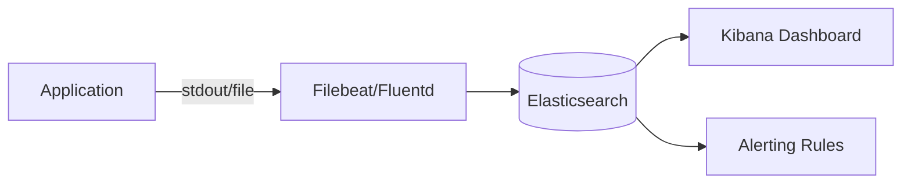

# N. 운영 및 모니터링 계획 (Operations & Monitoring Plan)

> 작성 기준: 30년 경력 시니어 아키텍트
> 대상 시스템: CCTV SAFE-YOLO Industrial Monitoring System
> 작성일: 2026-02-11

---

## 현재 운영 성숙도: Level 0 (초기화 이전)

운영 관점에서 이 시스템은 "개발자 로컬 머신에서만 실행 가능한" 상태다. 배포, 모니터링, 알림, 복구 — 어떤 운영 인프라도 존재하지 않는다.

---

## 1. 로깅 분석 및 개선

### 1.1 현재 로깅 상태

```python
# 전형적인 현재 로깅 패턴
logger = logging.getLogger(__name__)
logger.error(f"Failed to load YOLO model: {e}")  # 비구조적 문자열
```

**문제점:**
- 비구조적 텍스트 로그 (파싱 불가)
- 상관관계 ID(correlation ID) 없음 — 요청 추적 불가
- 로그 레벨 일관성 없음 — 어떤 건 error, 어떤 건 무시
- 로그 로테이션 없음 — server.log가 무한 증가
- 로그 파일이 리포에 커밋됨
- 프론트엔드에는 로깅 자체가 없음

### 1.2 구조화된 로깅 도입

```python
# structlog 기반 개선
import structlog

logger = structlog.get_logger()

logger.info("frame_processed",
    camera_id=camera_id,
    frame_number=frame_num,
    detection_count=len(detections),
    inference_time_ms=round(inference_time * 1000, 2),
    roi_violations=violations,
    request_id=request_id,  # 상관관계 ID
)
```

### 1.3 로그 수준 가이드

| 수준 | 기준 | 예시 |
|------|------|------|
| DEBUG | 개발 상세 정보 | 프레임 바이트 수, 좌표 값 |
| INFO | 정상 운영 이벤트 | 스트림 시작/종료, 카메라 연결 |
| WARNING | 복구된 문제 | 프레임 드롭, 재연결 성공 |
| ERROR | 복구 실패 | 모델 로드 실패, DB 접근 불가 |
| CRITICAL | 시스템 수준 장애 | GPU OOM, 전체 서비스 중단 |

### 1.4 로그 집계 아키텍처



---

## 2. 메트릭 수집

### 2.1 필수 메트릭

```python
# Prometheus 메트릭 (prometheus_client)
from prometheus_client import Counter, Histogram, Gauge

# 프레임 처리
frames_processed = Counter('frames_processed_total', 'Total frames processed', ['camera_id'])
frame_processing_time = Histogram('frame_processing_seconds', 'Frame processing time', ['camera_id'])

# 탐지
detection_inference_time = Histogram('detection_inference_seconds', 'Detection inference time')
detections_per_frame = Histogram('detections_per_frame', 'Detection count per frame')
detection_errors = Counter('detection_errors_total', 'Detection errors')

# WebSocket
ws_connections = Gauge('websocket_connections', 'Active WebSocket connections')
ws_frame_send_time = Histogram('ws_frame_send_seconds', 'WebSocket frame send time')

# 이벤트
safety_events = Counter('safety_events_total', 'Safety events generated', ['type', 'severity'])

# 시스템
gpu_memory_used = Gauge('gpu_memory_used_bytes', 'GPU memory used')
gpu_utilization = Gauge('gpu_utilization_percent', 'GPU utilization')
process_memory = Gauge('process_memory_bytes', 'Process memory usage')
```

### 2.2 Prometheus 엔드포인트

```python
# main.py에 추가
from prometheus_client import make_asgi_app

metrics_app = make_asgi_app()
app.mount("/metrics", metrics_app)
```

---

## 3. 알람 규칙

### 3.1 인프라 알람

| 알람 | 조건 | 심각도 | 알림 채널 |
|------|------|--------|----------|
| 서비스 다운 | 헬스체크 3회 연속 실패 | CRITICAL | SMS + Slack |
| 높은 CPU | CPU > 90% 5분 지속 | WARNING | Slack |
| 메모리 부족 | RSS > 80% 가용 메모리 | WARNING | Slack |
| GPU OOM 위험 | GPU 메모리 > 90% | CRITICAL | SMS + Slack |
| 디스크 부족 | 사용률 > 85% | WARNING | Slack |
| 디스크 위험 | 사용률 > 95% | CRITICAL | SMS + Slack |

### 3.2 애플리케이션 알람

| 알람 | 조건 | 심각도 | 알림 채널 |
|------|------|--------|----------|
| 탐지 실패율 높음 | 에러율 > 5% (5분) | CRITICAL | SMS + Slack |
| 프레임 드롭 | fps < 10 (1분 평균) | WARNING | Slack |
| WS 연결 끊김 | 활성 연결 0개 (정상 운영 시간) | WARNING | Slack |
| 이벤트 처리 지연 | 처리 시간 > 5초 | WARNING | Slack |
| DB 쓰기 실패 | 연속 5회 실패 | CRITICAL | SMS + Slack |
| 스냅샷 저장 실패 | 연속 10회 실패 | WARNING | Slack |

---

## 4. 배포 전략

### 4.1 현재: 수동 배포 (Level 0)

```bash
# 현재 배포 방식 (추정)
cd backend
pip install -r requirements.txt
python -m uvicorn app.main:app --port 8001

# 프론트엔드: Flutter Windows 빌드
cd frontend
flutter build windows
```

### 4.2 목표: Docker 기반 자동 배포

```dockerfile
# backend/Dockerfile
FROM nvidia/cuda:12.1-runtime-ubuntu22.04
WORKDIR /app
COPY requirements.txt .
RUN pip install -r requirements.txt
COPY app/ app/
COPY models/ models/
EXPOSE 8001
CMD ["uvicorn", "app.main:app", "--host", "0.0.0.0", "--port", "8001"]
```

```yaml
# docker-compose.yml
version: '3.8'
services:
  backend:
    build: ./backend
    ports:
      - "8001:8001"
    deploy:
      resources:
        reservations:
          devices:
            - driver: nvidia
              count: 1
              capabilities: [gpu]
    volumes:
      - snapshots:/app/snapshots
    environment:
      - DATABASE_URL=postgresql+asyncpg://...
      - SECRET_KEY=${SECRET_KEY}
    depends_on:
      - postgres
      - redis

  postgres:
    image: postgres:16
    volumes:
      - pgdata:/var/lib/postgresql/data

  redis:
    image: redis:7-alpine

  prometheus:
    image: prom/prometheus
    volumes:
      - ./monitoring/prometheus.yml:/etc/prometheus/prometheus.yml

  grafana:
    image: grafana/grafana
    ports:
      - "3000:3000"

volumes:
  snapshots:
  pgdata:
```

### 4.3 CI/CD 파이프라인

```yaml
# .github/workflows/ci.yml
name: CI/CD Pipeline
on:
  push:
    branches: [main, develop]
  pull_request:
    branches: [main]

jobs:
  test:
    runs-on: ubuntu-latest
    steps:
      - uses: actions/checkout@v4
      - name: Run backend tests
        run: |
          pip install -r backend/requirements.txt
          pytest backend/tests/ -v --cov=app --cov-report=xml
      - name: Run frontend tests
        run: |
          cd frontend
          flutter test

  security:
    runs-on: ubuntu-latest
    steps:
      - name: Dependency scan
        run: pip-audit -r backend/requirements.txt
      - name: SAST scan
        uses: github/codeql-action/analyze@v3

  build:
    needs: [test, security]
    runs-on: ubuntu-latest
    steps:
      - name: Build Docker image
        run: docker build -t cctv-backend ./backend
      - name: Push to registry
        run: docker push registry.example.com/cctv-backend:${{ github.sha }}

  deploy:
    needs: build
    if: github.ref == 'refs/heads/main'
    runs-on: ubuntu-latest
    steps:
      - name: Deploy to staging
        run: kubectl set image deployment/backend ...
```

---

## 5. 장애 대응 절차 (Runbook)

### 5.1 서비스 전체 다운

```
1. 확인: curl http://서버IP:8001/health
2. 로그 확인: docker logs cctv-backend --tail 100
3. 원인 분석:
   - GPU OOM → nvidia-smi 확인 → GPU 캐시 정리 후 재시작
   - 메모리 OOM → free -h 확인 → 프로세스 재시작
   - DB 락 → SQLite 파일 확인 → 프로세스 재시작
4. 복구: docker restart cctv-backend
5. 검증: 프론트엔드에서 스트리밍 확인
6. 포스트모템: 근본 원인 분석 및 재발 방지
```

### 5.2 탐지 중단 (스트리밍은 정상)

```
1. 확인: /metrics에서 detection_errors_total 확인
2. 로그 확인: 최근 detection 관련 에러 로그
3. GPU 확인: nvidia-smi (GPU 상태, 메모리, 온도)
4. 모델 확인: 모델 파일 무결성 (체크섬)
5. 복구: 탐지 서비스 재시작 또는 모델 재로드
6. 임시 조치: 프레임만 스트리밍 (탐지 비활성화)
```

---

## 6. 백업 및 복구

### 6.1 백업 대상

| 대상 | 빈도 | 보존 기간 | 방법 |
|------|------|----------|------|
| 데이터베이스 | 매일 | 30일 | pg_dump (PostgreSQL) |
| 스냅샷 이미지 | 실시간 | 90일 | Object Storage 동기화 |
| 모델 파일 | 변경 시 | 무기한 | 버전 관리 (DVC/MLflow) |
| 설정 파일 | 변경 시 | 무기한 | Git (환경 변수 제외) |
| 로그 | 실시간 | 90일 | Log aggregator |

### 6.2 복구 시간 목표 (RTO/RPO)

| 시나리오 | RTO | RPO |
|---------|-----|-----|
| 서비스 재시작 | < 5분 | 0 (상태 유지) |
| DB 복구 | < 30분 | < 24시간 (마지막 백업) |
| 전체 재배포 | < 1시간 | < 24시간 |
| 하드웨어 교체 | < 4시간 | < 24시간 |

---

## 최종 평가

**이 시스템은 운영 가능한 상태가 아니다.** 배포 자동화, 모니터링, 알림, 장애 대응 절차 — 프로덕션 운영에 필요한 모든 것이 부재하다.

최소 운영 요건:
1. Docker 컨테이너화
2. 헬스체크 엔드포인트
3. 구조화된 로깅
4. 기본 메트릭 수집
5. 알림 설정
6. 백업 자동화

이 6가지가 갖춰지기 전까지는 "운영 중"이라고 할 수 없다.
