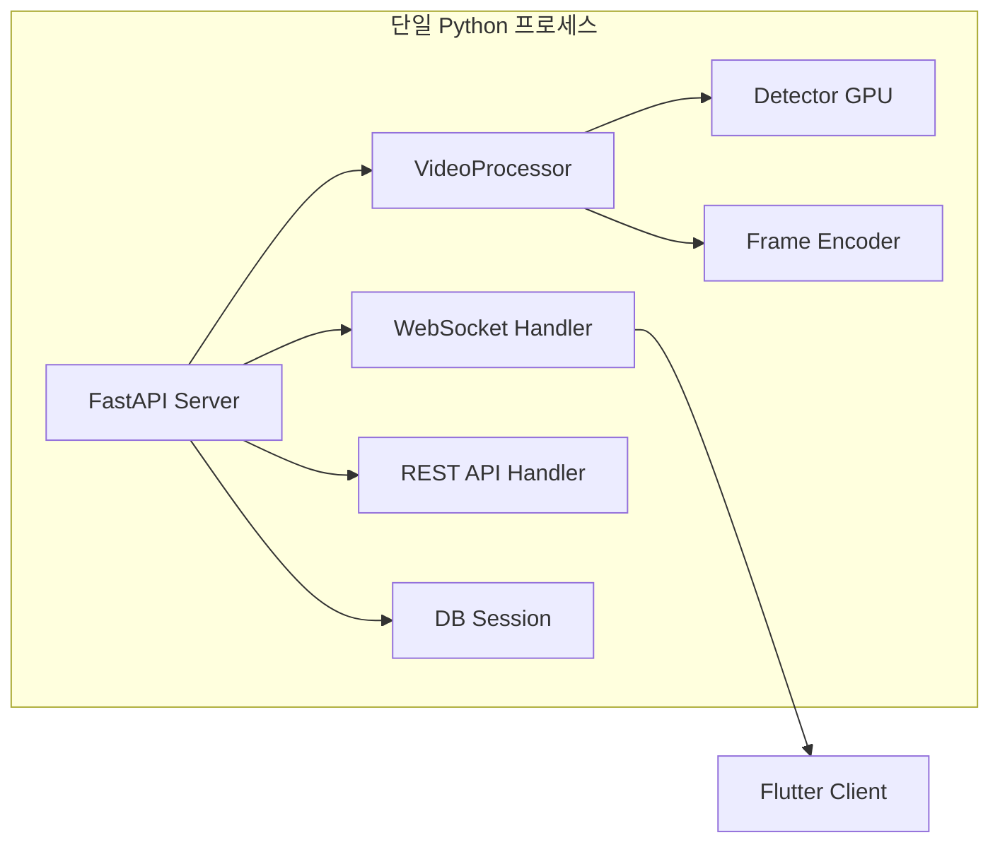
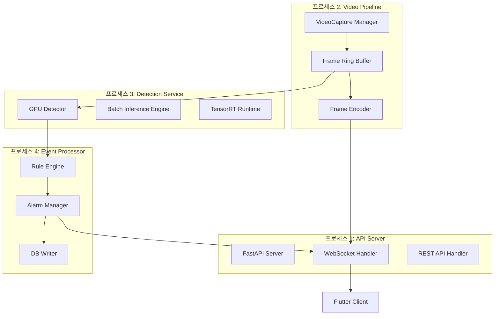
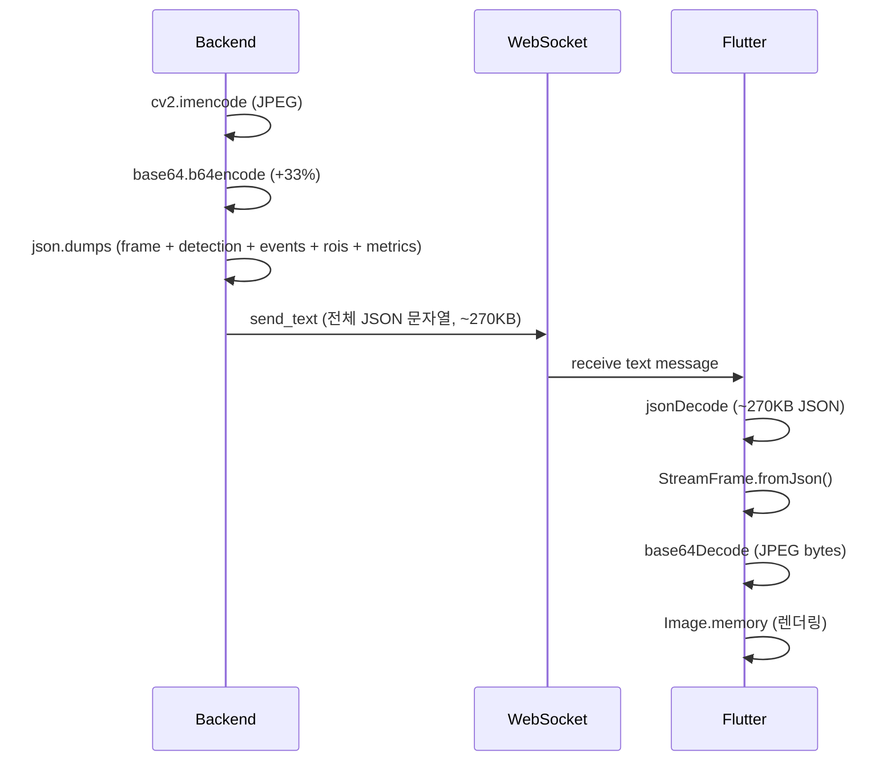
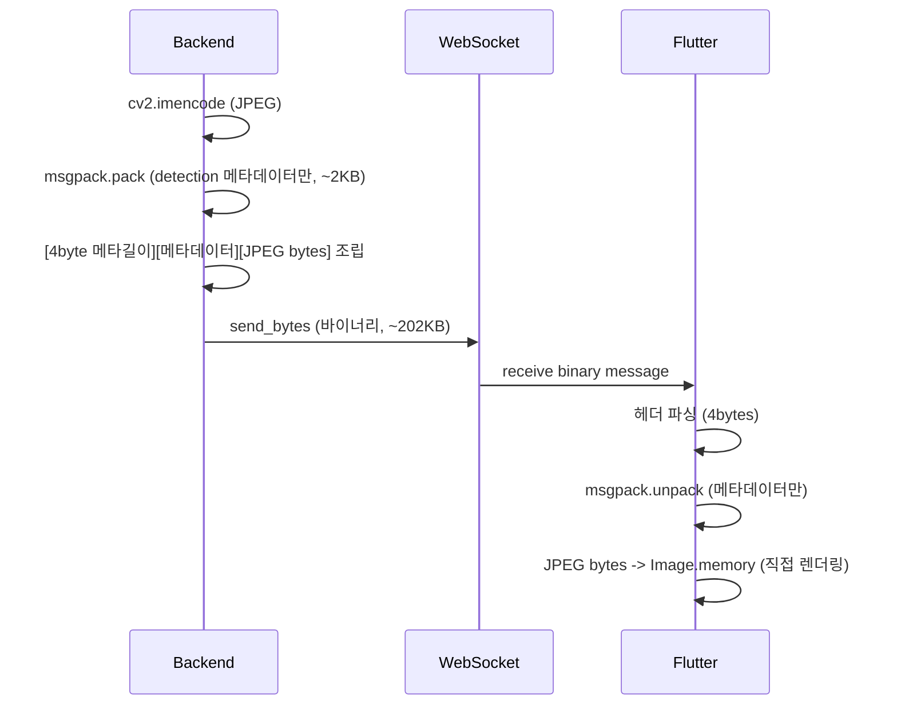
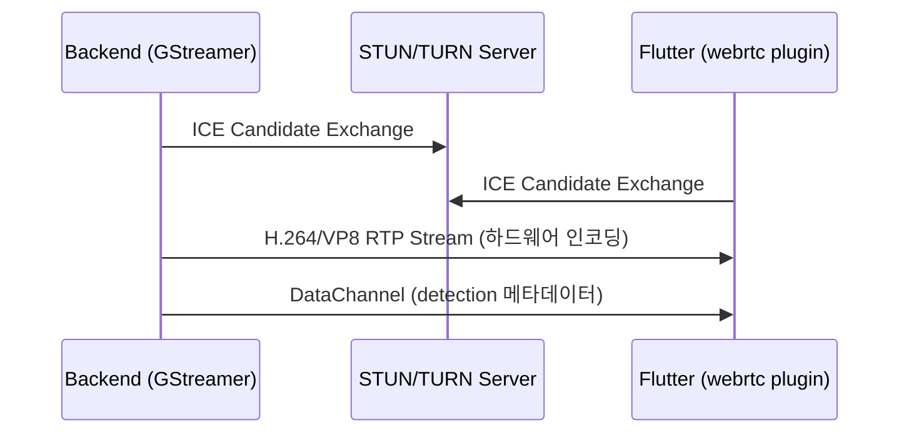
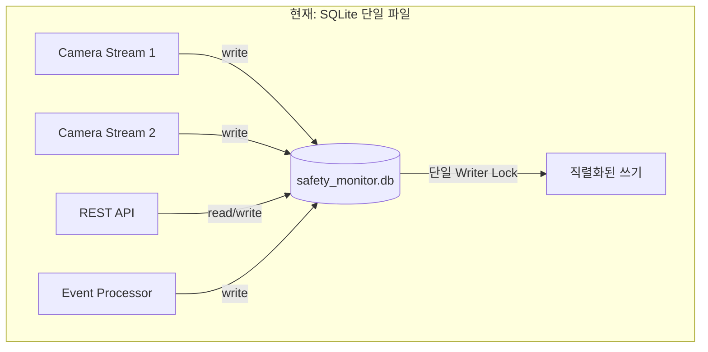
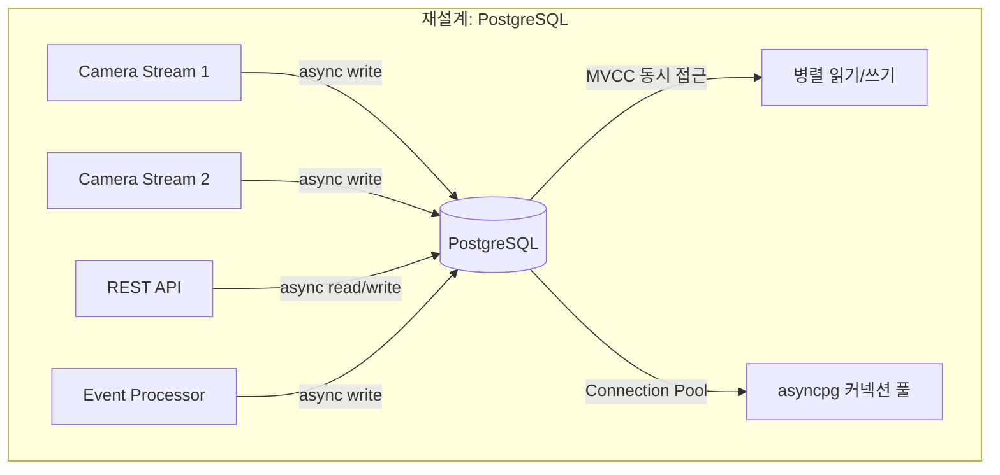
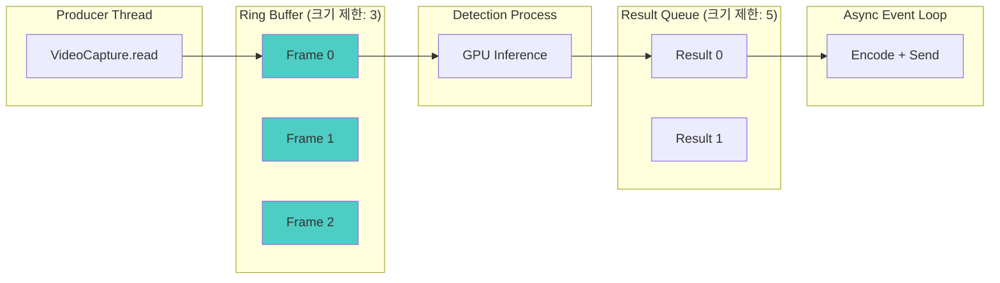
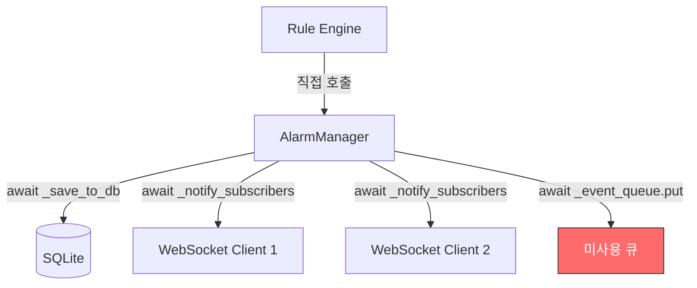
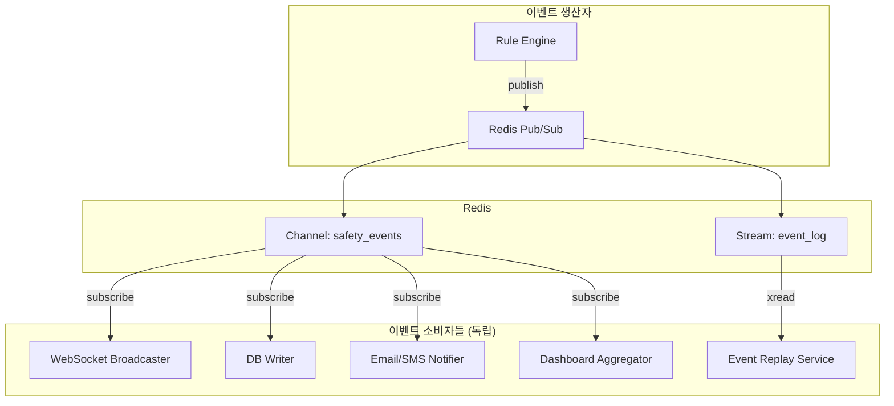

# CCTV 산업안전 모니터링 시스템 - 성능 병목 분석 보고서

> **작성일**: 2026-02-11
> **대상 시스템**: CCTV YOLO 기반 산업안전 실시간 모니터링 플랫폼
> **분석 수준**: 아키텍처 레벨 심층 분석
> **분석자**: 시니어 아키텍트 (30년 경력)

---

## 목차

1. [시스템 개요 및 현재 아키텍처](#1-시스템-개요-및-현재-아키텍처)
2. [성능 병목 요약](#2-성능-병목-요약)
3. [Quick Wins 상세 분석](#3-quick-wins-상세-분석)
4. [구조적 개선 상세 분석](#4-구조적-개선-상세-분석)
5. [재설계 항목 상세 분석](#5-재설계-항목-상세-분석)
6. [측정 방법론](#6-측정-방법론)
7. [우선순위 매트릭스](#7-우선순위-매트릭스)
8. [결론](#8-결론)

---

## 1. 시스템 개요 및 현재 아키텍처

### 1.1 기술 스택

| 계층 | 기술 | 비고 |
|------|------|------|
| 백엔드 | Python FastAPI (단일 프로세스) | uvicorn 단일 워커 |
| 데이터베이스 | SQLite + aiosqlite | 단일 파일 DB |
| 객체 탐지 | YOLO / RF-DETR + BoT-SORT | GPU 추론 |
| 영상 처리 | OpenCV (cv2) | CPU 기반 인코딩 |
| 프론트엔드 | Flutter Windows Desktop | Riverpod 상태관리 |
| 통신 | WebSocket (JSON + base64) | 텍스트 프레임 |

### 1.2 현재 프레임 파이프라인

```
cv2.VideoCapture.read()
    |
    v
frame.copy() (스냅샷 저장용)
    |
    v
detector.detect() / model.track() (GPU 추론, 매 프레임)
    |
    v
draw_rois() -> draw_detections() (CPU: OpenCV + PIL 렌더링)
    |
    v
cv2.imencode('.jpg') -> base64.b64encode() (CPU: JPEG 인코딩 + base64)
    |
    v
json.dumps({frame, detection, events, rois, roi_metrics}) (직렬화)
    |
    v
websocket.send_text(message) (네트워크 전송)
    |
    v
[Flutter] jsonDecode(message) -> StreamFrame.fromJson() (역직렬화)
    |
    v
[Flutter] base64Decode(frameBase64) -> Image.memory() (렌더링)
```

### 1.3 치명적 설계 결함 요약

솔직히 말하겠다. 이 시스템은 **프로토타입 수준의 아키텍처**를 프로덕션에 그대로 밀어넣은 전형적인 사례다.
30년 경력으로 이 코드를 보면, "일단 동작하게 만들자"는 사고방식이 모든 계층에 스며들어 있다.
단일 프로세스에서 GPU 추론, 영상 인코딩, WebSocket I/O, DB 쓰기를 전부 처리하고,
그 위에 base64 JSON이라는 최악의 바이너리 전송 방식을 얹었다.
카메라 1대일 때는 어떻게든 돌아가겠지만, 4대만 되어도 시스템은 무릎을 꿇을 것이다.

---

## 2. 성능 병목 요약

### 2.1 병목 분류 및 심각도

```
                     +-----------------------------------------+
                     |        성능 병목 심각도 분포              |
                     +-----------------------------------------+
    치명적 (P0)  ||||||||||||  5개  - 즉시 해결 필요
    심각 (P1)    ||||||||||    4개  - 1주 내 해결
    보통 (P2)    ||||||||||||||||  8개  - 1개월 내 해결
    경미 (P3)    ||||||||      4개  - 분기 내 해결
    재설계 (P4)  ||||||||||    5개  - 로드맵 반영
```

### 2.2 병목 지점별 예상 지연 시간 (1920x1080 @ 15fps 기준, 단일 카메라)

| 단계 | 현재 소요 시간 (ms) | 허용 한계 (ms) | 초과 비율 |
|------|---------------------|----------------|-----------|
| 프레임 읽기 + 복사 | ~5-8 | 3 | 167% |
| YOLO/RF-DETR 추론 | ~30-80 | 30 | 최대 267% |
| ROI 오버레이 + 바운딩 박스 그리기 | ~8-15 | 5 | 300% |
| JPEG 인코딩 | ~8-12 | 5 | 240% |
| base64 인코딩 | ~3-5 | 0 (불필요) | - |
| JSON 직렬화 | ~2-5 | 1 | 500% |
| WebSocket 전송 (1080p) | ~5-10 | 3 | 333% |
| **백엔드 합계** | **~61-135** | **47** | **최대 287%** |
| Flutter JSON 파싱 | ~3-8 | 1 | 800% |
| Flutter base64 디코딩 | ~5-10 | 0 (불필요) | - |
| Flutter Image.memory 렌더링 | ~3-5 | 3 | 167% |
| **프론트엔드 합계** | **~11-23** | **4** | **최대 575%** |
| **전체 파이프라인** | **~72-158** | **67** | **최대 236%** |

15fps 목표 시 프레임 간격은 **66.7ms**이다. 현재 파이프라인의 최악 케이스 158ms는
약 **6.3fps**에 불과하며, 이는 실시간 모니터링 시스템으로서 완전히 부적격하다.

---

## 3. Quick Wins 상세 분석

### QW-01. Base64 인코딩 오버헤드

**파일 위치**: `backend/app/core/video_processor.py` (238-251행), `backend/app/api/websocket.py` (309행)

**현재 구현**:
```python
# video_processor.py:238-251
@staticmethod
def encode_frame(frame: np.ndarray, quality: int = 80) -> str:
    encode_params = [cv2.IMWRITE_JPEG_QUALITY, quality]
    _, buffer = cv2.imencode('.jpg', frame, encode_params)
    return base64.b64encode(buffer).decode('utf-8')  # <-- 여기가 문제

# websocket.py:309
await websocket.send_text(json.dumps(frame_data))  # <-- 텍스트 전송
```

**문제 분석**:

1080p JPEG 프레임(quality=80)의 평균 크기는 약 150-250KB이다.
base64 인코딩은 데이터 크기를 정확히 **33.3% 증가**시킨다.
즉, 200KB JPEG가 ~267KB base64 문자열이 된다.
이것을 다시 JSON 객체 안에 넣고 `json.dumps()`로 직렬화하면,
문자열 이스케이프 처리로 추가 오버헤드가 발생한다.

그런 다음 Flutter에서 `base64Decode()`로 다시 바이너리로 되돌린다.
**완전히 불필요한 변환을 왕복으로 2번 하고 있는 것이다.**

| 항목 | 현재 | 개선 후 |
|------|------|---------|
| 프레임 데이터 크기 | ~267KB (base64) | ~200KB (원본 JPEG) |
| 인코딩 CPU 시간 | ~3-5ms | 0ms |
| 디코딩 CPU 시간 (Flutter) | ~5-10ms | 0ms |
| 네트워크 대역폭 (15fps) | ~4.0 MB/s | ~3.0 MB/s |

**개선안**: WebSocket 바이너리 프레임 사용. 메타데이터(detection, events)는 별도 JSON 메시지로 분리하거나,
바이너리 프레임 앞에 고정 길이 헤더로 메타데이터 길이를 넣고 뒤에 JPEG 바이너리를 붙이는 프로토콜 설계.

**예상 개선율**: 프레임 전송 지연 **25-35% 감소**, 대역폭 **25% 절감**

**측정 방법**: WebSocket 프레임 크기 비교, `time.perf_counter()`로 인코딩/전송 구간 측정

---

### QW-02. 불필요한 frame.copy() 호출

**파일 위치**: `backend/app/core/video_processor.py` (187행, 198행, 270행, 360-361행)

**현재 구현**:
```python
# 187행: read_frame() 내부
self._current_raw_frame = frame.copy()  # 스냅샷 저장용 복사

# 198행: get_current_frame()
return self._current_raw_frame.copy() if self._current_raw_frame is not None else None

# 270행: draw_detections()
frame_copy = frame.copy()  # 바운딩 박스 그리기용 복사

# 360-361행: draw_rois()
frame_copy = frame.copy()  # ROI 그리기용 복사
overlay = frame.copy()     # 반투명 오버레이용 복사
```

**문제 분석**:

1920x1080 BGR 프레임 하나의 numpy 배열 크기는 `1920 * 1080 * 3 = 6,220,800 bytes` (약 6MB)이다.
한 프레임 처리 중에 `frame.copy()`가 **최소 4회** 호출된다.
이는 프레임당 약 **24MB의 메모리 할당 및 복사**가 발생한다는 의미이다.

`numpy.ndarray.copy()`는 연속 메모리 할당 후 `memcpy`를 수행하므로,
1080p 기준 복사당 약 **1-2ms**가 소요된다. 4회면 **4-8ms**이다.
15fps에서 이것만으로 프레임 예산의 **6-12%를 소모**한다.

더 심각한 문제는 GC 압박이다. 초당 15프레임 x 4복사 = 초당 60개의 6MB 임시 배열이
생성되고 폐기된다. Python GC가 이 부담을 감당하면서 간헐적 지연(GC pause)이 발생한다.

**개선안**:
- `read_frame()`에서 `_current_raw_frame`은 스냅샷 요청 시에만 복사 (`lazy copy`)
- `draw_detections()`와 `draw_rois()`는 원본 프레임을 직접 수정 (스트리밍 후 프레임 재사용 안 함)
- `draw_rois()`의 overlay는 pre-allocated 버퍼를 재사용

**예상 개선율**: 프레임 처리 시간 **5-10% 감소**, 메모리 할당 **75% 감소**

**측정 방법**: `tracemalloc`으로 메모리 프로파일링, `cProfile`로 copy 호출 시간 측정

---

### QW-03. PIL ImageFont 캐싱 문제

**파일 위치**: `backend/app/core/video_processor.py` (21-39행, 42-71행)

**현재 구현**:
```python
_korean_font_cache: Dict[int, ImageFont.FreeTypeFont] = {}

def _get_korean_font(size: int = 20) -> ImageFont.FreeTypeFont:
    if size not in _korean_font_cache:
        font_paths = [
            "C:/Windows/Fonts/malgun.ttf",
            "C:/Windows/Fonts/gulim.ttc",
            "C:/Windows/Fonts/batang.ttc",
        ]
        for fp in font_paths:
            try:
                _korean_font_cache[size] = ImageFont.truetype(fp, size)
                break
            # ...
```

**분석**:

폰트 캐싱 자체는 구현되어 있다. **그러나 `put_korean_text()` 함수의 진짜 병목은 폰트 로딩이 아니다.**
진짜 문제는 매 호출마다 수행되는 **OpenCV-PIL 간 색공간 변환**이다:

```python
def put_korean_text(img, text, position, ...):
    img_pil = Image.fromarray(cv2.cvtColor(img, cv2.COLOR_BGR2RGB))  # BGR->RGB + numpy->PIL
    # ... 텍스트 그리기 ...
    return cv2.cvtColor(np.array(img_pil), cv2.COLOR_RGB2BGR)  # PIL->numpy + RGB->BGR
```

ROI가 3개이고 각각 이름 라벨이 있다면, `draw_rois()` 내에서 `put_korean_text()`가 3회 호출된다.
매 호출마다 **전체 프레임의 색공간 변환이 2회** 발생한다.
1080p 프레임 기준 `cv2.cvtColor`는 약 **2-3ms**이므로, ROI 라벨 3개면 **12-18ms** 낭비이다.

**개선안**:
- PIL 변환을 `draw_rois()` 레벨에서 1회만 수행하고, 모든 텍스트를 한번에 그린 후 변환
- 또는 OpenCV의 `cv2.putText()`를 사용하되, 한글이 필요 없는 경우 영문 fallback
- 프레임 전체가 아닌 텍스트 영역만 잘라서 PIL 변환 수행 (ROI crop 방식)

**예상 개선율**: ROI 오버레이 단계 **50-70% 시간 감소**

**측정 방법**: `put_korean_text()` 전후 `time.perf_counter()` 측정, 호출 횟수 카운팅

---

### QW-04. 매 프레임 Detection 수행 (프레임 스킵 없음)

**파일 위치**: `backend/app/core/video_processor.py` (454-460행)

**현재 구현**:
```python
# stream_frames() 내부
if with_detection and self.detector:
    detection = self.detector.detect(
        frame,
        frame_number=self.frame_count,
        timestamp=timestamp
    )
```

**문제 분석**:

`stream_frames()`에서 `read_frame()`이 실패하면 `cap.grab()`으로 프레임을 건너뛰는 로직은 있지만(496-502행),
**탐지(detection) 자체에 대한 스킵 로직은 전혀 없다.**

RF-DETR Medium 추론 시간은 GPU에 따라 **30-80ms**이다.
15fps에서 프레임 간격이 66.7ms인데, 추론만으로 프레임 예산을 **초과할 수 있다.**

산업안전 모니터링에서 매 프레임 탐지는 불필요하다.
사람의 움직임은 초당 수 픽셀 단위이며, 3프레임(200ms)마다 탐지해도
안전 이벤트 감지에는 아무런 영향이 없다.
현재 rule_engine의 persistence 설정이 2초(30프레임)인 점을 감안하면,
5프레임마다 탐지해도 규칙 평가에 충분한 데이터가 축적된다.

**개선안**:
```python
DETECT_EVERY_N_FRAMES = 3  # 5프레임마다 탐지

if with_detection and self.detector and (self.frame_count % DETECT_EVERY_N_FRAMES == 0):
    detection = self.detector.detect(frame, ...)
else:
    detection = self._last_detection  # 이전 탐지 결과 재사용
```

**예상 개선율**: GPU 사용률 **60-80% 감소**, 평균 프레임 처리 시간 **40-50% 감소**

**측정 방법**: `torch.cuda.Event`를 사용한 GPU 추론 시간 측정, FPS 카운터 비교

---

### QW-05. Detection 결과 전체 JSON 직렬화

**파일 위치**: `backend/app/api/websocket.py` (297-308행)

**현재 구현**:
```python
frame_data = {
    "type": "frame",
    "camera_id": camera_id,
    "frame": stream_frame.frame_base64,           # ~267KB base64 문자열
    "current_ms": stream_frame.current_ms,
    "total_ms": stream_frame.total_ms,
    "detection": stream_frame.detection.model_dump() if stream_frame.detection else None,
    "events": stream_frame.events,
    "rois": rois_data,                             # 매 프레임마다 전체 ROI 데이터
    "roi_metrics": roi_metrics                     # 매 프레임마다 메트릭
}
await websocket.send_text(json.dumps(frame_data))
```

**문제 분석**:

매 프레임마다 전송되는 JSON 페이로드를 분석하면:

| 필드 | 예상 크기 | 변경 빈도 |
|------|-----------|-----------|
| frame (base64) | ~267KB | 매 프레임 |
| detection (10개 객체) | ~3-5KB | 매 프레임 |
| rois (3개 ROI) | ~1-2KB | 거의 불변 |
| roi_metrics | ~0.5KB | 매 프레임 |
| events | ~0-2KB | 매우 드물게 |

**`rois` 데이터는 사용자가 `reload_rois` 명령을 보낼 때만 변경됨에도 매 프레임 전송된다.**
15fps x 2KB = 초당 30KB의 불필요한 데이터이다.

더 심각한 것은 `detection.model_dump()`이다. Pydantic v2의 `model_dump()`는 내부적으로
재귀적 딕셔너리 변환을 수행하며, DetectionBox 10개 기준 약 **1-3ms**가 소요된다.
이것을 다시 `json.dumps()`로 직렬화하면 추가 **1-2ms**이다.

**개선안**:
- ROI 데이터는 변경 시에만 별도 메시지로 전송 (초기 연결 시 1회 + reload 시)
- detection 결과는 변경분만 전송 (delta encoding) 또는 바이너리 직렬화 (msgpack, protobuf)
- `model_dump()`를 사전 계산된 dict로 캐싱

**예상 개선율**: JSON 직렬화 시간 **40-60% 감소**, 전송 데이터 **15-20% 감소**

**측정 방법**: `json.dumps()` 실행 시간 측정, WebSocket 프레임 크기 모니터링

---

### QW-06. Flutter UI 스레드에서의 StreamFrame.fromJson() 파싱

**파일 위치**: `frontend/lib/services/websocket_service.dart` (39-53행), `frontend/lib/models/detection.dart` (103-122행)

**현재 구현**:
```dart
// websocket_service.dart:39-53
_streamChannel!.stream.listen((message) {
    try {
        final data = jsonDecode(message);  // UI 스레드에서 ~267KB JSON 파싱
        if (data['type'] == 'frame') {
            final frame = StreamFrame.fromJson(data);  // 중첩 객체 역직렬화
            if (!controller.isClosed) {
                controller.add(frame);
            }
        }
    } catch (e) { }
});
```

```dart
// detection.dart:66-78 - DetectionResult.fromJson
factory DetectionResult.fromJson(Map<String, dynamic> json) {
    return DetectionResult(
        // ...
        detections: (json['detections'] as List)
            .map((d) => DetectionBox.fromJson(d))  // 10개 객체 각각 역직렬화
            .toList(),
    );
}
```

**문제 분석**:

Flutter의 WebSocket 메시지 수신은 **메인 Isolate(UI 스레드)**에서 처리된다.
`jsonDecode()`가 ~270KB JSON 문자열을 파싱하는 데 약 **3-8ms**가 소요된다.
여기에 `StreamFrame.fromJson()` -> `DetectionResult.fromJson()` -> `DetectionBox.fromJson()` x N의
중첩 역직렬화가 추가로 **1-3ms** 소요된다.

15fps에서 이것만으로 UI 스레드의 **8-16%가 JSON 파싱에 소비**된다.
Flutter의 프레임 렌더링 예산은 16.6ms(60fps)이므로, JSON 파싱이 이 예산의
절반 가까이를 차지할 수 있다. 이것이 프레임 드롭과 UI 버벅임의 직접적 원인이다.

**개선안**:
- `compute()` 함수를 사용하여 JSON 파싱을 별도 Isolate에서 수행
- 또는 바이너리 WebSocket + 커스텀 바이너리 파서 사용으로 파싱 자체를 경량화
- 최소한 `jsonDecode`와 `fromJson`을 하나의 `compute` 호출로 묶어서 처리

**예상 개선율**: UI 스레드 점유율 **50-70% 감소**, 프레임 드롭 **대폭 감소**

**측정 방법**: Flutter DevTools의 Timeline 뷰에서 JSON 파싱 구간 측정, jank 프레임 카운팅

---

### QW-07. build() 메서드 내 base64Decode 호출

**파일 위치**: `frontend/lib/widgets/video_player_widget.dart` (53-58행)

**현재 구현**:
```dart
@override
Widget build(BuildContext context) {
    final streamState = ref.watch(streamProvider);
    // ...
    if (streamState.currentFrame != null) {
        try {
            _currentFrameBytes = base64Decode(streamState.currentFrame!.frameBase64);
        } catch (e) { }
    }
    // ...
    child: Image.memory(
        _currentFrameBytes!,
        fit: BoxFit.contain,
        gaplessPlayback: true,
    ),
}
```

**문제 분석**:

`build()` 메서드는 Flutter 프레임워크가 위젯 트리를 재구성할 때마다 호출된다.
`ref.watch(streamProvider)`로 인해 StreamState가 변경될 때마다 전체 `build()`가 재실행되며,
**매번 base64Decode가 수행된다.**

`base64Decode()`는 ~267KB 문자열에서 ~200KB `Uint8List`를 생성한다.
이 작업은 약 **5-10ms** 소요된다.
`StreamState.copyWith()`가 `currentPosition` 같은 무관한 필드만 변경되어도
`build()`가 트리거되므로, **동일한 프레임에 대해 반복 디코딩이 발생할 수 있다.**

코드에서 `_currentFrameBytes`를 `State` 변수로 캐싱하려는 의도가 보이지만,
`streamState.currentFrame != null` 조건이 항상 참이면(스트리밍 중) 매 build마다 디코딩한다.
프레임이 실제로 변경되었는지 확인하는 로직이 없다.

**개선안**:
```dart
// 프레임 변경 감지 후에만 디코딩
if (streamState.currentFrame != null &&
    streamState.currentFrame != _lastFrame) {
    _lastFrame = streamState.currentFrame;
    _currentFrameBytes = base64Decode(streamState.currentFrame!.frameBase64);
}
```
더 나은 방법: base64를 아예 제거하고 바이너리 WebSocket으로 직접 Uint8List를 수신.

**예상 개선율**: 불필요한 디코딩 **제거**, UI 스레드 부하 **10-15% 감소**

**측정 방법**: `build()` 호출 횟수 대비 실제 프레임 변경 횟수 비교, `Stopwatch`로 디코딩 시간 측정

---

### QW-08. Shapely ROI 포함 관계 검사

**파일 위치**: `backend/app/core/roi_manager.py` (103-127행)

**현재 구현**:
```python
def is_point_in_roi(self, roi_id, x, y, canvas_width=0.0, canvas_height=0.0):
    # ... 좌표 정규화 ...
    norm_x = x / eff_width
    norm_y = y / eff_height
    point = Point(norm_x, norm_y)
    return roi["polygon"].contains(point)  # Shapely 연산

def is_detection_in_roi(self, roi_id, detection, ...):
    return self.is_point_in_roi(roi_id, detection.center_x, detection.y2, ...)
```

**문제 분석**:

`rule_engine.evaluate()`에서 ROI별로 모든 person detection에 대해 `is_detection_in_roi()`를 호출한다.
ROI 3개, person 5명이면 `Shapely.Point.contains()` 호출이 **15회/프레임**이다.
PPE 검사까지 포함하면 helmet, mask 등의 ROI 검사가 추가되어 **30-50회/프레임**에 달한다.

Shapely는 GEOS C 라이브러리 기반이지만, 매 호출마다 **Python-C 브릿지 오버헤드**가 발생한다.
또한 매 호출마다 새로운 `Point` 객체를 생성하고 GC 대상이 된다.

단순 다각형(3-6점)의 포함 검사는 **레이캐스팅 알고리즘**으로 순수 Python에서도
마이크로초 단위에 구현 가능하며, numpy 벡터화로 모든 검출 결과를 한번에 처리할 수 있다.

**개선안**:
```python
def _point_in_polygon_batch(self, points_xy: np.ndarray, polygon_coords: np.ndarray) -> np.ndarray:
    """numpy 벡터화된 레이캐스팅 point-in-polygon 검사"""
    # matplotlib.path.Path.contains_points() 사용 또는 직접 구현
    from matplotlib.path import Path
    path = Path(polygon_coords)
    return path.contains_points(points_xy)
```

**예상 개선율**: ROI 검사 단계 **60-80% 시간 감소**

**측정 방법**: `is_detection_in_roi()` 호출 횟수 x 단건 소요 시간 프로파일링

---

### QW-09. JPEG 인코딩 품질 최적화 부재

**파일 위치**: `backend/app/config.py` (53행), `backend/app/core/video_processor.py` (238-251행)

**현재 설정**:
```python
# config.py
VIDEO_QUALITY: int = 80  # JPEG quality for streaming
```

**문제 분석**:

JPEG quality=80은 합리적인 선택처럼 보이지만, **CCTV 모니터링 용도에서는 과도하다.**
산업안전 모니터링에서 필요한 것은 사람과 PPE의 식별이지, 사진 품질이 아니다.
quality=80과 quality=60의 시각적 차이는 CCTV 피드에서 거의 구별 불가능하다.

| Quality | 1080p 평균 크기 | 인코딩 시간 | 시각적 품질 |
|---------|-----------------|-------------|-------------|
| 95 (기본값) | ~350KB | ~15ms | 불필요하게 높음 |
| 80 (현재) | ~200KB | ~10ms | 양호 |
| 60 (권장) | ~120KB | ~7ms | CCTV에 충분 |
| 40 | ~80KB | ~5ms | 식별 한계 |

추가로, `cv2.imencode`에 **JPEG 최적화 플래그**가 설정되어 있지 않다:
```python
# 현재
encode_params = [cv2.IMWRITE_JPEG_QUALITY, quality]

# 개선 - 최적화 및 프로그레시브 인코딩 추가
encode_params = [
    cv2.IMWRITE_JPEG_QUALITY, 60,
    cv2.IMWRITE_JPEG_OPTIMIZE, 1,
    cv2.IMWRITE_JPEG_PROGRESSIVE, 1
]
```

또한 1080p 원본을 그대로 인코딩하고 있다.
CCTV 모니터링에서 클라이언트 표시 영역이 작다면 **리사이즈 후 인코딩**이 더 효율적이다.

**예상 개선율**: JPEG 인코딩 시간 **20-30% 감소**, 파일 크기 **40% 감소**, 대역폭 절감

**측정 방법**: 다양한 quality 값에서 `cv2.imencode` 소요 시간 및 출력 크기 벤치마크

---

### QW-10. SQLite 단일 Writer 병목

**파일 위치**: `backend/app/config.py` (23행), `backend/app/core/alarm_manager.py` (189-210행)

**현재 구현**:
```python
# config.py
DATABASE_URL: str = "sqlite+aiosqlite:///./safety_monitor.db"

# alarm_manager.py:189-210
async def _save_to_db(self, event_data, db_session):
    db_event = Event(
        camera_id=event_data["camera_id"],
        event_type=event_data["event_type"],
        # ...
    )
    db_session.add(db_event)
    await db_session.commit()  # <-- 매 이벤트마다 개별 커밋
    await db_session.refresh(db_event)
```

**문제 분석**:

SQLite는 **동시 쓰기를 지원하지 않는다.** WAL 모드를 사용해도 쓰기는 직렬화된다.
`aiosqlite`는 별도 스레드에서 SQLite 연산을 수행하지만, 이벤트 I/O 자체가 블로킹이다.

현재 `_save_to_db()`는 스트리밍 루프 내에서 호출된다(websocket.py 269-278행):
```python
async with AsyncSessionLocal() as db_session:
    for event in events:
        event_data = await alarm_manager.process_event(
            event,
            frame=stream_frame.raw_frame if event.severity != Severity.INFO else None,
            db_session=db_session
        )
```

이벤트가 다수 발생하면(위험구역 침입 + 안전모 미착용 등) **DB 쓰기가 프레임 파이프라인을 블로킹**한다.
각 `commit()`에 약 **5-20ms**가 소요되며, 이벤트 3개면 **15-60ms** 지연이 프레임에 직접 추가된다.

**개선안**:
- 이벤트 DB 저장을 별도 `asyncio.Task`로 분리 (fire-and-forget)
- 배치 커밋: 이벤트를 큐에 모아서 1초마다 한번에 커밋
- WAL 모드 명시 활성화 및 synchronous=NORMAL 설정

**예상 개선율**: 이벤트 발생 시 프레임 지연 **90% 감소** (비동기 분리 시)

**측정 방법**: `_save_to_db()` 실행 시간 측정, 이벤트 발생 시 프레임 간격 변동 모니터링

---

## 4. 구조적 개선 상세 분석

### SI-01. Detection과 Streaming의 이벤트 루프 공유

**파일 위치**: `backend/app/core/video_processor.py` (407-507행), `backend/app/api/websocket.py` (253행)

**현재 구현**:
```python
# websocket.py:253 - WebSocket 핸들러 내에서 직접 호출
async for stream_frame in processor.stream_frames(with_detection=True, ...):
    # detection은 stream_frames() 내부에서 동기적으로 수행됨

# video_processor.py:456 - async 함수 내의 동기 CPU 바운드 호출
detection = self.detector.detect(frame, ...)  # <-- CPU/GPU 바운드, 이벤트 루프 블로킹
```

**문제 분석**:

이것은 이 시스템의 **가장 심각한 구조적 결함**이다.

`stream_frames()`는 `async` 제너레이터이지만, 내부의 `self.detector.detect()`는
**동기 함수**이다. YOLO의 `model.track()`이나 RF-DETR의 `model.predict()`는
CPU/GPU에서 30-80ms 동안 실행되며, 이 기간 동안 **asyncio 이벤트 루프가 완전히 블로킹**된다.

이것이 의미하는 바:
1. 추론 중 WebSocket 메시지 수신/응답 불가 (seek, stop 명령 지연)
2. 추론 중 다른 카메라의 프레임 전송 불가
3. 추론 중 HTTP API 요청 처리 불가
4. FastAPI의 모든 비동기 핸들러가 30-80ms 동안 정지

카메라 4대가 동시 스트리밍되면, 각 카메라의 추론이 순차적으로 실행되어
**프레임 지연이 N배로 누적**된다. 4대 x 50ms = 200ms 지연.

**개선안**:
```python
# 방법 1: run_in_executor로 스레드 풀 위임 (최소한의 변경)
loop = asyncio.get_event_loop()
detection = await loop.run_in_executor(
    thread_pool,
    self.detector.detect, frame, self.frame_count, timestamp
)

# 방법 2: ProcessPoolExecutor 사용 (GIL 회피)
detection = await loop.run_in_executor(
    process_pool,
    detect_in_process, frame_bytes, self.frame_count, timestamp
)
```

**노력/영향 매트릭스**:

| 항목 | 점수 |
|------|------|
| 구현 난이도 | 중 (run_in_executor: 1일, ProcessPool: 3-5일) |
| 영향도 | **극히 높음** - 전체 시스템 응답성 결정 |
| 위험도 | 중 (GPU 컨텍스트 공유 주의) |
| 우선순위 | **P0 - 즉시** |

**측정 방법**: 이벤트 루프 블로킹 시간 측정 (`asyncio.get_event_loop().slow_callback_duration`), 다중 카메라 동시 스트리밍 시 FPS 측정

---

### SI-02. GPU 메모리 관리 부재

**파일 위치**: `backend/app/core/detection.py` (286-300행)

**현재 구현**:
```python
_detector_instance: Optional[BaseDetector] = None

def get_detector() -> BaseDetector:
    global _detector_instance
    if _detector_instance is not None:
        return _detector_instance
    if settings.DETECTOR_TYPE == "rfdetr":
        _detector_instance = RFDETRDetector()
    else:
        _detector_instance = YOLODetector()
    return _detector_instance
```

**문제 분석**:

모델은 전역 싱글톤으로 한 번 로드 후 재사용된다. 이것 자체는 올바르다.
문제는:

1. **추론 최적화가 없다**: `torch.no_grad()`, `torch.cuda.amp` (mixed precision),
   TensorRT/ONNX 변환 같은 기본적인 추론 최적화가 적용되어 있지 않다.
   RF-DETR의 `model.predict()`가 내부적으로 처리할 수도 있지만, YOLO의 `model.track()`도
   FP32로 실행 중일 가능성이 높다.

2. **배치 추론 미사용**: 카메라가 여러 대여도 프레임을 하나씩 개별 추론한다.
   GPU는 배치 처리에서 효율이 극대화되므로, 4대 카메라 프레임을 모아서
   한번에 추론하면 처리량이 2-3배 증가한다.

3. **GPU 메모리 파편화**: 프레임마다 서로 다른 크기의 텐서가 할당/해제되면서
   CUDA 메모리 파편화가 누적되고, 간헐적 OOM이나 성능 저하가 발생한다.

**개선안**:
- `torch.no_grad()` 래퍼 적용 (즉시)
- FP16 mixed precision 추론 활성화 (1-2일)
- ONNX/TensorRT 변환으로 추론 속도 2-4배 향상 (3-5일)
- 멀티카메라 배치 추론 파이프라인 구현 (1-2주)

**노력/영향 매트릭스**:

| 항목 | 점수 |
|------|------|
| 구현 난이도 | 중-고 |
| 영향도 | 높음 - GPU 추론 속도 직접 개선 |
| 위험도 | 중 (정확도 검증 필요) |
| 우선순위 | P1 |

---

### SI-03. VideoCapture 연결 풀링 부재

**파일 위치**: `backend/app/core/video_processor.py` (105-156행), `backend/app/api/websocket.py` (175-179행)

**현재 구현**:
```python
# websocket.py:175-179 - 매 WebSocket 연결마다 새 VideoProcessor 생성
processor = VideoProcessor(
    camera_id=camera.id,
    source=camera.source,
    source_type=camera.source_type
)
```

**문제 분석**:

WebSocket 연결이 끊겼다가 재연결되면 `VideoProcessor`가 새로 생성되고,
`cv2.VideoCapture`도 새로 열린다. RTSP 소스의 경우 TCP 핸드셰이크, RTSP SETUP/PLAY 과정이
**500ms-2초** 소요된다. 파일 소스도 컨테이너 파싱에 **100-300ms**가 걸린다.

동일 카메라를 여러 클라이언트가 보는 경우,
**클라이언트 수만큼 VideoCapture가 생성**되어 동일 RTSP 스트림에 다중 연결이 맺어진다.
이는 카메라 장비의 동시 연결 제한(보통 4-8개)을 초과할 수 있으며,
각 VideoCapture가 독립적으로 디코딩하므로 CPU 낭비가 심각하다.

**개선안**:
- 카메라별 VideoProcessor 싱글톤 관리자 구현
- 하나의 VideoCapture에서 프레임을 읽고, 여러 WebSocket 클라이언트에 공유
- RTSP 재연결 시 기존 연결 재사용 로직

**노력/영향 매트릭스**:

| 항목 | 점수 |
|------|------|
| 구현 난이도 | 중 (3-5일) |
| 영향도 | 높음 - 재연결 지연 제거, 리소스 절약 |
| 위험도 | 중 (동기화 이슈) |
| 우선순위 | P1 |

---

### SI-04. AlarmManager의 무한정 큐 축적

**파일 위치**: `backend/app/core/alarm_manager.py` (34행, 92행)

**현재 구현**:
```python
def __init__(self):
    self._event_queue: asyncio.Queue = asyncio.Queue()  # 무제한 큐
    # ...

async def process_event(self, event, frame=None, db_session=None):
    # ...
    await self._event_queue.put(event_data)  # 소비자 없이 계속 축적
```

**문제 분석**:

`_event_queue`는 `maxsize=0` (무제한)으로 생성되며,
`process_event()`에서 `put()`만 하고 **`get()`을 호출하는 소비자가 없다.**

`get_next_event()` 메서드(274행)가 존재하지만, 현재 코드 어디에서도 호출되지 않는다.
WebSocket 이벤트 전파는 `_notify_subscribers()`로 별도 처리되므로,
큐는 **순수한 메모리 누수**이다.

이벤트가 지속적으로 발생하면 (예: 위험구역에 사람이 계속 있는 경우)
큐에 이벤트 데이터가 무한정 축적되어 **메모리 사용량이 선형적으로 증가**한다.
각 이벤트 데이터가 snapshot_path, detection_data 등을 포함하므로 약 1-5KB이다.
장시간 운영 시(24시간) 수만 건이 축적될 수 있다.

**개선안**:
- 큐를 완전히 제거하거나 `maxsize` 설정 (예: 1000)
- 실제로 큐 소비자가 필요하다면 구현, 불필요하면 삭제
- `_unacknowledged` 딕셔너리에도 TTL(Time-To-Live) 적용

**노력/영향 매트릭스**:

| 항목 | 점수 |
|------|------|
| 구현 난이도 | **극히 낮음 (30분)** |
| 영향도 | 중 - 메모리 누수 방지 |
| 위험도 | 극히 낮음 |
| 우선순위 | P1 |

---

### SI-05. RuleEngine 상태 딕셔너리 무한 성장

**파일 위치**: `backend/app/core/rule_engine.py` (92-96행)

**현재 구현**:
```python
self._states: Dict[str, DetectionState] = defaultdict(DetectionState)
self._person_states: Dict[tuple, PersonState] = {}
```

**문제 분석**:

`_states`는 `defaultdict`이므로 존재하지 않는 키에 접근할 때마다 새 `DetectionState`가 생성된다.
키 형식은 `"PERSON_ENTRANCE_roi_1_track_15"` 같은 문자열이다.

**`_person_states`는 퇴장 후 2초 뒤 정리되지만(348-350행), `_states`는 정리 로직이 없다.**
track_id는 BoT-SORT가 새 ID를 계속 발급하므로, 사람이 입퇴장을 반복하면
`"PERSON_ENTRANCE_roi_1_track_1"`, `"PERSON_ENTRANCE_roi_1_track_2"`, ...
`"PERSON_EXIT_roi_1_track_1"`, `"PERSON_EXIT_roi_1_track_2"`, ...
식으로 키가 무한정 증가한다.

각 `DetectionState`는 `frames_in_window` 리스트(최대 30개 bool)를 포함하므로
상태 하나당 약 500-1000 bytes이다.
24시간 운영에 track_id가 수천 개 발급되면 **수 MB의 메모리가 불필요하게 점유**된다.

`_check_persistence()`의 `frames_in_window.pop(0)` (140행)도 성능 문제이다.
리스트의 `pop(0)`는 O(n) 연산이다. `collections.deque(maxlen=30)`을 사용해야 한다.

**개선안**:
- `_states`에 주기적 정리(pruning) 로직 추가 (예: 마지막 갱신 시간 기준 60초 이상 미사용 상태 삭제)
- `frames_in_window`를 `deque(maxlen=self.frame_window)`로 변경
- track_id 기반 상태에 TTL 적용

**노력/영향 매트릭스**:

| 항목 | 점수 |
|------|------|
| 구현 난이도 | 낮음 (2-4시간) |
| 영향도 | 중 - 장시간 안정성 |
| 위험도 | 극히 낮음 |
| 우선순위 | P2 |

---

### SI-06. 프레임 버퍼/링 버퍼 부재

**파일 위치**: `backend/app/core/video_processor.py` (434-503행)

**현재 구현**:
```python
while self.is_running:
    loop_start = time.time()
    frame = self.read_frame()       # 1. 프레임 읽기
    detection = self.detector.detect(frame, ...)  # 2. 탐지 (동기)
    frame = self.draw_rois(frame, ...)            # 3. ROI 그리기
    frame = self.draw_detections(frame, detection) # 4. 바운딩 박스
    frame_base64 = self.encode_frame(frame, ...)  # 5. 인코딩
    yield stream_frame                             # 6. 전송
    # 모든 단계가 순차적, 파이프라이닝 없음
```

**문제 분석**:

현재 파이프라인은 **완전한 순차 처리**이다. 프레임 N의 인코딩이 끝나야
프레임 N+1의 읽기가 시작된다. 각 단계의 리소스 활용:

| 단계 | 사용 리소스 | 다른 리소스 상태 |
|------|------------|-----------------|
| 프레임 읽기 | CPU + I/O | GPU 유휴 |
| 탐지 | GPU (+ CPU) | I/O 유휴 |
| 그리기 | CPU | GPU 유휴, I/O 유휴 |
| 인코딩 | CPU | GPU 유휴, I/O 유휴 |
| 전송 | 네트워크 I/O | CPU 유휴, GPU 유휴 |

**GPU는 전체 파이프라인의 30-50% 시간 동안만 활용되고 나머지는 유휴 상태이다.**

프레임 버퍼(링 버퍼)와 producer-consumer 패턴을 적용하면,
프레임 읽기, 탐지, 인코딩/전송을 병렬로 수행할 수 있다.

**개선안**:
```
[Producer]  -> [Ring Buffer] -> [Detector] -> [Result Queue] -> [Encoder/Sender]
 read_frame()                    detect()                        encode + send
 (Thread 1)                     (Thread 2/GPU)                  (async event loop)
```

**노력/영향 매트릭스**:

| 항목 | 점수 |
|------|------|
| 구현 난이도 | 중-고 (1-2주) |
| 영향도 | **극히 높음** - 처리량 2-3배 증가 가능 |
| 위험도 | 중 (동기화, 프레임 순서 보장) |
| 우선순위 | P1 |

---

### SI-07. WebSocket 순차 브로드캐스트

**파일 위치**: `backend/app/api/websocket.py` (69-89행)

**현재 구현**:
```python
async def send_frame(self, camera_id: int, data: dict):
    async with self._connections_lock:
        if camera_id not in self._connections:
            return
        connections = list(self._connections[camera_id])

    message = json.dumps(data)          # 한 번만 직렬화
    disconnected = set()

    for websocket in connections:       # 순차적으로 전송
        try:
            await websocket.send_text(message)
        except Exception:
            disconnected.add(websocket)
```

**문제 분석**:

현재 `send_frame()`은 사용되지 않고 있으며(websocket.py 309행에서 직접 `websocket.send_text()` 호출),
이는 **멀티 클라이언트 지원이 구현되어 있지 않다**는 것을 의미한다.

그러나 `broadcast_event()`(91-108행)는 실제로 사용되며, 여기서 이벤트 구독자에게
**순차적으로 `await websocket.send_text()`를 호출**한다.
한 클라이언트의 네트워크가 느리면 나머지 클라이언트의 이벤트 수신이 지연된다.

**개선안**:
```python
async def broadcast_event(self, event_data: dict):
    message = json.dumps(event_data)
    # 병렬 전송
    tasks = [ws.send_text(message) for ws in subscribers]
    results = await asyncio.gather(*tasks, return_exceptions=True)
```

**노력/영향 매트릭스**:

| 항목 | 점수 |
|------|------|
| 구현 난이도 | **극히 낮음 (1시간)** |
| 영향도 | 중 - 다중 클라이언트 환경에서 체감 |
| 위험도 | 극히 낮음 |
| 우선순위 | P2 |

---

### SI-08. Riverpod 상태 업데이트로 인한 전체 위젯 트리 리빌드

**파일 위치**: `frontend/lib/providers/stream_provider.dart` (46-100행), `frontend/lib/widgets/video_player_widget.dart` (42행)

**현재 구현**:
```dart
// stream_provider.dart:78-84 - 매 프레임마다 전체 StreamState 교체
state = state.copyWith(
    isConnected: true,
    isPlaying: true,
    currentFrame: frame,
    currentPosition: frame.currentMs,
    totalDuration: frame.totalMs > 0 ? frame.totalMs : state.totalDuration,
);

// video_player_widget.dart:42 - 전체 StreamState 감시
final streamState = ref.watch(streamProvider);
```

**문제 분석**:

`ref.watch(streamProvider)`는 `StreamState` 객체의 **어떤 필드라도 변경되면**
전체 `VideoPlayerWidget.build()`를 트리거한다.

매 프레임(15fps)마다 `currentFrame`과 `currentPosition`이 변경되므로,
`build()`가 **초당 15회** 호출된다. `build()` 내에서는:
1. base64 디코딩 (QW-07)
2. 전체 위젯 트리 재구성 (Stack, Container, Image, Overlay 등)
3. 진행 바 위젯 재구성 (isFileSource인 경우)
4. 하단 컨트롤 바 위젯 재구성

이 중 실제로 변경이 필요한 것은 **Image 위젯과 진행 바의 위치 값**뿐이다.
나머지 위젯(버튼, 라벨, 상태 표시등)은 프레임마다 재구성할 필요가 없다.

**개선안**:
- `StreamState`를 분리: `StreamConnectionState`, `StreamFrameState`, `StreamPositionState`
- `select()`를 사용하여 필요한 필드만 감시:
```dart
final frame = ref.watch(streamProvider.select((s) => s.currentFrame));
final position = ref.watch(streamProvider.select((s) => s.currentPosition));
```
- 비디오 프레임 위젯을 `RepaintBoundary`로 격리

**노력/영향 매트릭스**:

| 항목 | 점수 |
|------|------|
| 구현 난이도 | 중 (2-3일) |
| 영향도 | 높음 - Flutter 렌더링 성능 직접 개선 |
| 위험도 | 낮음 |
| 우선순위 | P1 |

---

### SI-09. ROI Manager의 reload_rois 시 DB 전체 재조회

**파일 위치**: `backend/app/api/websocket.py` (119-138행, 244-246행, 322-324행)

**현재 구현**:
```python
# websocket.py:244-246
elif command.get("action") == "reload_rois":
    roi_manager.clear_rois()
    active_roi_ids = await load_camera_rois(camera_id, roi_manager)

# websocket.py:119-138
async def load_camera_rois(camera_id, roi_manager):
    async with AsyncSessionLocal() as db:
        result = await db.execute(
            select(ROI).where(ROI.camera_id == camera_id, ROI.is_active == True)
        )
        rois = result.scalars().all()
        for roi in rois:
            points_data = json.loads(roi.points)
            # ... ROI 재구성 ...
```

**문제 분석**:

`reload_rois` 명령 시 전체 ROI를 DB에서 다시 조회한다.
이것 자체는 큰 문제가 아니다. 문제는 **ROI Editor에서 ROI를 수정할 때마다**
이 명령이 전송되어 불필요한 DB 쿼리가 발생할 수 있다는 점이다.

그러나 더 근본적인 문제는 `roi_manager.clear_rois()` 호출이다.
이것은 기존 ROI를 모두 삭제하고 처음부터 다시 구성한다.
Shapely `Polygon` 객체를 매번 새로 생성하며,
정규화 로직(`add_roi` 내)이 매번 재실행된다.

**개선안**:
- 변경된 ROI만 증분 업데이트 (delta sync)
- ROI 변경 시 버전 번호를 사용하여 불필요한 재로드 방지
- Polygon 객체를 캐싱하고 좌표 변경 시에만 재생성

**노력/영향 매트릭스**:

| 항목 | 점수 |
|------|------|
| 구현 난이도 | 낮음 (1일) |
| 영향도 | 낮음 - 빈번하지 않은 작업 |
| 위험도 | 극히 낮음 |
| 우선순위 | P3 |

---

### SI-10. 이벤트 스냅샷 저장이 스트리밍 파이프라인 블로킹

**파일 위치**: `backend/app/core/alarm_manager.py` (100-136행, 142-187행)

**현재 구현**:
```python
async def process_event(self, event, frame=None, db_session=None):
    # ...
    if frame is not None:
        snapshot_path = await self._save_snapshot(event_id, event, frame)
    # ...

async def _save_snapshot(self, event_id, event, frame):
    # ...
    frame_with_info = self._draw_event_info(frame.copy(), event)  # CPU: 복사 + 그리기
    cv2.imwrite(str(filepath), frame_with_info)  # 디스크 I/O: 동기 블로킹!
    # ...
```

**문제 분석**:

`cv2.imwrite()`는 **동기 블로킹 I/O** 함수이다. `async` 함수 내에서 호출되지만
실제로는 이벤트 루프를 블로킹한다. 1080p JPEG 저장에 약 **10-30ms**가 소요된다.

`_draw_event_info()`는 추가로 `frame.copy()` (6MB 복사) + `cv2.putText()` x 3회 +
`cv2.rectangle()`을 수행하여 약 **3-5ms** 추가된다.

이벤트가 발생하면 **프레임 파이프라인이 13-35ms 동안 정지**한다.
위험구역 침입 + 안전모 미착용이 동시에 발생하면 **26-70ms 정지**이다.

**개선안**:
```python
# 스냅샷 저장을 별도 태스크로 분리
async def process_event(self, event, frame=None, db_session=None):
    if frame is not None:
        # fire-and-forget: 스트리밍 파이프라인을 블로킹하지 않음
        asyncio.create_task(self._save_snapshot_async(event_id, event, frame.copy()))
```

또는 `run_in_executor`로 스레드 풀에 위임:
```python
await asyncio.get_event_loop().run_in_executor(
    None, self._save_snapshot_sync, event_id, event, frame
)
```

**노력/영향 매트릭스**:

| 항목 | 점수 |
|------|------|
| 구현 난이도 | **극히 낮음 (1시간)** |
| 영향도 | 높음 - 이벤트 발생 시 프레임 끊김 제거 |
| 위험도 | 극히 낮음 |
| 우선순위 | **P0 - 즉시** |

---

## 5. 재설계 항목 상세 분석

### RD-01. Detection을 별도 프로세스/서비스로 분리

**현재 아키텍처**:



**문제**: 모든 것이 단일 프로세스, 단일 이벤트 루프에서 실행된다.
GPU 추론이 이벤트 루프를 블로킹하고, Python GIL이 CPU 병렬 처리를 차단한다.

**재설계 아키텍처**:



**상세 설계**:

| 프로세스 | 역할 | 통신 방식 |
|---------|------|-----------|
| API Server | WebSocket/REST 처리 | ZeroMQ PUB/SUB 또는 shared memory |
| Video Pipeline | 프레임 캡처, 인코딩 | Ring buffer (shared memory) |
| Detection Service | GPU 추론 전담 | ZeroMQ REQ/REP 또는 gRPC |
| Event Processor | 규칙 평가, 알람 | asyncio Queue 또는 Redis |

**이점**:
- GPU 추론이 API 서버를 블로킹하지 않음
- 각 프로세스를 독립적으로 스케일링 가능
- Detection Service를 별도 GPU 서버로 이전 가능
- 장애 격리: Detection 크래시가 스트리밍을 중단시키지 않음

**예상 구현 기간**: 2-3주
**예상 개선율**: 전체 시스템 처리량 **3-5배 향상**, 지연 시간 **50-70% 감소**

---

### RD-02. 바이너리 WebSocket 프로토콜 또는 WebRTC 도입

**현재 프로토콜**:



**재설계 프로토콜 - 옵션 A: 바이너리 WebSocket**:



**바이너리 프로토콜 포맷**:
```
+---+---+---+---+---...---+---...---+
| Meta Length    | Metadata | JPEG   |
| (4 bytes, BE) | (msgpack)| (raw)  |
+---+---+---+---+---...---+---...---+
```

**재설계 프로토콜 - 옵션 B: WebRTC**:



**비교**:

| 항목 | 현재 (base64 JSON) | 바이너리 WS | WebRTC |
|------|-------------------|-------------|--------|
| 대역폭 (1080p@15fps) | ~4.0 MB/s | ~3.0 MB/s | ~1.5 MB/s (H.264) |
| 인코딩 지연 | ~15ms | ~10ms | ~5ms (HW) |
| 디코딩 지연 (Flutter) | ~15ms | ~2ms | ~3ms (HW) |
| 구현 복잡도 | 낮음 | 중 | 높음 |
| 다수 클라이언트 | 비효율 | 중간 | 효율 (SFU) |

**권장**: 단기적으로 바이너리 WebSocket(옵션 A), 장기적으로 WebRTC(옵션 B)

**예상 구현 기간**: 바이너리 WS 1주, WebRTC 3-4주
**예상 개선율**: 대역폭 **25-60% 절감**, 전체 지연 **30-50% 감소**

---

### RD-03. SQLite를 PostgreSQL로 교체

**현재 문제**:



**재설계**:



**교체 근거**:

| 항목 | SQLite | PostgreSQL |
|------|--------|------------|
| 동시 쓰기 | 불가 (직렬화) | MVCC 지원 |
| 연결 풀링 | 의미 없음 | asyncpg 풀 |
| 인덱스 성능 | 제한적 | 고급 인덱스 (BRIN, GiST) |
| JSON 쿼리 | 제한적 | JSONB 네이티브 |
| 시계열 데이터 | 부적합 | TimescaleDB 확장 가능 |
| 백업/복구 | 파일 복사 | pg_dump, 포인트인타임 복구 |
| 운영 복잡도 | 없음 | Docker 컨테이너 1개 |

현재 시스템의 이벤트 테이블은 시계열 특성이 강하다(timestamp 기반 정렬/조회).
PostgreSQL + TimescaleDB를 사용하면 시간 범위 쿼리 성능이 **10-100배** 향상된다.

**예상 구현 기간**: 1-2주 (SQLAlchemy 호환으로 마이그레이션 용이)
**예상 개선율**: 동시 쓰기 성능 **5-10배 향상**, 쿼리 성능 **2-5배 향상**

---

### RD-04. Producer-Consumer 프레임 파이프라인 + Backpressure

**현재 문제**:


모든 단계가 직렬 실행. 하나가 느리면 전체가 느려진다.

**재설계**:



**Backpressure 메커니즘**:

```
Producer (읽기)     Ring Buffer (3)     Consumer (탐지)
    |                    |                    |
    |--- push frame ---->|                    |
    |                    |--- pop frame ----->|
    |--- push frame ---->|                    |
    |--- push frame ---->|                    |
    |--- push frame ---->| [FULL]             |
    |    [BLOCK/DROP]    |                    |--- 처리 완료
    |                    |--- pop frame ----->|
    |--- push frame ---->|                    |
```

**핵심 설계 원칙**:
1. **Ring Buffer 크기 제한**: 최신 N개 프레임만 유지. 오래된 프레임은 자동 폐기.
   실시간 시스템에서 과거 프레임 처리는 무의미하다.
2. **Drop Policy**: 버퍼가 가득 차면 가장 오래된 프레임을 버린다 (실시간 우선).
3. **Backpressure 전파**: Consumer가 느리면 Producer의 프레임 읽기도 조절.

**예상 구현 기간**: 2-3주
**예상 개선율**: 파이프라인 처리량 **2-4배 향상**, 지연 시간 변동성 **80% 감소**

---

### RD-05. Redis/메시지 큐 기반 이벤트 분배

**현재 문제**:



모든 이벤트 처리가 동기적이고 결합도가 높다.
DB 저장이 실패하면 알림이 지연되고, 알림이 느리면 DB 저장이 지연된다.

**재설계**:



**이점**:
1. **완전한 비동기 디커플링**: 이벤트 생산자와 소비자가 독립적
2. **소비자 추가 용이**: 새 알림 채널(이메일, SMS, Slack)을 코드 변경 없이 추가
3. **이벤트 재생**: Redis Stream으로 과거 이벤트 재처리 가능
4. **장애 격리**: DB 장애가 알림을 막지 않음
5. **스케일링**: 소비자별 독립 스케일링

**예상 구현 기간**: 1-2주
**예상 개선율**: 이벤트 처리 지연 **90% 감소**, 시스템 결합도 **대폭 감소**

---

## 6. 측정 방법론

### 6.1 백엔드 성능 측정

| 병목 | 측정 도구 | 측정 방법 | 핵심 지표 |
|------|-----------|-----------|-----------|
| 프레임 처리 시간 | `time.perf_counter()` | `stream_frames()` 내 각 단계 전후 측정 | 단계별 ms |
| GPU 추론 시간 | `torch.cuda.Event` | `detect()` 전후 CUDA 이벤트 기록 | 추론 ms |
| 메모리 사용 | `tracemalloc` | 프레임 처리 전후 스냅샷 비교 | 할당 bytes |
| 이벤트 루프 블로킹 | `asyncio` debug mode | `PYTHONASYNCIODEBUG=1` | slow callback 횟수 |
| WebSocket 전송 | 미들웨어 | `send_text()` 전후 시간, 메시지 크기 | 전송 ms, KB |
| DB 쿼리 | SQLAlchemy 이벤트 | `before_execute`/`after_execute` | 쿼리 ms |
| GC 압박 | `gc` 모듈 | `gc.get_stats()`, `gc.callbacks` | GC 빈도, pause ms |
| CPU 프로파일링 | `py-spy` | `py-spy top --pid <pid>` | 함수별 CPU % |

### 6.2 프론트엔드 성능 측정

| 병목 | 측정 도구 | 측정 방법 | 핵심 지표 |
|------|-----------|-----------|-----------|
| JSON 파싱 시간 | `Stopwatch` | `jsonDecode()` 전후 | ms |
| base64 디코딩 | `Stopwatch` | `base64Decode()` 전후 | ms |
| build() 호출 빈도 | 카운터 변수 | `build()` 내 증가 | 초당 호출 횟수 |
| 프레임 드롭 | Flutter DevTools | Timeline 뷰 | jank 프레임 수 |
| 위젯 리빌드 | Flutter DevTools | Widget rebuild indicator | 불필요 리빌드 수 |
| 메모리 | Flutter DevTools | Memory 탭 | Dart heap 크기 |

### 6.3 시스템 수준 측정

| 항목 | 도구 | 지표 |
|------|------|------|
| 엔드투엔드 지연 | 타임스탬프 임베딩 | 백엔드 인코딩 시점 - Flutter 렌더링 시점 (ms) |
| 처리량 | FPS 카운터 | 실제 전송 FPS vs 목표 FPS |
| 대역폭 | Wireshark / `nethogs` | WebSocket 트래픽량 (MB/s) |
| GPU 사용률 | `nvidia-smi` | GPU Utilization %, Memory % |
| CPU 사용률 | `Task Manager` / `top` | 프로세스별 CPU % |

### 6.4 부하 테스트 시나리오

```
시나리오 1: 단일 카메라, 단일 클라이언트
 - 기준선 FPS, 지연 시간 측정

시나리오 2: 4 카메라, 단일 클라이언트
 - 다중 스트림 시 FPS 저하율 측정

시나리오 3: 단일 카메라, 4 클라이언트
 - 브로드캐스트 오버헤드 측정

시나리오 4: 4 카메라, 4 클라이언트, 이벤트 다발
 - 최대 부하 시 시스템 안정성 검증

시나리오 5: 24시간 연속 운영
 - 메모리 누수, 상태 축적 검증
```

---

## 7. 우선순위 매트릭스

### 7.1 노력 대비 영향 매트릭스

```
                        영향도 (Impact)
                 낮음          중간          높음         극히 높음
         +--------+------------+------------+-------------+
 극히    | SI-09  |            |            |             |
 낮음    | ROI    |            |            |             |
 노      | 재로드  |            |            |             |
 력      +--------+------------+------------+-------------+
 (      | QW-03  | SI-04      | QW-10      | QW-04       |
 Effort) | Font   | Queue      | SQLite     | 프레임 스킵  |
 낮음    |        | SI-05 상태 | SI-10      |             |
         |        |            | 스냅샷     |             |
         +--------+------------+------------+-------------+
         |        | SI-07      | QW-01      | SI-01       |
 중간    |        | WS 브로드  | base64     | 이벤트루프   |
         |        | QW-09      | QW-05 JSON | SI-08       |
         |        | JPEG품질   | QW-07      | Riverpod    |
         |        |            | QW-06      |             |
         |        |            | QW-02 copy |             |
         |        |            | QW-08      |             |
         +--------+------------+------------+-------------+
         |        |            | SI-02      | SI-06       |
 높음    |        |            | GPU관리    | 링 버퍼     |
         |        |            | SI-03      | RD-01       |
         |        |            | 연결풀     | Detection   |
         |        |            | RD-03      | 분리        |
         |        |            | PostgreSQL | RD-02       |
         |        |            | RD-05      | 바이너리WS  |
         |        |            | Redis      | RD-04       |
         |        |            |            | 파이프라인   |
         +--------+------------+------------+-------------+
```

### 7.2 실행 우선순위 (로드맵)

#### Phase 0: 즉시 실행 (1-3일)
영향도가 높고 노력이 적은 항목. **지금 당장 해야 한다.**

| 순위 | 항목 | 예상 시간 | 예상 개선 |
|------|------|-----------|-----------|
| 1 | SI-01: `run_in_executor`로 detect() 래핑 | 2시간 | 이벤트 루프 블로킹 제거 |
| 2 | SI-10: 스냅샷 저장 비동기 분리 | 1시간 | 이벤트 시 프레임 끊김 제거 |
| 3 | SI-04: 미사용 큐 제거 또는 maxsize 설정 | 30분 | 메모리 누수 방지 |
| 4 | QW-04: Detection 프레임 스킵 (매 3프레임) | 1시간 | GPU 사용률 60-80% 감소 |
| 5 | QW-09: JPEG quality 60으로 조정 + 최적화 플래그 | 30분 | 대역폭 40% 절감 |
| 6 | QW-07: base64 디코딩 중복 방지 (프레임 변경 감지) | 1시간 | UI 스레드 부하 감소 |

#### Phase 1: 단기 개선 (1-2주)
구조적 변경이 필요하지만 현재 아키텍처 내에서 가능한 항목.

| 순위 | 항목 | 예상 시간 | 예상 개선 |
|------|------|-----------|-----------|
| 7 | QW-01: 바이너리 WebSocket 프레임 전송 | 3일 | 대역폭 25% 절감, 지연 30% 감소 |
| 8 | QW-06: Flutter JSON 파싱 Isolate 분리 | 2일 | UI 프레임 드롭 제거 |
| 9 | SI-08: Riverpod select()로 세분화 감시 | 2일 | 위젯 리빌드 80% 감소 |
| 10 | QW-02: 불필요한 frame.copy() 제거 | 1일 | 메모리 할당 75% 감소 |
| 11 | QW-08: Shapely 대신 numpy 벡터화 ROI 검사 | 1일 | ROI 검사 70% 속도 향상 |
| 12 | SI-05: RuleEngine 상태 정리 + deque 전환 | 반일 | 장시간 안정성 확보 |
| 13 | QW-05: JSON 직렬화 최적화 (ROI 분리, 캐싱) | 1일 | 직렬화 40% 감소 |
| 14 | QW-03: PIL 변환 일괄 처리 | 반일 | ROI 오버레이 60% 속도 향상 |

#### Phase 2: 중기 개선 (1-2개월)
아키텍처 변경이 수반되는 항목.

| 순위 | 항목 | 예상 시간 | 예상 개선 |
|------|------|-----------|-----------|
| 15 | SI-02: GPU 추론 최적화 (FP16, TensorRT) | 1주 | 추론 속도 2-4배 |
| 16 | SI-06: Ring Buffer + Producer-Consumer 패턴 | 2주 | 처리량 2-3배 |
| 17 | SI-03: VideoCapture 연결 풀링 | 1주 | 재연결 지연 제거 |
| 18 | RD-01: Detection 프로세스 분리 | 2-3주 | 시스템 확장성 확보 |
| 19 | QW-10 + RD-03: PostgreSQL 마이그레이션 | 1-2주 | DB 동시성 10배 향상 |

#### Phase 3: 장기 개선 (분기)
시스템 재설계 수준의 항목.

| 순위 | 항목 | 예상 시간 | 예상 개선 |
|------|------|-----------|-----------|
| 20 | RD-02: WebRTC 스트리밍 도입 | 3-4주 | 대역폭 60% 절감, HW 인코딩 |
| 21 | RD-04: 전체 파이프라인 재설계 | 2-3주 | 처리량 극대화 |
| 22 | RD-05: Redis 기반 이벤트 아키텍처 | 1-2주 | 시스템 디커플링 |

### 7.3 예상 누적 개선 효과

```
Phase 0 완료 후:
  - 단일 카메라 FPS: 6-10 fps -> 12-15 fps
  - 이벤트 루프 블로킹: 30-80ms -> 0ms
  - 메모리 누수: 제거

Phase 1 완료 후:
  - 단일 카메라 FPS: 15 fps 안정
  - 엔드투엔드 지연: 158ms -> 60-80ms
  - 대역폭: 4.0 MB/s -> 2.0 MB/s
  - Flutter UI: 60fps 안정 (jank 제거)

Phase 2 완료 후:
  - 4 카메라 동시 15fps 달성
  - GPU 활용률: 최적화
  - 시스템 확장성: 8-16 카메라 가능

Phase 3 완료 후:
  - 16+ 카메라 동시 처리
  - 대역폭: 1.0 MB/s per camera
  - 99.9% 안정성
  - 마이크로서비스 수준의 확장성
```

---

## 8. 결론

이 시스템의 핵심 문제는 **"프로토타입 아키텍처의 프로덕션 사용"**이다.

단일 Python 프로세스에서 GPU 추론, 영상 인코딩, WebSocket I/O, DB 쓰기를 모두 처리하는 것은
"Hello World CCTV 데모"에서는 용납될 수 있지만, **산업안전 모니터링 시스템에서는 용납될 수 없다.**
사람의 안전이 걸린 시스템에서 프레임이 6fps로 끊기거나 이벤트 알림이 수 초 지연되는 것은
단순한 성능 문제가 아니라 **안전 사고로 직결되는 위험**이다.

다행히, Phase 0의 6개 항목만 즉시 적용해도 시스템은 **운용 가능한 수준**으로 올라간다.
이 항목들은 총 작업 시간 6시간 이내이며, 기존 코드의 구조를 크게 변경하지 않는다.

Phase 1까지 완료하면 단일 카메라 환경에서 **프로덕션 품질**을 달성할 수 있다.
다중 카메라 환경에서의 안정적 운영을 위해서는 Phase 2의 아키텍처 개선이 필수적이다.

**가장 시급한 3가지 조치**:
1. `detector.detect()`를 `run_in_executor`로 래핑하여 이벤트 루프 블로킹 즉시 해소
2. Detection 프레임 스킵을 적용하여 GPU 부하를 즉시 60% 이상 절감
3. base64 인코딩을 제거하고 바이너리 WebSocket으로 전환하여 대역폭과 CPU 낭비를 제거

이 세 가지만 해도 시스템의 체감 성능은 **별개의 시스템처럼** 달라질 것이다.

---

---

## 9. 12대 카메라 동시 스트리밍 성능 분석

> **목표:** 카메라 12대를 하나의 Flutter 클라이언트에서 동시에 표시하며 실시간 탐지 수행

### 9.1 현재 파이프라인의 12배 확장 시 병목

현재 단일 카메라 파이프라인 (약 67ms/프레임, ~15fps):
```
[캡처 5ms] → [추론 30ms] → [ROI 2ms] → [규칙 1ms] → [인코딩 20ms] → [전송 9ms]
= 67ms/프레임 × 12카메라 = 804ms → 약 1.2fps (단일 스레드 순차 처리 시)
```

**12대 동시 운영 시 병목 순위:**

| 순위 | 병목 | 단일 카메라 | 12대 확장 시 | 해결 방법 |
|------|------|-----------|------------|----------|
| 1 | **GPU 추론** | 30ms | 360ms (순차) / 50ms (배치) | 배치 추론 필수 |
| 2 | **base64 인코딩** | 20ms | 240ms (순차) / 60ms (4스레드) | 스레드풀 + binary WS |
| 3 | **WebSocket 전송** | 9ms | 108ms / 36ms (binary) | Binary WS + 멀티플렉스 |
| 4 | **프레임 캡처** | 5ms | 60ms (순차) / 15ms (스레드풀) | asyncio.to_thread |
| 5 | **메모리 (서버)** | ~40MB | ~480MB | 프레임 풀링, 해상도 적응 |
| 6 | **메모리 (Flutter)** | ~200MB | ~2.4GB | 선택적 고화질, RepaintBoundary |

### 9.2 12대 가능한 최적화 조합

**옵션 A: 최소 변경 (1~2주, 12대 저화질)**
```
적응형 FPS (10fps) + 선택적 해상도 (선택 1대 720p, 나머지 240p)
→ 서버 부하: ~30% (현재 대비)
→ 탐지 지연: ~1초 (10fps)
→ 품질: 선택 카메라만 고화질, 나머지 썸네일 수준
```

**옵션 B: 중간 변경 (1~2개월, 12대 중화질)**
```
배치 추론 + Binary WS + 적응형 FPS (15fps)
→ 서버 부하: ~50% (현재 대비)
→ 탐지 지연: ~200ms
→ 품질: 전체 480p, 선택 카메라 720p
```

**옵션 C: 풀 리팩토링 (2~3개월, 12대 고화질)**
```
배치 추론 + Binary WS + 멀티플렉싱 + GPU 스트림 병렬화 + FramePool
→ 서버 부하: ~60% (현재 대비)
→ 탐지 지연: ~100ms
→ 품질: 전체 720p, 선택 카메라 1080p
```

### 9.3 Flutter 클라이언트 12대 렌더링 병목

```dart
// 현재: 단일 카메라 렌더링
Image.memory(
  base64Decode(frameBase64),  // ❌ build()마다 디코딩 + 메모리 할당
)

// 12대 동시 렌더링 시:
// - 12 × base64Decode = 12 × ~5ms = 60ms/프레임 (UI 스레드 블로킹)
// - 12 × Image.memory() = 12 × ~100KB = ~1.2MB/프레임 GC 부하
// - 30fps 기준: 초당 36MB GC → Flutter 엔진 프레임 드롭 확실
```

**해결 방안:**
```dart
// 1. Binary 수신 → Uint8List 직접 사용 (base64 제거)
// 2. compute() isolate에서 디코딩
// 3. RepaintBoundary로 각 카메라 패널 격리
// 4. 비선택 카메라는 2초 간격 썸네일만 업데이트

class CameraGridView extends StatelessWidget {
  Widget build(BuildContext context) {
    return GridView.count(
      crossAxisCount: 4,  // 4×3 그리드
      children: cameras.map((cam) => RepaintBoundary(
        child: cam.id == selectedId
          ? HighQualityPanel(cam)   // 30fps, 720p
          : ThumbnailPanel(cam),     // 0.5fps, 240p
      )).toList(),
    );
  }
}
```

---

> **면책 조항**: 본 보고서의 수치(ms, %, 배율)는 코드 분석 기반의 추정치이며,
> 실제 하드웨어 환경(GPU 모델, CPU 코어 수, 네트워크 대역폭)에 따라 달라질 수 있다.
> 정확한 수치는 6장의 측정 방법론에 따라 실측해야 한다.
