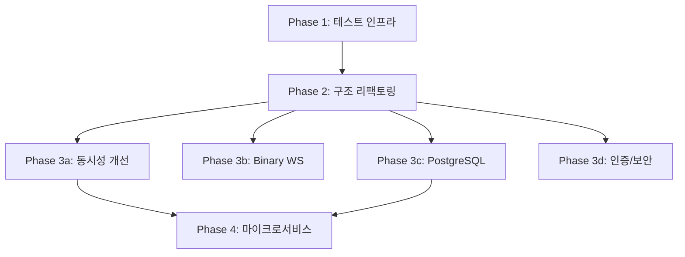

# O. 리팩토링 로드맵 (Refactoring Roadmap)

> 작성 기준: 30년 경력 시니어 아키텍트
> 대상 시스템: CCTV SAFE-YOLO Industrial Monitoring System
> 작성일: 2026-02-11

---

## 리팩토링 원칙

1. **기존 동작을 먼저 테스트로 보호한 후 수정한다**
2. **한 번에 하나의 변경만 한다**
3. **각 단계 후 시스템이 동작하는 상태를 유지한다**

---

## Phase 1: 기반 구축 (1주)

**목표: 리팩토링을 안전하게 수행할 수 있는 테스트 인프라 구축**

### 1.1 테스트 프레임워크 설정

| 작업 | 대상 파일 | 리스크 | 테스트 |
|------|----------|--------|--------|
| pytest + conftest.py 설정 | tests/conftest.py (신규) | 없음 | 실행 확인 |
| 테스트 DB 팩토리 (인메모리 SQLite) | tests/conftest.py | 없음 | DB 접근 확인 |
| Detector 모킹 인프라 | tests/mocks/detector.py (신규) | 없음 | 모킹 확인 |
| API 테스트 클라이언트 (TestClient) | tests/conftest.py | 없음 | 엔드포인트 호출 확인 |

### 1.2 핵심 모듈 보호 테스트 작성

| 작업 | 대상 파일 | 리스크 | 테스트 |
|------|----------|--------|--------|
| RuleEngine 단위 테스트 (10개+) | tests/test_rule_engine.py | 없음 | 현재 동작 캡처 |
| ROIManager 단위 테스트 (5개+) | tests/test_roi_manager.py | 없음 | 좌표 변환 검증 |
| Camera CRUD API 테스트 | tests/test_cameras.py | 없음 | REST API 검증 |
| Event CRUD API 테스트 | tests/test_events.py | 없음 | REST API 검증 |
| ROI CRUD API 테스트 | tests/test_rois.py | 없음 | REST API 검증 |

### 1.3 CI 파이프라인 최소 설정

| 작업 | 대상 파일 | 리스크 | 테스트 |
|------|----------|--------|--------|
| GitHub Actions 워크플로우 | .github/workflows/test.yml | 없음 | PR에서 자동 테스트 |
| pre-commit 설정 (lint, format) | .pre-commit-config.yaml | 없음 | 커밋 시 자동 검사 |

**Phase 1 완료 기준:**
- [ ] pytest 실행 시 모든 테스트 통과
- [ ] CI에서 자동 테스트 실행
- [ ] 테스트 커버리지 40%+ (핵심 모듈)

---

## Phase 2: 구조적 리팩토링 (2주)

**목표: 전역 싱글턴 제거, 계층 분리, 에러 핸들링 개선**

### 2.1 전역 싱글턴 → FastAPI 의존성 주입

| 작업 | 대상 파일 | 리스크 | 테스트 |
|------|----------|--------|--------|
| DetectorProvider 클래스 생성 | core/dependencies.py (신규) | LOW | 기존 탐지 테스트 통과 |
| `get_detector()` → `Depends(get_detector)` | api/*.py, core/*.py | MEDIUM | 모든 API 테스트 통과 |
| ROIManager DI 전환 | core/dependencies.py | MEDIUM | ROI 테스트 통과 |
| AlarmManager DI 전환 | core/dependencies.py | MEDIUM | 이벤트 테스트 통과 |

**변경 전:**
```python
# websocket.py
detector = get_detector()  # 전역 싱글턴
result = detector.detect(frame)
```

**변경 후:**
```python
# dependencies.py
def get_detector(settings: Settings = Depends(get_settings)) -> BaseDetector:
    return _create_detector(settings)

# websocket.py
async def websocket_stream(websocket, detector: BaseDetector = Depends(get_detector)):
    result = detector.detect(frame)
```

### 2.2 websocket.py 비즈니스 로직 분리

| 작업 | 대상 파일 | 리스크 | 테스트 |
|------|----------|--------|--------|
| StreamService 클래스 추출 | services/stream_service.py (신규) | HIGH | WebSocket 통합 테스트 |
| EventProcessingService 추출 | services/event_service.py (신규) | MEDIUM | 이벤트 생성 테스트 |
| websocket.py에서 비즈니스 로직 제거 | api/websocket.py | HIGH | 전체 스트리밍 테스트 |

**변경 전:** websocket.py가 모든 것을 수행 (150줄 단일 함수)
**변경 후:**
```python
# websocket.py (얇은 핸들러)
async def websocket_stream(websocket, camera_id):
    stream_service = StreamService(detector, roi_manager, event_service)
    async for frame_data in stream_service.process_camera(camera_id):
        await websocket.send_json(frame_data)
```

### 2.3 VideoProcessor 분리

| 작업 | 대상 파일 | 리스크 | 테스트 |
|------|----------|--------|--------|
| FrameCapture 클래스 (캡처만) | core/frame_capture.py (신규) | MEDIUM | 프레임 읽기 테스트 |
| FrameEncoder 클래스 (인코딩만) | core/frame_encoder.py (신규) | LOW | 인코딩 테스트 |
| FrameAnnotator 클래스 (그리기만) | core/frame_annotator.py (신규) | LOW | 렌더링 테스트 |
| VideoProcessor → 조합 클래스 | core/video_processor.py | MEDIUM | 기존 테스트 통과 |

### 2.4 에러 핸들링 개선

| 작업 | 대상 파일 | 리스크 | 테스트 |
|------|----------|--------|--------|
| 커스텀 예외 계층 정의 | core/exceptions.py (신규) | 없음 | - |
| 빈 except → 구체적 except | 전체 | LOW | 에러 시 올바른 예외 발생 확인 |
| 에러 삼킴 → 에러 전파 또는 로깅 | 전체 | MEDIUM | 에러 발생 시 로그 생성 확인 |

**Phase 2 완료 기준:**
- [ ] 전역 싱글턴 0개
- [ ] websocket.py 함수당 30줄 이하
- [ ] 빈 except/catch 블록 0개
- [ ] 테스트 커버리지 60%+

---

## Phase 3: 성능 및 아키텍처 개선 (1개월)

**목표: 동시성 문제 해결, 프레임 파이프라인 최적화, DB 마이그레이션**

### 3.1 동시성 개선

| 작업 | 대상 파일 | 리스크 | 테스트 |
|------|----------|--------|--------|
| asyncio.to_thread()로 블로킹 호출 래핑 | core/*.py | MEDIUM | 이벤트 루프 블로킹 0 확인 |
| 카메라별 Detector 인스턴스 분리 | dependencies.py | HIGH | 다중 카메라 동시 테스트 |
| RuleEngine person_states TTL 정리 | core/rule_engine.py | LOW | 메모리 누수 테스트 |
| VideoProcessor 컨텍스트 매니저 | core/video_processor.py | LOW | 리소스 정리 테스트 |

### 3.2 Binary WebSocket 전환

| 작업 | 대상 파일 | 리스크 | 테스트 |
|------|----------|--------|--------|
| Binary 프레임 전송 (base64 제거) | websocket.py | HIGH | 대역폭 33% 감소 확인 |
| 메타데이터 별도 채널 또는 헤더 | websocket.py | MEDIUM | 탐지 결과 전달 확인 |
| Flutter binary WebSocket 수신 | websocket_service.dart | HIGH | 프레임 표시 정상 확인 |
| 프론트엔드 binary → Image 변환 | video_player_widget.dart | MEDIUM | 렌더링 정상 확인 |

### 3.3 PostgreSQL 마이그레이션

| 작업 | 대상 파일 | 리스크 | 테스트 |
|------|----------|--------|--------|
| Alembic 설정 | alembic/ (신규) | LOW | 마이그레이션 실행 확인 |
| DB URL 설정 변경 | config.py | LOW | 연결 확인 |
| asyncpg 드라이버 전환 | database.py, requirements.txt | MEDIUM | 전체 CRUD 테스트 |
| 데이터 마이그레이션 스크립트 | scripts/migrate_data.py (신규) | HIGH | 데이터 무결성 확인 |

### 3.4 인증/보안 추가

| 작업 | 대상 파일 | 리스크 | 테스트 |
|------|----------|--------|--------|
| JWT 인증 미들웨어 | auth/ (신규) | MEDIUM | 인증 없이 접근 거부 확인 |
| CORS 화이트리스트 | main.py | LOW | 허용 오리진만 통과 확인 |
| WebSocket 토큰 검증 | api/websocket.py | MEDIUM | 미인증 WS 거부 확인 |
| 프론트엔드 인증 흐름 | services/auth_service.dart (신규) | MEDIUM | 로그인 → 토큰 저장 → API 호출 확인 |

**Phase 3 완료 기준:**
- [ ] 이벤트 루프 블로킹 0 (py-spy로 확인)
- [ ] Binary WebSocket으로 전환 완료
- [ ] PostgreSQL로 마이그레이션 완료
- [ ] JWT 인증 적용 완료
- [ ] 테스트 커버리지 75%+

---

## 리팩토링 순서 의존성



**Phase 1 없이 Phase 2를 시작하면 리팩토링이 기존 기능을 파괴할 위험이 있다.**
**Phase 2 없이 Phase 3를 시작하면 전역 싱글턴 위에 새 코드를 쌓는 꼴이 된다.**

---

## 리스크 관리

### 각 Phase의 롤백 전략

| Phase | 롤백 방법 | 롤백 시간 |
|-------|----------|----------|
| Phase 1 | git revert (새 파일만 추가됨) | < 5분 |
| Phase 2 | git revert + 테스트 확인 | < 30분 |
| Phase 3a | git revert (내부 변경) | < 30분 |
| Phase 3b | 프로토콜 버전 분기 (v1/v2 병행) | 즉시 (기능 플래그) |
| Phase 3c | DB URL만 SQLite로 변경 | < 10분 |
| Phase 3d | 인증 미들웨어 비활성화 | < 5분 |

### 리팩토링 중 금지 사항

1. **테스트 없이 구조 변경 금지**
2. **한 PR에서 여러 리팩토링 혼합 금지**
3. **기능 추가와 리팩토링 동시 수행 금지**
4. **전역 검색/치환으로 일괄 변경 금지** (반드시 단계적으로)
5. **기존 API 계약 파괴 금지** (버전 관리 필요)

---

## 리팩토링 효과 예측

| 지표 | 현재 | Phase 1 후 | Phase 2 후 | Phase 3 후 |
|------|------|-----------|-----------|-----------|
| 테스트 커버리지 | ~0.5% | 40% | 60% | 75% |
| 전역 싱글턴 | 3개 | 3개 | 0개 | 0개 |
| 빈 except/catch | 9개+ | 9개+ | 0개 | 0개 |
| 최대 함수 길이 | ~150줄 | ~150줄 | ~30줄 | ~30줄 |
| 동시 카메라 | 1~2대 | 1~2대 | 1~2대 | 5~10대 |
| 보안 인증 | 없음 | 없음 | 없음 | JWT |

---

## 최종 권고

**리팩토링은 투자다.** Phase 1에 1주를 투자하면 Phase 2~3에서 수주를 절약할 수 있다. 테스트 없이 리팩토링하면 "개선"이 아니라 "재작성"이 되고, 새로운 버그를 도입하는 위험이 기존 기술 부채보다 더 큰 문제가 된다.

**절대로 Phase를 건너뛰지 마라.**

---

## 부록: 핵심 리팩토링 코드 예시

### A1. 전역 싱글턴 제거 — detection.py

**현재 (안티패턴):**
```python
# detection.py
_detector_instance = None
_detector_type = None

def get_detector() -> BaseDetector:
    global _detector_instance, _detector_type
    if _detector_instance is None:
        _detector_instance = YOLODetector()
    return _detector_instance
```

**변경 후 (의존성 주입):**
```python
# dependencies.py (신규)
from functools import lru_cache
from fastapi import Depends

class DetectorProvider:
    _instance: Optional[BaseDetector] = None

    @classmethod
    def get(cls, settings: Settings = Depends(get_settings)) -> BaseDetector:
        if cls._instance is None:
            if settings.DETECTOR_TYPE == "rfdetr":
                cls._instance = RFDETRDetector(settings)
            else:
                cls._instance = YOLODetector(settings)
        return cls._instance

    @classmethod
    def reset(cls):
        """테스트에서 사용: 인스턴스 초기화"""
        if cls._instance:
            cls._instance.cleanup()
        cls._instance = None

# websocket.py에서 사용
@router.websocket("/ws/stream/{camera_id}")
async def websocket_stream(
    websocket: WebSocket,
    camera_id: int,
    detector: BaseDetector = Depends(DetectorProvider.get),
    roi_manager: ROIManager = Depends(ROIManagerProvider.get),
):
    # detector, roi_manager가 주입됨 → 테스트에서 모킹 가능
```

### A2. websocket.py 분리 — 150줄 함수 해체

**현재 (God Function):**
```python
# websocket.py — 하나의 함수에 모든 로직
async def websocket_stream(websocket, camera_id, db):
    # 1. VideoProcessor 생성 (10줄)
    # 2. 탐지기 초기화 (5줄)
    # 3. ROI 매니저 초기화 (5줄)
    # 4. 클라이언트 명령 수신 태스크 (20줄)
    # 5. 프레임 루프 (50줄)
    #   5a. 프레임 읽기
    #   5b. 탐지 수행
    #   5c. ROI 체크
    #   5d. 규칙 엔진 평가
    #   5e. 이벤트 생성/저장
    #   5f. 프레임 어노테이션
    #   5g. base64 인코딩
    #   5h. JSON 전송
    # 6. 정리 (10줄)
```

**변경 후 (책임 분리):**
```python
# services/stream_service.py (신규)
class StreamService:
    def __init__(self, detector, roi_manager, rule_engine, event_service):
        self._detector = detector
        self._roi_manager = roi_manager
        self._rule_engine = rule_engine
        self._event_service = event_service

    async def process_frame(self, frame, frame_number) -> FrameResult:
        """하나의 프레임 처리 파이프라인"""
        detections = await asyncio.to_thread(
            self._detector.detect, frame, frame_number
        )
        roi_results = self._roi_manager.check_detections(detections)
        events = self._rule_engine.evaluate(detections, roi_results)
        return FrameResult(detections=detections, roi=roi_results, events=events)

# services/event_service.py (신규)
class EventService:
    async def save_events(self, events: List[SafetyEvent], db: AsyncSession):
        for event in events:
            db.add(EventModel(**event.dict()))
        await db.commit()

# websocket.py (얇은 핸들러)
async def websocket_stream(websocket, camera_id, ...):
    stream = StreamService(detector, roi_manager, rule_engine, event_service)
    async for frame in capture.frames():
        result = await stream.process_frame(frame, frame.number)
        await websocket.send_json(result.to_dict())
```

### A3. VideoProcessor SRP 분리

**현재 (6개 책임):**
```python
class VideoProcessor:
    def read_frame(self): ...       # 프레임 캡처
    def seek(self, ms): ...         # 탐색
    def draw_boxes(self, ...): ...  # 바운딩 박스 그리기
    def draw_rois(self, ...): ...   # ROI 폴리곤 그리기
    def put_korean_text(self, ...): ... # 한국어 텍스트 렌더링
    def encode_frame(self, ...): ... # base64 인코딩
```

**변경 후 (단일 책임):**
```python
# core/frame_capture.py
class FrameCapture:
    """프레임 캡처만 담당"""
    def __init__(self, source_url, source_type): ...
    def read(self) -> Optional[np.ndarray]: ...
    def seek(self, ms: float): ...
    def release(self): ...
    def __enter__(self): return self
    def __exit__(self, *args): self.release()

# core/frame_annotator.py
class FrameAnnotator:
    """프레임 위에 시각적 요소 그리기만 담당"""
    def draw_detections(self, frame, detections) -> np.ndarray: ...
    def draw_rois(self, frame, rois) -> np.ndarray: ...
    def draw_text(self, frame, text, position) -> np.ndarray: ...

# core/frame_encoder.py
class FrameEncoder:
    """프레임 인코딩만 담당"""
    def to_jpeg_bytes(self, frame, quality=85) -> bytes: ...
    def to_base64(self, frame, quality=85) -> str: ...
    def to_binary(self, frame, quality=85) -> bytes: ...  # binary WS용
```

### A4. 에러 핸들링 개선 — 구체적 예외 계층

```python
# core/exceptions.py (신규)
class SafeYoloError(Exception):
    """애플리케이션 최상위 예외"""
    pass

class DetectionError(SafeYoloError):
    """탐지 관련 에러"""
    pass

class ModelNotLoadedError(DetectionError):
    """모델 파일 로딩 실패"""
    pass

class InferenceError(DetectionError):
    """추론 실행 실패 (GPU OOM 등)"""
    pass

class StreamError(SafeYoloError):
    """스트림 관련 에러"""
    pass

class CaptureError(StreamError):
    """프레임 캡처 실패"""
    pass

class ConnectionLostError(StreamError):
    """RTSP/WebSocket 연결 끊김"""
    pass

class StorageError(SafeYoloError):
    """저장소 관련 에러"""
    pass

class DatabaseError(StorageError):
    """DB 트랜잭션 실패"""
    pass

class DiskFullError(StorageError):
    """디스크 공간 부족"""
    pass
```

**사용 예시:**
```python
# 변경 전
try:
    result = detector.detect(frame)
except Exception:
    pass

# 변경 후
try:
    result = detector.detect(frame)
except InferenceError as e:
    logger.error(f"Inference failed: {e}", exc_info=True)
    metrics.increment("detection.inference_errors")
    return FrameResult.degraded(reason=str(e))  # 에러 상태 전파
except ModelNotLoadedError as e:
    logger.critical(f"Model not available: {e}")
    raise  # 상위로 전파 → 서비스 중단 알림
```

### A5. 프론트엔드: freezed 모델 전환

```dart
// 변경 전: 수동 fromJson (에러 프론)
class Camera {
  final int id;
  final String name;
  // ... 7개 필드, 생성자, fromJson, toJson 수동 작성 (63줄)
}

// 변경 후: freezed + json_serializable (자동 생성)
@freezed
class Camera with _$Camera {
  const factory Camera({
    required int id,
    required String name,
    @JsonKey(name: 'source_url') required String source,
    @JsonKey(name: 'source_type') required String sourceType,
    @JsonKey(name: 'is_active') required bool isActive,
    @JsonKey(name: 'created_at') required DateTime createdAt,
    @JsonKey(name: 'updated_at') required DateTime updatedAt,
  }) = _Camera;

  factory Camera.fromJson(Map<String, dynamic> json) => _$CameraFromJson(json);
}

// 자동으로 생성되는 것:
// - copyWith() (모든 필드)
// - == 연산자
// - hashCode
// - toString()
// - fromJson / toJson
// - null safety 컴파일 타임 검증
```

---

## 부록: 12대 카메라 동시 스트리밍 목표 아키텍처

> **핵심 요구사항:** 카메라 12대 화면을 동시에 보더라도 무리가 없는 수준이 되어야 한다.

### 현재 상태 vs 목표

| 지표 | 현재 (1~2대) | 목표 (12대 동시) | 갭 |
|------|------------|----------------|-----|
| WebSocket 연결 | 1~2개 | 12개 | 단일 프로세스에서 12개 동시 처리 필요 |
| GPU 추론 | 순차적 (카메라당 1모델) | 12개 카메라 병렬 | 배치 추론 또는 다중 GPU 필요 |
| 프레임 인코딩 | base64 JSON (33% 오버헤드) | Binary WS | 12배 트래픽에서 base64는 불가능 |
| 메모리 (서버) | ~500MB (1카메라) | ~6GB+ 예상 | 프레임 버퍼, 모델 인스턴스 최적화 필요 |
| 메모리 (Flutter) | ~200MB (1스트림) | ~2.4GB+ 예상 | 12개 Image.memory() 동시 렌더링 |
| CPU (인코딩) | ~15% (1카메라) | ~180% 예상 | 멀티스레드 인코딩 필수 |
| 네트워크 대역폭 | ~3MB/s (1카메라 base64) | ~36MB/s base64, ~24MB/s binary | Binary 전환 필수 |

### 12대 달성을 위한 필수 리팩토링 항목

**Phase 2 추가 (구조):**
1. **배치 추론 파이프라인** — 12개 카메라 프레임을 모아서 한 번에 추론 (GPU 효율 극대화)
```python
class BatchDetector:
    async def detect_batch(self, frames: List[np.ndarray]) -> List[DetectionResult]:
        batch = np.stack(frames)  # (12, H, W, 3)
        results = self.model(batch, batch=True)
        return [self._parse(r) for r in results]
```

2. **프레임 큐 + 워커 풀** — 카메라별 프레임을 큐에 넣고, 워커 스레드풀에서 인코딩 병렬 처리
```python
class FramePipeline:
    def __init__(self, num_workers=4):
        self._queue = asyncio.Queue(maxsize=24)  # 12카메라 × 2프레임 버퍼
        self._executor = ThreadPoolExecutor(max_workers=num_workers)
```

3. **적응형 프레임레이트** — 카메라 수에 따라 FPS 동적 조절
```python
# 1~4대: 30fps, 5~8대: 15fps, 9~12대: 10fps
target_fps = max(10, 30 // math.ceil(active_cameras / 4))
```

**Phase 3 추가 (성능):**
4. **Binary WebSocket + 멀티플렉싱** — 12개 카메라를 하나의 WS 연결로 멀티플렉스
```
[Header: camera_id(2B) + frame_len(4B)] + [JPEG bytes] + [Metadata JSON]
```

5. **Flutter 렌더링 최적화** — 12개 동시 비디오 패널
```dart
// 현재: Image.memory() 매 프레임 새 위젯 생성
// 변경: RawImage + ui.Image + CanvasKit 직접 렌더링
// 또는: RepaintBoundary로 각 카메라 패널 격리
class CameraGrid extends StatelessWidget {
  Widget build(BuildContext context) {
    return GridView.builder(
      gridDelegate: SliverGridDelegateWithFixedCrossAxisCount(
        crossAxisCount: _calculateColumns(cameraCount), // 4×3 그리드
      ),
      itemCount: cameraCount,
      itemBuilder: (_, index) => RepaintBoundary(
        child: CameraPanel(cameraId: cameras[index].id),
      ),
    );
  }
}
```

6. **선택적 고화질** — 선택한 카메라만 고화질, 나머지는 저화질 썸네일
```python
# 선택된 카메라: 1280x720 JPEG quality=85
# 나머지 11대: 320x240 JPEG quality=60
resolution = (1280, 720) if camera_id == selected else (320, 240)
quality = 85 if camera_id == selected else 60
```

### 하드웨어 요구사항 (12대 동시)

| 컴포넌트 | 최소 사양 | 권장 사양 |
|---------|----------|----------|
| GPU | RTX 3060 12GB | RTX 4080 16GB |
| CPU | i7-12700 (12코어) | i9-13900 (24코어) |
| RAM (서버) | 16GB | 32GB |
| RAM (클라이언트) | 8GB | 16GB |
| 네트워크 | 1Gbps | 2.5Gbps |
| 디스크 | SSD 256GB | NVMe SSD 512GB |

---

## 부록: 리팩토링 체크리스트 (PR 리뷰용)

### 매 PR마다 확인:
- [ ] 새 코드에 빈 catch/except 블록이 없는가?
- [ ] 전역 변수를 새로 추가하지 않았는가?
- [ ] 새 기능에 대한 테스트가 포함되어 있는가?
- [ ] 하드코딩된 URL/경로/값이 없는가?
- [ ] 새 의존성의 라이선스와 보안을 확인했는가?
- [ ] 함수 길이가 30줄을 초과하지 않는가?
- [ ] 커밋 메시지가 변경 이유를 설명하는가?

### Phase 완료 시 확인:
- [ ] 전체 테스트 스위트 통과
- [ ] 테스트 커버리지 목표 달성
- [ ] 성능 회귀 없음 (프레임 처리 시간, 메모리 사용량)
- [ ] API 하위 호환성 유지
- [ ] 배포 가이드 업데이트
