# CCTV 산업안전 관제시스템 역설계 분석서

> **문서 버전:** 1.0
> **분석일:** 2026-02-11
> **분석 대상:** `cctv_yolo` 프로젝트 전체 (Backend + Frontend)
> **분석자:** Senior Architect (30년 경력)
> **문서 성격:** 비판적 아키텍처 리뷰 및 기술 부채 식별

---

## 경고

이 문서는 프로덕션 배포 전 반드시 해결해야 할 **치명적 설계 결함**을 다수 포함하고 있다.
현재 시스템은 프로토타입 수준이며, 산업안전 관제라는 미션 크리티컬한 도메인에 배포하기에는
**구조적으로 부적합**하다. 한 명의 개발자가 빠르게 만든 MVP라는 점을 감안하더라도,
인증/인가 부재, 단일 프로세스 아키텍처, SQLite 동시성 한계 등은 용납할 수 없는 수준이다.

---

## 목차

1. [시스템 개요](#1-시스템-개요)
2. [실행 흐름](#2-실행-흐름)
3. [아키텍처 다이어그램](#3-아키텍처-다이어그램)
4. [데이터 흐름](#4-데이터-흐름)
5. [상태 관리 분석](#5-상태-관리-분석)
6. [3대 핵심 플로우 분석](#6-3대-핵심-플로우-분석)
7. [치명적 설계 결함 요약](#7-치명적-설계-결함-요약)

---

## 1. 시스템 개요

### 1.1 프로젝트 정의

CCTV 기반 화기작업 안전관제 시스템. YOLO/RF-DETR 객체 탐지 모델을 활용하여 실시간 비디오 스트림에서
작업자, 안전모, 마스크, 소화기 등 11개 클래스를 탐지하고, ROI(관심영역) 기반 안전 규칙을 평가하여
위반 이벤트를 생성하는 시스템이다.

### 1.2 기술 스택

| 구분 | 기술 | 버전/비고 |
|------|------|-----------|
| **백엔드 프레임워크** | Python FastAPI | uvicorn, 포트 8001 |
| **데이터베이스** | SQLite | aiosqlite 비동기 드라이버 |
| **ORM** | SQLAlchemy (Async) | DeclarativeBase, mapped_column |
| **객체 탐지** | YOLO / RF-DETR | ultralytics, rfdetr 패키지 |
| **객체 추적** | BoT-SORT | ultralytics 내장 BOTSORT |
| **영상 처리** | OpenCV | cv2.VideoCapture, JPEG 인코딩 |
| **프론트엔드** | Flutter (Windows Desktop) | Material3, Dark Theme |
| **상태 관리** | Riverpod | StateNotifier, Provider |
| **HTTP 클라이언트** | Dio | 타임아웃 5초/30초 |
| **WebSocket** | web_socket_channel | 양방향 JSON 프로토콜 |
| **창 관리** | window_manager | 1600x900, 최소 1280x720 |

### 1.3 프로젝트 디렉터리 구조

```
cctv_yolo/
├── backend/
│   ├── app/
│   │   ├── main.py                    # FastAPI 엔트리포인트
│   │   ├── config.py                  # pydantic-settings 설정
│   │   ├── api/
│   │   │   ├── websocket.py           # WebSocket 스트리밍 엔드포인트
│   │   │   └── routes/
│   │   │       ├── cameras.py         # 카메라 CRUD
│   │   │       ├── rois.py            # ROI CRUD
│   │   │       ├── events.py          # 이벤트 조회/확인
│   │   │       ├── checklists.py      # 체크리스트 관리
│   │   │       ├── stream.py          # 스냅샷/스트림 정보
│   │   │       └── regulations.py     # 안전법규 조회
│   │   ├── core/
│   │   │   ├── detection.py           # YOLO/RF-DETR 탐지기
│   │   │   ├── tracker.py             # BoT-SORT 추적기
│   │   │   ├── video_processor.py     # 비디오 캡처/인코딩
│   │   │   ├── rule_engine.py         # 안전 규칙 평가
│   │   │   ├── roi_manager.py         # ROI 폴리곤 관리
│   │   │   └── alarm_manager.py       # 알람 큐/알림 관리
│   │   ├── db/
│   │   │   ├── database.py            # SQLAlchemy 엔진/세션
│   │   │   ├── models.py              # ORM 모델 6개
│   │   │   └── seed_data.py           # 초기 데이터
│   │   └── schemas/
│   │       ├── camera.py, roi.py, event.py, checklist.py
│   │       ├── detection.py           # Pydantic 스키마
│   │       └── regulations.py
│   ├── models/                        # ML 모델 파일 (.pt, .pth)
│   ├── snapshots/                     # 이벤트 스냅샷 이미지
│   └── tests/
├── frontend/
│   ├── lib/
│   │   ├── main.dart                  # 앱 엔트리포인트
│   │   ├── style_constants.dart       # 테마 상수
│   │   ├── models/                    # 데이터 모델 (Camera, Event, Detection...)
│   │   ├── services/
│   │   │   ├── api_service.dart       # Dio REST 클라이언트
│   │   │   ├── websocket_service.dart # WebSocket 서비스
│   │   │   └── alarm_service.dart     # 알람 사운드
│   │   ├── providers/                 # Riverpod 상태 관리
│   │   │   ├── camera_provider.dart
│   │   │   ├── stream_provider.dart
│   │   │   ├── event_provider.dart
│   │   │   ├── roi_provider.dart
│   │   │   └── checklist_provider.dart
│   │   ├── screens/                   # 페이지 (Main, Settings, ROI Editor, History)
│   │   └── widgets/                   # UI 컴포넌트
│   └── pubspec.yaml
└── docs/
```

### 1.4 데이터베이스 모델 관계

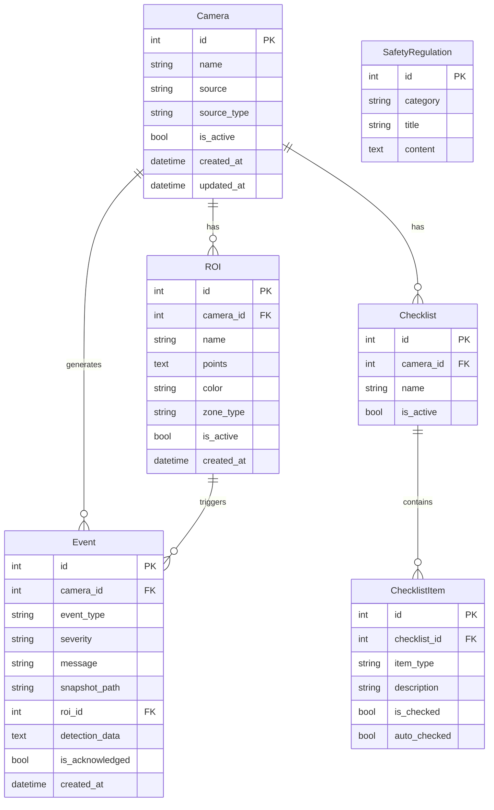
```mermaid
erDiagram
    Camera ||--o{ ROI : "has"
    Camera ||--o{ Event : "generates"
    Camera ||--o{ Checklist : "has"
    Checklist ||--o{ ChecklistItem : "contains"
    ROI ||--o{ Event : "triggers"

    Camera {
        int id PK
        string name
        string source
        string source_type
        bool is_active
        datetime created_at
        datetime updated_at
    }

    ROI {
        int id PK
        int camera_id FK
        string name
        text points
        string color
        string zone_type
        bool is_active
        datetime created_at
    }

    Event {
        int id PK
        int camera_id FK
        string event_type
        string severity
        string message
        string snapshot_path
        int roi_id FK
        text detection_data
        bool is_acknowledged
        datetime created_at
    }

    Checklist {
        int id PK
        int camera_id FK
        string name
        bool is_active
    }

    ChecklistItem {
        int id PK
        int checklist_id FK
        string item_type
        string description
        bool is_checked
        bool auto_checked
    }

    SafetyRegulation {
        int id PK
        string category
        string title
        text content
    }
```

**문제점:** `ROI.points`가 `Text` 타입에 JSON 문자열로 저장된다. 이는 SQLite의 JSON 지원
부재(SQLite 3.38+ 이전)와 맞물려 쿼리 불가능한 블롭이 된다. `Event.detection_data`도 동일.
정규화되지 않은 JSON 문자열 저장은 데이터 무결성 보장이 불가능하다.

---

## 2. 실행 흐름

### 2.1 시스템 부트스트랩 시퀀스

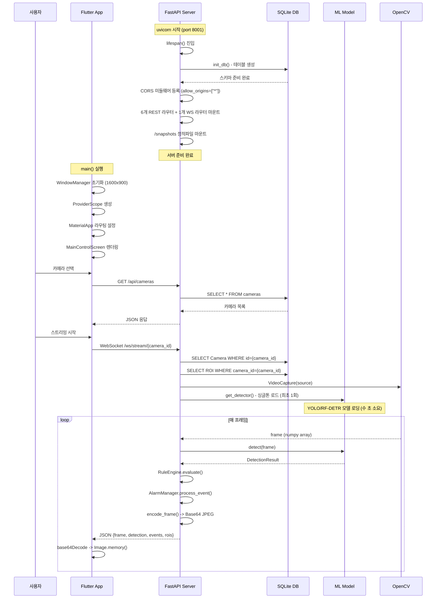
```mermaid
sequenceDiagram
    participant User as 사용자
    participant Flutter as Flutter App
    participant FastAPI as FastAPI Server
    participant DB as SQLite DB
    participant Model as ML Model
    participant CV as OpenCV

    Note over FastAPI: uvicorn 시작 (port 8001)
    FastAPI->>FastAPI: lifespan() 진입
    FastAPI->>DB: init_db() - 테이블 생성
    DB-->>FastAPI: 스키마 준비 완료
    FastAPI->>FastAPI: CORS 미들웨어 등록 (allow_origins=["*"])
    FastAPI->>FastAPI: 6개 REST 라우터 + 1개 WS 라우터 마운트
    FastAPI->>FastAPI: /snapshots 정적파일 마운트
    Note over FastAPI: 서버 준비 완료

    Note over Flutter: main() 실행
    Flutter->>Flutter: WindowManager 초기화 (1600x900)
    Flutter->>Flutter: ProviderScope 생성
    Flutter->>Flutter: MaterialApp 라우팅 설정
    Flutter->>Flutter: MainControlScreen 렌더링

    User->>Flutter: 카메라 선택
    Flutter->>FastAPI: GET /api/cameras
    FastAPI->>DB: SELECT * FROM cameras
    DB-->>FastAPI: 카메라 목록
    FastAPI-->>Flutter: JSON 응답

    User->>Flutter: 스트리밍 시작
    Flutter->>FastAPI: WebSocket /ws/stream/{camera_id}
    FastAPI->>DB: SELECT Camera WHERE id={camera_id}
    FastAPI->>DB: SELECT ROI WHERE camera_id={camera_id}
    FastAPI->>CV: VideoCapture(source)
    FastAPI->>Model: get_detector() - 싱글톤 로드 (최초 1회)
    Note over Model: YOLO/RF-DETR 모델 로딩 (수 초 소요)

    loop 매 프레임
        CV-->>FastAPI: frame (numpy array)
        FastAPI->>Model: detect(frame)
        Model-->>FastAPI: DetectionResult
        FastAPI->>FastAPI: RuleEngine.evaluate()
        FastAPI->>FastAPI: AlarmManager.process_event()
        FastAPI->>FastAPI: encode_frame() -> Base64 JPEG
        FastAPI-->>Flutter: JSON {frame, detection, events, rois}
        Flutter->>Flutter: base64Decode -> Image.memory()
    end
```

**치명적 문제:** 이 시퀀스에서 보이듯이, **비디오 디코딩, ML 추론, JPEG 인코딩, Base64 변환,
JSON 직렬화가 모두 단일 asyncio 이벤트 루프 내 단일 프로세스에서 실행**된다.
CPU 바운드 작업(ML 추론, 이미지 인코딩)이 이벤트 루프를 블로킹하여 다른 WebSocket 연결의
응답성을 심각하게 저하시킨다. `asyncio.sleep()`으로 양보하는 것만으로는 해결되지 않는다.

### 2.2 WebSocket 연결 생명주기

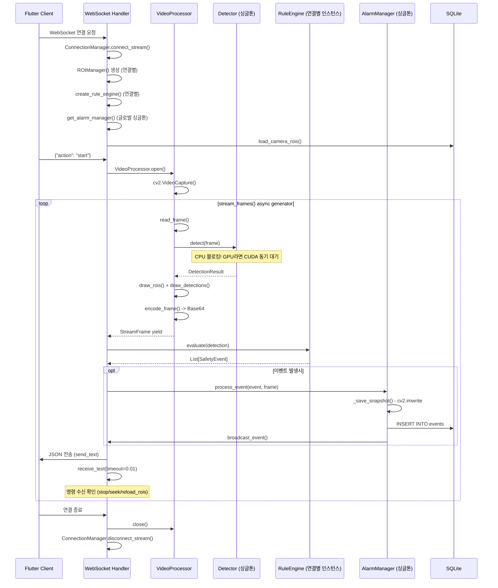
```mermaid
sequenceDiagram
    participant Client as Flutter Client
    participant WS as WebSocket Handler
    participant VP as VideoProcessor
    participant Det as Detector (싱글톤)
    participant RE as RuleEngine (연결별 인스턴스)
    participant AM as AlarmManager (싱글톤)
    participant DB as SQLite

    Client->>WS: WebSocket 연결 요청
    WS->>WS: ConnectionManager.connect_stream()
    WS->>WS: ROIManager() 생성 (연결별)
    WS->>WS: create_rule_engine() (연결별)
    WS->>WS: get_alarm_manager() (글로벌 싱글톤)
    WS->>DB: load_camera_rois()

    Client->>WS: {"action": "start"}
    WS->>VP: VideoProcessor.open()
    VP->>VP: cv2.VideoCapture()

    loop stream_frames() async generator
        VP->>VP: read_frame()
        VP->>Det: detect(frame)
        Note over Det: CPU 블로킹! GPU라면 CUDA 동기 대기
        Det-->>VP: DetectionResult
        VP->>VP: draw_rois() + draw_detections()
        VP->>VP: encode_frame() -> Base64
        VP-->>WS: StreamFrame yield

        WS->>RE: evaluate(detection)
        RE-->>WS: List[SafetyEvent]

        opt 이벤트 발생시
            WS->>AM: process_event(event, frame)
            AM->>AM: _save_snapshot() - cv2.imwrite
            AM->>DB: INSERT INTO events
            AM->>WS: broadcast_event()
        end

        WS->>Client: JSON 전송 (send_text)

        WS->>WS: receive_text(timeout=0.01)
        Note over WS: 명령 수신 확인 (stop/seek/reload_rois)
    end

    Client->>WS: 연결 종료
    WS->>VP: close()
    WS->>WS: ConnectionManager.disconnect_stream()
```

**문제점 분석:**

1. `RuleEngine`이 **연결(WebSocket)별로 새로 생성**된다. 이는 같은 카메라에 두 클라이언트가 연결되면
   독립적인 상태 추적이 이루어진다는 뜻이다. 한 클라이언트에서 발생한 이벤트 이력이 다른 클라이언트와
   공유되지 않는다.

2. `AlarmManager`는 글로벌 싱글톤이지만 `_next_event_id`가 인메모리 카운터다.
   서버 재시작 시 1부터 다시 시작하여 DB의 auto-increment ID와 충돌한다.
   `process_event()`에서 `event_data["id"]`를 먼저 인메모리 ID로 설정한 후,
   `_save_to_db()`에서 DB ID로 덮어쓴다. 이 시간 차이에 구독자에게 잘못된 ID가 전달될 수 있다.

3. `asyncio.wait_for(websocket.receive_text(), timeout=0.01)` - 프레임당 10ms 타임아웃으로
   클라이언트 명령을 폴링한다. 이것은 비효율적이며, 프레임 처리와 명령 수신을 별도 태스크로
   분리해야 한다.

---

## 3. 아키텍처 다이어그램

### 3.1 시스템 컨텍스트 (C4 Level 1)

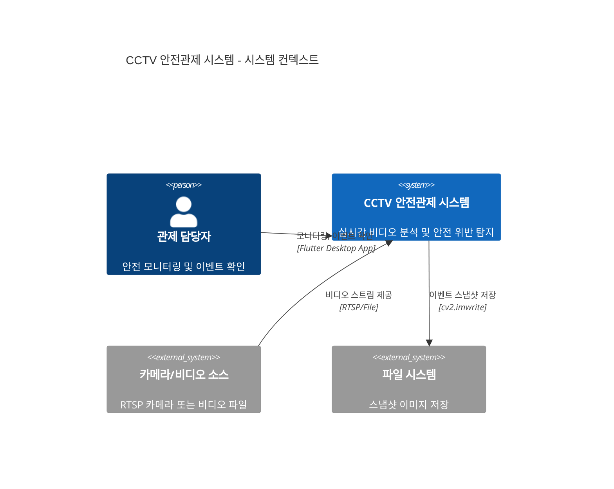
```mermaid
C4Context
    title CCTV 안전관제 시스템 - 시스템 컨텍스트

    Person(operator, "관제 담당자", "안전 모니터링 및 이벤트 확인")

    System(cctv_system, "CCTV 안전관제 시스템", "실시간 비디오 분석 및 안전 위반 탐지")

    System_Ext(camera_source, "카메라/비디오 소스", "RTSP 카메라 또는 비디오 파일")
    System_Ext(filesystem, "파일 시스템", "스냅샷 이미지 저장")

    Rel(operator, cctv_system, "모니터링, 이벤트 확인", "Flutter Desktop App")
    Rel(camera_source, cctv_system, "비디오 스트림 제공", "RTSP/File")
    Rel(cctv_system, filesystem, "이벤트 스냅샷 저장", "cv2.imwrite")
```

### 3.2 컨테이너 다이어그램 (C4 Level 2)

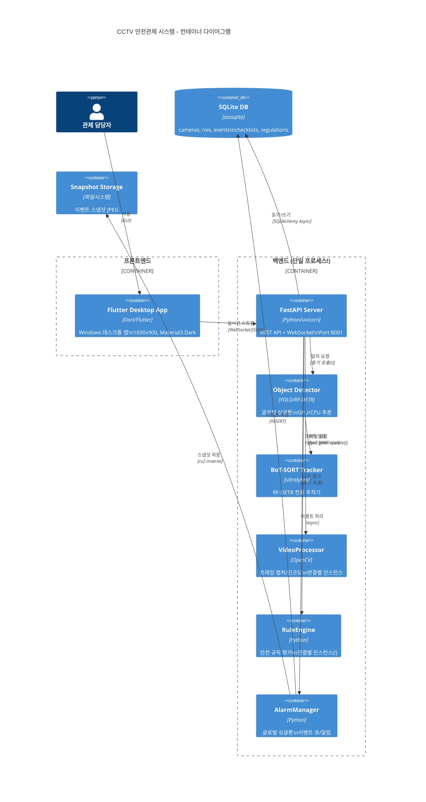
```mermaid
C4Container
    title CCTV 안전관제 시스템 - 컨테이너 다이어그램

    Person(operator, "관제 담당자")

    Container_Boundary(frontend_bound, "프론트엔드") {
        Container(flutter_app, "Flutter Desktop App", "Dart/Flutter", "Windows 데스크톱 앱\n1600x900, Material3 Dark")
    }

    Container_Boundary(backend_bound, "백엔드 (단일 프로세스!)") {
        Container(fastapi, "FastAPI Server", "Python/uvicorn", "REST API + WebSocket\nPort 8001")
        Container(detector, "Object Detector", "YOLO/RF-DETR", "글로벌 싱글톤\nGPU/CPU 추론")
        Container(tracker, "BoT-SORT Tracker", "ultralytics", "RF-DETR 전용 추적기")
        Container(video_proc, "VideoProcessor", "OpenCV", "프레임 캡처/인코딩\n연결별 인스턴스")
        Container(rule_engine, "RuleEngine", "Python", "안전 규칙 평가\n연결별 인스턴스(!)")
        Container(alarm_mgr, "AlarmManager", "Python", "글로벌 싱글톤\n이벤트 큐/알림")
    }

    ContainerDb(sqlite, "SQLite DB", "aiosqlite", "cameras, rois, events\nchecklists, regulations")
    Container(snapshots, "Snapshot Storage", "파일시스템", "이벤트 스냅샷 JPEG")

    Rel(operator, flutter_app, "사용", "GUI")
    Rel(flutter_app, fastapi, "REST API", "HTTP/JSON via Dio")
    Rel(flutter_app, fastapi, "실시간 스트림", "WebSocket/JSON")
    Rel(fastapi, sqlite, "읽기/쓰기", "SQLAlchemy Async")
    Rel(fastapi, detector, "탐지 요청", "동기 호출(!)")
    Rel(detector, tracker, "추적 연동", "BoT-SORT update()")
    Rel(fastapi, video_proc, "프레임 요청", "async generator")
    Rel(fastapi, rule_engine, "규칙 평가", "동기 호출")
    Rel(fastapi, alarm_mgr, "이벤트 처리", "async")
    Rel(alarm_mgr, sqlite, "이벤트 저장", "INSERT")
    Rel(alarm_mgr, snapshots, "스냅샷 저장", "cv2.imwrite")
```

**핵심 문제:** 모든 것이 **하나의 Python 프로세스** 안에 있다. FastAPI의 REST 핸들러, WebSocket 핸들러,
ML 추론, 비디오 디코딩, 이미지 인코딩이 전부 동일한 asyncio 이벤트 루프를 공유한다.
Python의 GIL(Global Interpreter Lock)로 인해 CPU 바운드 작업(ML 추론, OpenCV 처리)이
다른 모든 비동기 작업을 블로킹한다.

### 3.3 컴포넌트 상세 다이어그램

```mermaid
graph TB
    subgraph "FastAPI Application (main.py)"
        MAIN[main.py<br/>FastAPI App]
        CORS[CORS Middleware<br/>allow_origins=*]
        STATIC[StaticFiles<br/>/snapshots]
        LIFESPAN[Lifespan Handler<br/>init_db / close_db]
    end

    subgraph "REST API Routes"
        R_CAM[cameras.py<br/>CRUD 7개 엔드포인트]
        R_ROI[rois.py<br/>CRUD 엔드포인트]
        R_EVT[events.py<br/>조회/통계/확인]
        R_CHK[checklists.py<br/>체크리스트 관리]
        R_STR[stream.py<br/>스냅샷/정보]
        R_REG[regulations.py<br/>안전법규]
    end

    subgraph "WebSocket"
        WS[websocket.py<br/>ConnectionManager]
        WS_STREAM[/ws/stream/camera_id<br/>비디오 스트리밍]
        WS_EVENT[/ws/events<br/>이벤트 알림]
    end

    subgraph "Core Engine"
        DET[detection.py<br/>YOLODetector / RFDETRDetector<br/>글로벌 싱글톤]
        TRK[tracker.py<br/>BoTSORTTracker]
        VP[video_processor.py<br/>VideoProcessor<br/>연결별 인스턴스]
        RE[rule_engine.py<br/>RuleEngine<br/>연결별 인스턴스]
        RM[roi_manager.py<br/>ROIManager<br/>연결별 인스턴스]
        AM[alarm_manager.py<br/>AlarmManager<br/>글로벌 싱글톤]
    end

    subgraph "Database Layer"
        DB_ENGINE[database.py<br/>AsyncEngine + SessionLocal]
        MODELS[models.py<br/>Camera, ROI, Event<br/>Checklist, ChecklistItem<br/>SafetyRegulation]
    end

    MAIN --> CORS
    MAIN --> STATIC
    MAIN --> LIFESPAN
    MAIN --> R_CAM & R_ROI & R_EVT & R_CHK & R_STR & R_REG
    MAIN --> WS

    WS --> WS_STREAM & WS_EVENT
    WS_STREAM --> VP
    WS_STREAM --> DET
    WS_STREAM --> RE
    WS_STREAM --> AM
    VP --> DET
    DET --> TRK
    RE --> RM

    R_CAM & R_ROI & R_EVT & R_CHK & R_STR & R_REG --> DB_ENGINE
    AM --> DB_ENGINE
    WS_STREAM --> DB_ENGINE
    DB_ENGINE --> MODELS

    R_STR -.->|요청당 새 인스턴스!| VP

    style DET fill:#ff6b6b,stroke:#c92a2a,color:#fff
    style AM fill:#ff6b6b,stroke:#c92a2a,color:#fff
    style CORS fill:#ffa94d,stroke:#e8590c,color:#000
    style R_STR fill:#ffa94d,stroke:#e8590c,color:#000
```

### 3.4 프론트엔드 아키텍처

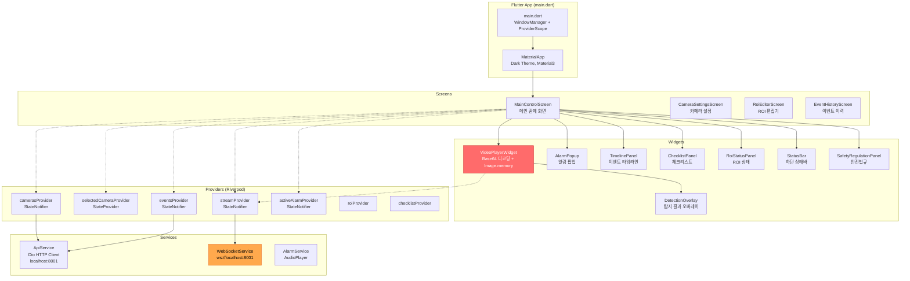
```mermaid
graph TB
    subgraph "Flutter App (main.dart)"
        ENTRY[main.dart<br/>WindowManager + ProviderScope]
        THEME[MaterialApp<br/>Dark Theme, Material3]
    end

    subgraph "Screens"
        S_MAIN[MainControlScreen<br/>메인 관제 화면]
        S_SETTINGS[CameraSettingsScreen<br/>카메라 설정]
        S_ROI[RoiEditorScreen<br/>ROI 편집기]
        S_HISTORY[EventHistoryScreen<br/>이벤트 이력]
    end

    subgraph "Widgets"
        W_VIDEO[VideoPlayerWidget<br/>Base64 디코딩 + Image.memory]
        W_DETECT[DetectionOverlay<br/>탐지 결과 오버레이]
        W_ALARM[AlarmPopup<br/>알람 팝업]
        W_TIMELINE[TimelinePanel<br/>이벤트 타임라인]
        W_CHECKLIST[ChecklistPanel<br/>체크리스트]
        W_ROISTATUS[RoiStatusPanel<br/>ROI 상태]
        W_STATUSBAR[StatusBar<br/>하단 상태바]
        W_REGULATION[SafetyRegulationPanel<br/>안전법규]
    end

    subgraph "Providers (Riverpod)"
        P_CAMERA[camerasProvider<br/>StateNotifier]
        P_SELECTED[selectedCameraProvider<br/>StateProvider]
        P_STREAM[streamProvider<br/>StateNotifier]
        P_EVENT[eventsProvider<br/>StateNotifier]
        P_ALARM[activeAlarmProvider<br/>StateNotifier]
        P_ROI[roiProvider]
        P_CHECKLIST[checklistProvider]
    end

    subgraph "Services"
        SVC_API[ApiService<br/>Dio HTTP Client<br/>localhost:8001]
        SVC_WS[WebSocketService<br/>ws://localhost:8001]
        SVC_ALARM[AlarmService<br/>AudioPlayer]
    end

    ENTRY --> THEME --> S_MAIN
    S_MAIN --> W_VIDEO & W_ALARM & W_TIMELINE & W_CHECKLIST & W_ROISTATUS & W_STATUSBAR & W_REGULATION
    W_VIDEO --> W_DETECT

    S_MAIN -.-> P_CAMERA & P_SELECTED & P_STREAM & P_EVENT & P_ALARM
    W_VIDEO -.-> P_STREAM

    P_CAMERA --> SVC_API
    P_STREAM --> SVC_WS
    P_EVENT --> SVC_API

    style W_VIDEO fill:#ff6b6b,stroke:#c92a2a,color:#fff
    style SVC_WS fill:#ffa94d,stroke:#e8590c,color:#000
```

**프론트엔드 문제점:**

- `VideoPlayerWidget`에서 **매 프레임마다 `base64Decode()`를 호출**하여 `Uint8List`로 변환 후
  `Image.memory()`로 렌더링한다. 15fps 기준 초당 15회 메모리 할당/해제. 가비지 컬렉션 압박이 극심하다.
- `WebSocketService`의 `baseUrl`이 `ws://localhost:8001`로 하드코딩되어 있다.
  원격 서버 배포 시 변경 불가.
- `ApiService`의 `baseUrl`도 `http://localhost:8001`로 하드코딩.

---

## 4. 데이터 흐름

### 4.1 프레임 처리 파이프라인

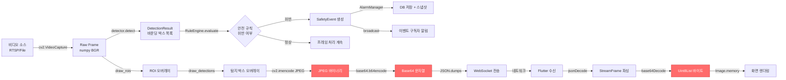
```mermaid
flowchart LR
    A[비디오 소스<br/>RTSP/File] -->|cv2.VideoCapture| B[Raw Frame<br/>numpy BGR]
    B -->|detector.detect| C[DetectionResult<br/>바운딩 박스 목록]
    C -->|RuleEngine.evaluate| D{안전 규칙<br/>위반 여부}
    D -->|위반| E[SafetyEvent 생성]
    D -->|정상| F[프레임 처리 계속]
    E -->|AlarmManager| G[DB 저장 + 스냅샷]
    E -->|broadcast| H[이벤트 구독자 알림]

    B -->|draw_rois| I[ROI 오버레이]
    I -->|draw_detections| J[탐지 박스 오버레이]
    J -->|cv2.imencode JPEG| K[JPEG 바이너리]
    K -->|base64.b64encode| L[Base64 문자열]
    L -->|JSON.dumps| M[WebSocket 전송]
    M -->|네트워크| N[Flutter 수신]
    N -->|jsonDecode| O[StreamFrame 파싱]
    O -->|base64Decode| P[Uint8List 바이트]
    P -->|Image.memory| Q[화면 렌더링]

    style K fill:#ff6b6b,stroke:#c92a2a,color:#fff
    style L fill:#ff6b6b,stroke:#c92a2a,color:#fff
    style P fill:#ff6b6b,stroke:#c92a2a,color:#fff
```

**대역폭 분석 (핵심 병목):**

1080p 프레임 기준 JPEG 품질 80%일 때 약 100-200KB.
Base64 인코딩하면 **33% 오버헤드**가 추가되어 약 130-260KB.
JSON 래핑(탐지 결과, ROI 데이터, 이벤트)까지 포함하면 프레임당 약 150-300KB.

15fps 기준: **2.25MB/s ~ 4.5MB/s** (초당).

이것은 **WebSocket 텍스트 프레임**으로 전송된다. 바이너리 프레임도 아닌 텍스트 프레임이다.
JSON 안에 Base64 문자열이 들어가므로 추가적인 UTF-8 인코딩 오버헤드까지 발생한다.

합리적 대안은 WebSocket 바이너리 프레임으로 JPEG를 직접 전송하고,
메타데이터는 별도 채널이나 헤더로 분리하는 것이다. 또는 WebRTC를 사용하여
H.264/VP8 압축 스트림을 전송하면 대역폭을 **1/10 이하**로 줄일 수 있다.

### 4.2 이벤트 데이터 흐름

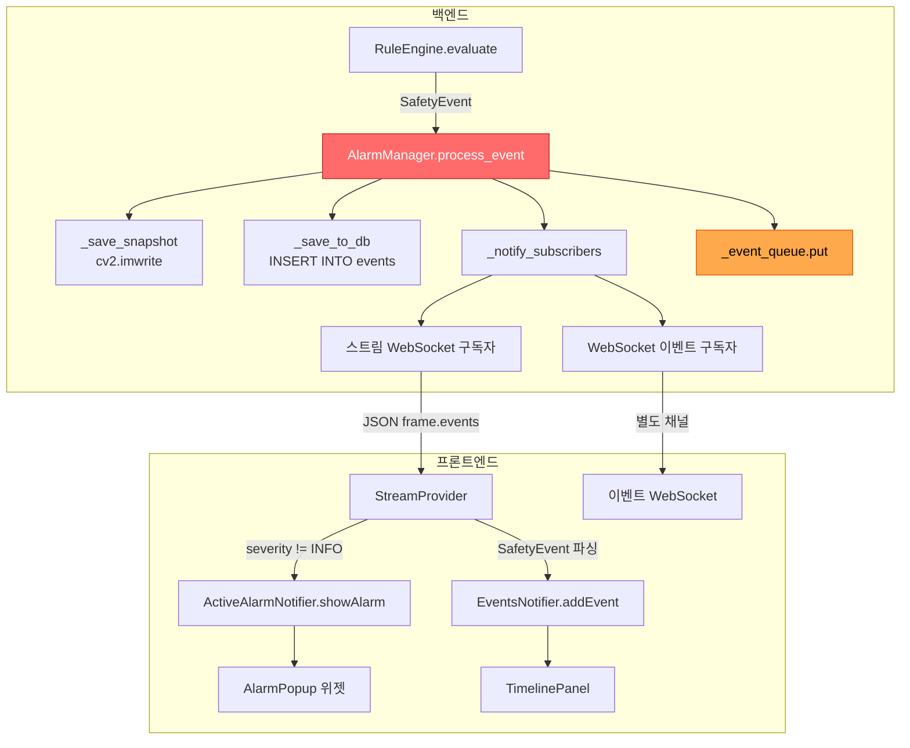
```mermaid
flowchart TB
    subgraph "백엔드"
        RE[RuleEngine.evaluate] -->|SafetyEvent| AM[AlarmManager.process_event]
        AM --> SNAP[_save_snapshot<br/>cv2.imwrite]
        AM --> DBSAVE[_save_to_db<br/>INSERT INTO events]
        AM --> NOTIFY[_notify_subscribers]
        AM --> QUEUE[_event_queue.put]

        NOTIFY --> SUB1[WebSocket 이벤트 구독자]
        NOTIFY --> SUB2[스트림 WebSocket 구독자]
    end

    subgraph "프론트엔드"
        SUB2 -->|JSON frame.events| SP[StreamProvider]
        SP -->|SafetyEvent 파싱| EP[EventsNotifier.addEvent]
        SP -->|severity != INFO| AP[ActiveAlarmNotifier.showAlarm]
        AP --> POPUP[AlarmPopup 위젯]
        EP --> TIMELINE[TimelinePanel]

        SUB1 -->|별도 채널| EP2[이벤트 WebSocket]
    end

    style AM fill:#ff6b6b,stroke:#c92a2a,color:#fff
    style QUEUE fill:#ffa94d,stroke:#e8590c,color:#000
```

**문제점:**

- 이벤트가 **두 가지 경로**로 프론트엔드에 도달한다:
  (1) 스트림 WebSocket의 `frame.events` 배열 내부,
  (2) 이벤트 전용 WebSocket `/ws/events`.
  이로 인해 **이벤트 중복 수신**이 발생할 수 있다.

- `AlarmManager._event_queue`에 이벤트를 넣지만, 이 큐를 소비하는 컨슈머가 코드에 없다.
  `get_next_event()` 메서드가 있지만 아무도 호출하지 않는다. **큐가 무한히 쌓인다 (메모리 누수).**

- `_unacknowledged` 딕셔너리도 인메모리. 서버 재시작 시 모든 미확인 이벤트 정보가 소실된다.

### 4.3 ROI 데이터 흐름

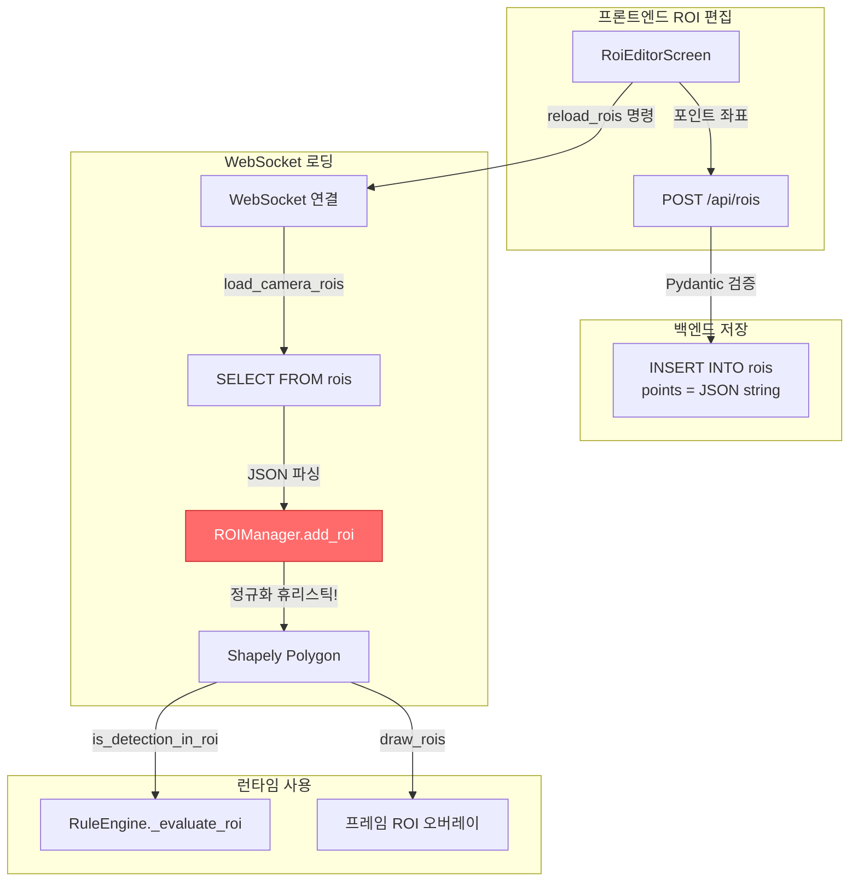
```mermaid
flowchart TB
    subgraph "프론트엔드 ROI 편집"
        EDITOR[RoiEditorScreen] -->|포인트 좌표| API_CREATE[POST /api/rois]
    end

    subgraph "백엔드 저장"
        API_CREATE -->|Pydantic 검증| DB_INSERT[INSERT INTO rois<br/>points = JSON string]
    end

    subgraph "WebSocket 로딩"
        WS_CONNECT[WebSocket 연결] -->|load_camera_rois| DB_SELECT[SELECT FROM rois]
        DB_SELECT -->|JSON 파싱| ROI_MGR[ROIManager.add_roi]
        ROI_MGR -->|정규화 휴리스틱!| POLYGON[Shapely Polygon]
    end

    subgraph "런타임 사용"
        POLYGON -->|is_detection_in_roi| RULE[RuleEngine._evaluate_roi]
        POLYGON -->|draw_rois| OVERLAY[프레임 ROI 오버레이]
    end

    EDITOR -->|reload_rois 명령| WS_CONNECT

    style ROI_MGR fill:#ff6b6b,stroke:#c92a2a,color:#fff
```

**ROI 정규화의 위험성:**

`ROIManager.add_roi()`에서 포인트 좌표를 정규화하는 휴리스틱이 극히 위험하다:

```python
if px_maxx > 1.1:
    scale_x = 1280.0 if px_maxx > 1.1 else 1.0
    scale_y = 720.0 if px_maxy > 1.1 else 1.0
    if px_maxx > 1300: scale_x = 1920.0
    if px_maxy > 800: scale_y = 1080.0
```

이것은 **입력 좌표가 어떤 해상도인지 추측**하는 코드다. 1280x720이 아닌 다른 해상도의
카메라가 연결되면 ROI 좌표가 완전히 틀어진다. 1024x768? 2560x1440? 이 휴리스틱은 깨진다.
좌표 정규화는 저장 시점에 원본 해상도를 함께 저장하여 명시적으로 수행해야 한다.

---

## 5. 상태 관리 분석

### 5.1 백엔드 글로벌 상태 지도

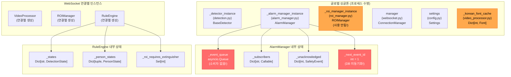
```mermaid
graph TB
    subgraph "글로벌 싱글톤 (프로세스 수명)"
        DET["_detector_instance<br/>(detection.py)<br/>BaseDetector"]
        AM["_alarm_manager_instance<br/>(alarm_manager.py)<br/>AlarmManager"]
        RM_GLOBAL["_roi_manager_instance<br/>(roi_manager.py)<br/>ROIManager<br/>(사용 안됨!)"]
        CONN["manager<br/>(websocket.py)<br/>ConnectionManager"]
        SETTINGS["settings<br/>(config.py)<br/>Settings"]
        FONT["_korean_font_cache<br/>(video_processor.py)<br/>Dict[int, Font]"]
    end

    subgraph "WebSocket 연결별 인스턴스"
        VP_I["VideoProcessor<br/>(연결별 생성)"]
        RM_I["ROIManager<br/>(연결별 생성)"]
        RE_I["RuleEngine<br/>(연결별 생성)"]
    end

    subgraph "AlarmManager 내부 상태"
        EQ["_event_queue<br/>asyncio.Queue<br/>(소비자 없음!)"]
        SUB["_subscribers<br/>Dict[str, Callable]"]
        UNACK["_unacknowledged<br/>Dict[int, SafetyEvent]"]
        NEXT_ID["_next_event_id<br/>int = 1<br/>(DB 미동기화!)"]
    end

    subgraph "RuleEngine 내부 상태"
        STATES["_states<br/>Dict[str, DetectionState]"]
        PERSON_STATES["_person_states<br/>Dict[tuple, PersonState]"]
        REQ_EXT["_roi_requires_extinguisher<br/>Set[int]"]
    end

    AM --> EQ & SUB & UNACK & NEXT_ID
    RE_I --> STATES & PERSON_STATES & REQ_EXT

    style EQ fill:#ff6b6b,stroke:#c92a2a,color:#fff
    style NEXT_ID fill:#ff6b6b,stroke:#c92a2a,color:#fff
    style RM_GLOBAL fill:#ffa94d,stroke:#e8590c,color:#000
    style FONT fill:#ffa94d,stroke:#e8590c,color:#000
```

**글로벌 상태 문제 상세 분석:**

| 상태 | 문제 | 심각도 |
|------|------|--------|
| `_detector_instance` | 전체 프로세스에서 하나의 탐지기 공유. 동시 요청 시 스레드 안전성 미보장. YOLO의 `model.track(persist=True)`는 내부 상태를 유지하므로 여러 카메라 스트림이 추적 상태를 공유하여 **추적 ID가 카메라 간 오염**된다. | **치명적** |
| `_alarm_manager_instance` | `_next_event_id`가 1부터 시작. 서버 재시작마다 리셋. DB ID와 불일치. `_unacknowledged`가 인메모리이므로 재시작 시 소실. | **높음** |
| `_roi_manager_instance` | `get_roi_manager()` 함수가 존재하지만 WebSocket 핸들러에서 사용하지 않음. 각 연결이 독립적 `ROIManager()`를 생성. 글로벌 인스턴스는 **데드 코드**. | 중간 |
| `manager` (ConnectionManager) | 연결 관리 자체는 적절하나, `_connections`와 `_event_subscribers`에 대한 lock이 asyncio.Lock (코루틴용). 멀티스레드 접근 시 보호되지 않음. 단일 이벤트 루프에서만 안전. | 중간 |
| `_korean_font_cache` | Windows 전용 폰트 경로 하드코딩. Linux/macOS에서 실행 불가. Docker 컨테이너화 불가. | 높음 |
| `settings` | 불변 객체이므로 상태 문제 없음. 다만 런타임 설정 변경 불가. | 낮음 |

### 5.2 프론트엔드 Riverpod 상태 계층

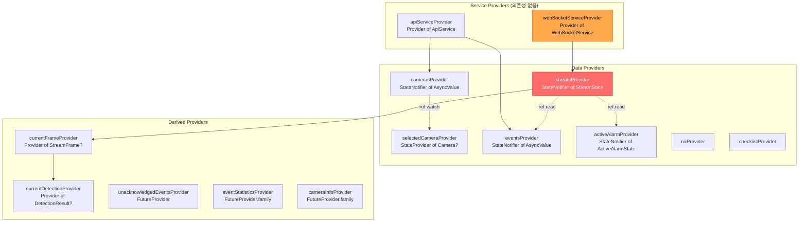
```mermaid
graph TB
    subgraph "Service Providers (의존성 없음)"
        API[apiServiceProvider<br/>Provider of ApiService]
        WS[webSocketServiceProvider<br/>Provider of WebSocketService]
    end

    subgraph "Data Providers"
        CAM[camerasProvider<br/>StateNotifier of AsyncValue]
        SELECTED[selectedCameraProvider<br/>StateProvider of Camera?]
        STREAM[streamProvider<br/>StateNotifier of StreamState]
        EVENTS[eventsProvider<br/>StateNotifier of AsyncValue]
        ALARM[activeAlarmProvider<br/>StateNotifier of ActiveAlarmState]
        ROI_P[roiProvider]
        CHECK_P[checklistProvider]
    end

    subgraph "Derived Providers"
        FRAME[currentFrameProvider<br/>Provider of StreamFrame?]
        DETECT[currentDetectionProvider<br/>Provider of DetectionResult?]
        UNACK[unacknowledgedEventsProvider<br/>FutureProvider]
        STATS[eventStatisticsProvider<br/>FutureProvider.family]
        CAM_INFO[cameraInfoProvider<br/>FutureProvider.family]
    end

    API --> CAM
    API --> EVENTS
    WS --> STREAM

    STREAM --> FRAME --> DETECT

    CAM -.->|ref.watch| SELECTED
    STREAM -.->|ref.read| EVENTS
    STREAM -.->|ref.read| ALARM

    style STREAM fill:#ff6b6b,stroke:#c92a2a,color:#fff
    style WS fill:#ffa94d,stroke:#e8590c,color:#000
```

**프론트엔드 상태 관리 문제:**

1. **`StreamNotifier`가 `ref.read()`로 다른 Provider에 직접 접근한다.** `streamProvider` 내에서
   `ref.read(eventsProvider.notifier).addEvent(event)`와 `ref.read(activeAlarmProvider.notifier).showAlarm(event)`를
   호출한다. 이는 Provider 간 **양방향 의존성**을 만들어 상태 갱신 순서 예측을 어렵게 한다.
   Riverpod의 단방향 데이터 흐름 원칙을 위반한다.

2. **`WebSocketService`가 `Provider`로 제공되지만 `dispose()`가 호출되지 않는다.**
   앱 종료 시 WebSocket 연결이 명시적으로 정리되지 않을 수 있다.

3. **`selectedCameraProvider`가 단순 `StateProvider`다.** 카메라 선택 시 이전 스트림의
   정리(disconnect)와 새 스트림의 연결(connect)이 `VideoPlayerWidget`의 `build()` 메서드에서
   `addPostFrameCallback`을 통해 이루어진다. 이는 위젯 생명주기에 비즈니스 로직을 결합시킨
   안티패턴이다.

4. **`StreamState`의 `currentFrame`이 매 프레임마다 교체된다.** 15fps이면 초당 15회 `state = state.copyWith(...)`.
   모든 리스너(VideoPlayerWidget, DetectionOverlay 등)가 매 프레임마다 rebuild된다.
   프레임 데이터와 메타데이터(isConnected, isPlaying)를 분리해야 한다.

---

## 6. 3대 핵심 플로우 분석

### 6.1 Flow 1: 실시간 비디오 스트리밍 및 탐지

#### 6.1.1 상세 시퀀스

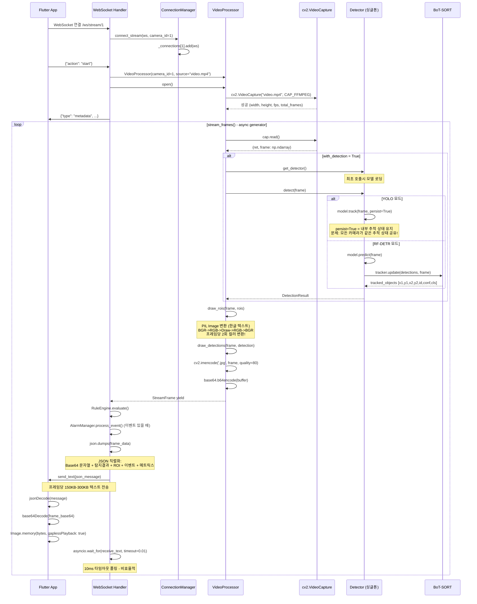
```mermaid
sequenceDiagram
    participant F as Flutter App
    participant WS as WebSocket Handler
    participant CM as ConnectionManager
    participant VP as VideoProcessor
    participant CV as cv2.VideoCapture
    participant DET as Detector (싱글톤)
    participant TRK as BoT-SORT

    F->>WS: WebSocket 연결 /ws/stream/1
    WS->>CM: connect_stream(ws, camera_id=1)
    CM->>CM: _connections[1].add(ws)

    F->>WS: {"action": "start"}
    WS->>VP: VideoProcessor(camera_id=1, source="video.mp4")
    WS->>VP: open()
    VP->>CV: cv2.VideoCapture("video.mp4", CAP_FFMPEG)
    CV-->>VP: 성공 (width, height, fps, total_frames)

    WS->>F: {"type": "metadata", ...}

    loop stream_frames() - async generator
        VP->>CV: cap.read()
        CV-->>VP: (ret, frame: np.ndarray)

        alt with_detection = True
            VP->>DET: get_detector()
            Note over DET: 최초 호출시 모델 로딩
            VP->>DET: detect(frame)

            alt YOLO 모드
                DET->>DET: model.track(frame, persist=True)
                Note over DET: persist=True = 내부 추적 상태 유지<br/>문제: 모든 카메라가 같은 추적 상태 공유!
            else RF-DETR 모드
                DET->>DET: model.predict(frame)
                DET->>TRK: tracker.update(detections, frame)
                TRK-->>DET: tracked_objects [x1,y1,x2,y2,id,conf,cls]
            end

            DET-->>VP: DetectionResult
        end

        VP->>VP: draw_rois(frame, rois)
        Note over VP: PIL Image 변환 (한글 텍스트)<br/>BGR->RGB->Draw->RGB->BGR<br/>프레임당 2회 컬러 변환!
        VP->>VP: draw_detections(frame, detection)
        VP->>VP: cv2.imencode('.jpg', frame, quality=80)
        VP->>VP: base64.b64encode(buffer)
        VP-->>WS: StreamFrame yield

        WS->>WS: RuleEngine.evaluate()
        WS->>WS: AlarmManager.process_event() (이벤트 있을 때)

        WS->>WS: json.dumps(frame_data)
        Note over WS: JSON 직렬화:<br/>Base64 문자열 + 탐지결과 + ROI + 이벤트 + 메트릭스
        WS->>F: send_text(json_message)
        Note over WS,F: 프레임당 150KB-300KB 텍스트 전송

        F->>F: jsonDecode(message)
        F->>F: base64Decode(frame_base64)
        F->>F: Image.memory(bytes, gaplessPlayback: true)

        WS->>WS: asyncio.wait_for(receive_text, timeout=0.01)
        Note over WS: 10ms 타임아웃 폴링 - 비효율적
    end
```

#### 6.1.2 성능 병목 분석

| 단계 | 처리 시간 (추정) | CPU/GPU | 블로킹 여부 |
|------|-----------------|---------|------------|
| `cap.read()` | 1-5ms | CPU | **동기 블로킹** |
| `model.track()` (YOLO) | 20-100ms | GPU/CPU | **동기 블로킹** |
| `model.predict()` (RF-DETR) | 30-150ms | GPU/CPU | **동기 블로킹** |
| `tracker.update()` (BoT-SORT) | 5-20ms | CPU | **동기 블로킹** |
| `draw_rois()` (PIL 변환 포함) | 5-15ms | CPU | **동기 블로킹** |
| `draw_detections()` | 1-3ms | CPU | 동기 블로킹 |
| `cv2.imencode()` | 5-15ms | CPU | **동기 블로킹** |
| `base64.b64encode()` | 1-3ms | CPU | 동기 블로킹 |
| `json.dumps()` | 1-5ms | CPU | 동기 블로킹 |
| `send_text()` | 1-10ms | I/O | 비동기 |
| **총합** | **70-320ms+** | | |

15fps 목표 = 프레임당 66.7ms 가용. 추론만으로도 이미 초과한다.
`await asyncio.sleep(sleep_time)` 양보가 있지만, 그 전의 **모든 CPU 작업이 이벤트 루프를 점유**한다.

**구조적 해결책:** ML 추론과 비디오 처리를 `ProcessPoolExecutor`나 별도 워커 프로세스로 분리해야 한다.
또는 `run_in_executor`로 CPU 바운드 작업을 스레드풀에 오프로드해야 한다. 현재 구조에서는 불가능에 가깝다.

#### 6.1.3 YOLO vs RF-DETR 탐지기 싱글톤 문제

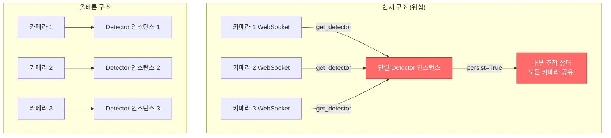
```mermaid
flowchart TB
    subgraph "현재 구조 (위험)"
        CAM1[카메라 1 WebSocket] -->|get_detector| SINGLE[단일 Detector 인스턴스]
        CAM2[카메라 2 WebSocket] -->|get_detector| SINGLE
        CAM3[카메라 3 WebSocket] -->|get_detector| SINGLE
        SINGLE -->|persist=True| STATE[내부 추적 상태<br/>모든 카메라 공유!]
    end

    subgraph "올바른 구조"
        CAM1_OK[카메라 1] --> DET1[Detector 인스턴스 1]
        CAM2_OK[카메라 2] --> DET2[Detector 인스턴스 2]
        CAM3_OK[카메라 3] --> DET3[Detector 인스턴스 3]
    end

    style SINGLE fill:#ff6b6b,stroke:#c92a2a,color:#fff
    style STATE fill:#ff6b6b,stroke:#c92a2a,color:#fff
```

YOLO의 `model.track(persist=True)`는 모델 내부에 추적 상태를 유지한다.
여러 카메라 스트림이 동일한 모델 인스턴스를 사용하면, **카메라 A의 추적 ID가
카메라 B의 프레임 처리에 오염**된다. 이것은 데이터 정합성을 완전히 파괴한다.

RF-DETR 모드에서는 `BoTSORTTracker`가 `RFDETRDetector` 인스턴스에 포함되어 있는데,
탐지기가 싱글톤이므로 추적기도 공유된다. **동일한 문제가 발생한다.**

### 6.2 Flow 2: 안전 이벤트 생성 및 알람

#### 6.2.1 이벤트 생성 파이프라인

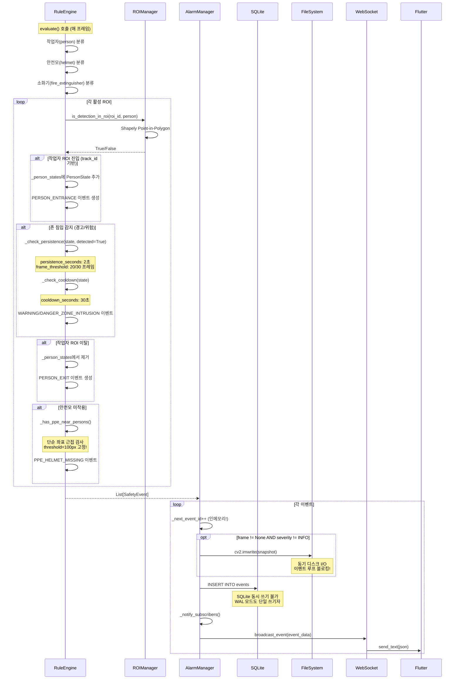
```mermaid
sequenceDiagram
    participant RE as RuleEngine
    participant RM as ROIManager
    participant AM as AlarmManager
    participant DB as SQLite
    participant FS as FileSystem
    participant WS as WebSocket
    participant F as Flutter

    Note over RE: evaluate() 호출 (매 프레임)

    RE->>RE: 작업자(person) 분류
    RE->>RE: 안전모(helmet) 분류
    RE->>RE: 소화기(fire_extinguisher) 분류

    loop 각 활성 ROI
        RE->>RM: is_detection_in_roi(roi_id, person)
        RM->>RM: Shapely Point-in-Polygon
        RM-->>RE: True/False

        alt 작업자 ROI 진입 (track_id 기반)
            RE->>RE: _person_states에 PersonState 추가
            RE->>RE: PERSON_ENTRANCE 이벤트 생성
        end

        alt 존 침입 감지 (경고/위험)
            RE->>RE: _check_persistence(state, detected=True)
            Note over RE: persistence_seconds: 2초<br/>frame_threshold: 20/30 프레임
            RE->>RE: _check_cooldown(state)
            Note over RE: cooldown_seconds: 30초
            RE->>RE: WARNING/DANGER_ZONE_INTRUSION 이벤트
        end

        alt 작업자 ROI 이탈
            RE->>RE: _person_states에서 제거
            RE->>RE: PERSON_EXIT 이벤트 생성
        end

        alt 안전모 미착용
            RE->>RE: _has_ppe_near_persons()
            Note over RE: 단순 좌표 근접 검사<br/>threshold=100px 고정!
            RE->>RE: PPE_HELMET_MISSING 이벤트
        end
    end

    RE-->>AM: List[SafetyEvent]

    loop 각 이벤트
        AM->>AM: _next_event_id++ (인메모리!)

        opt frame != None AND severity != INFO
            AM->>FS: cv2.imwrite(snapshot)
            Note over FS: 동기 디스크 I/O<br/>이벤트 루프 블로킹!
        end

        AM->>DB: INSERT INTO events
        Note over DB: SQLite 동시 쓰기 불가<br/>WAL 모드도 단일 쓰기자

        AM->>AM: _notify_subscribers()
        AM->>WS: broadcast_event(event_data)
        WS->>F: send_text(json)
    end
```

#### 6.2.2 오탐 방지 메커니즘

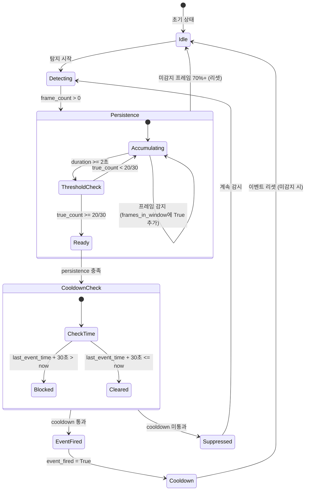
```mermaid
stateDiagram-v2
    [*] --> Idle: 초기 상태

    Idle --> Detecting: 탐지 시작
    Detecting --> Persistence: frame_count > 0

    state Persistence {
        [*] --> Accumulating
        Accumulating --> Accumulating: 프레임 감지 (frames_in_window에 True 추가)
        Accumulating --> ThresholdCheck: duration >= 2초
        ThresholdCheck --> Accumulating: true_count < 20/30
        ThresholdCheck --> Ready: true_count >= 20/30
    }

    Persistence --> Idle: 미감지 프레임 70%+ (리셋)

    Ready --> CooldownCheck: persistence 충족

    state CooldownCheck {
        [*] --> CheckTime
        CheckTime --> Blocked: last_event_time + 30초 > now
        CheckTime --> Cleared: last_event_time + 30초 <= now
    }

    CooldownCheck --> EventFired: cooldown 통과
    CooldownCheck --> Suppressed: cooldown 미통과

    EventFired --> Cooldown: event_fired = True
    Cooldown --> Idle: 이벤트 리셋 (미감지 시)

    Suppressed --> Detecting: 계속 감시
```

**오탐 방지의 한계:**

1. `persistence_seconds = 2.0` - 2초간 지속 감지 필요. 합리적이나, 비디오 FPS와 프레임 스킵에 따라
   실제 시간 정확도가 불안정하다. `current_time`이 `detection.timestamp` (비디오 타임스탬프)를 사용하므로,
   파일 재생 속도가 불규칙할 때 persistence 계산이 부정확해진다.

2. `frame_threshold = 20/30` - 30프레임 윈도우에서 20프레임 이상 감지. 이 파라미터가
   `settings`에서 설정되지만, ROI별/규칙별 커스터마이징이 불가능하다. 위험 구역은 더 민감해야 하고,
   경고 구역은 덜 민감해야 하는데, 모든 규칙에 동일한 임계값을 적용한다.

3. `cooldown_seconds = 30.0` - 동일 이벤트 재발생까지 30초 대기. 하지만 이 쿨다운이
   **`event_fired` 플래그 리셋과 얽혀** 있어, 미감지 후 재감지 시 쿨다운이 올바르게 적용되는지
   검증이 필요하다. `_check_persistence`에서 `event_fired = False`를 리셋하는 else 분기가
   쿨다운 체크보다 먼저 실행될 수 있다.

4. `_has_ppe_near_persons(threshold=100.0)` - 안전모 근접 검사의 100px 고정 임계값.
   카메라 해상도와 거리에 따라 물체 크기가 달라지므로, **절대 픽셀 값은 의미없다.**
   해상도 정규화 또는 바운딩 박스 비율 기반 검사가 필요하다.

#### 6.2.3 AlarmManager의 이벤트 ID 충돌 문제

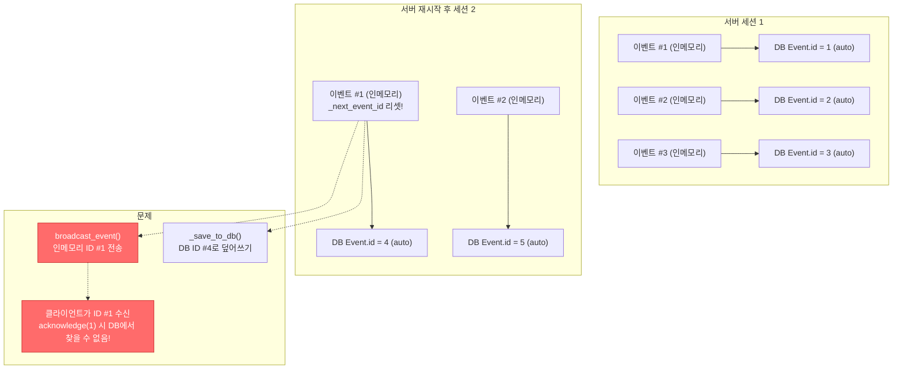
```mermaid
flowchart TB
    subgraph "서버 세션 1"
        S1_E1["이벤트 #1 (인메모리)"] --> S1_DB1["DB Event.id = 1 (auto)"]
        S1_E2["이벤트 #2 (인메모리)"] --> S1_DB2["DB Event.id = 2 (auto)"]
        S1_E3["이벤트 #3 (인메모리)"] --> S1_DB3["DB Event.id = 3 (auto)"]
    end

    subgraph "서버 재시작 후 세션 2"
        S2_E1["이벤트 #1 (인메모리)<br/>_next_event_id 리셋!"] --> S2_DB4["DB Event.id = 4 (auto)"]
        S2_E2["이벤트 #2 (인메모리)"] --> S2_DB5["DB Event.id = 5 (auto)"]
    end

    subgraph "문제"
        BROADCAST["broadcast_event()<br/>인메모리 ID #1 전송"]
        SAVE["_save_to_db()<br/>DB ID #4로 덮어쓰기"]
        CLIENT["클라이언트가 ID #1 수신<br/>acknowledge(1) 시 DB에서 찾을 수 없음!"]
    end

    S2_E1 -.-> BROADCAST
    S2_E1 -.-> SAVE
    BROADCAST -.-> CLIENT

    style BROADCAST fill:#ff6b6b,stroke:#c92a2a,color:#fff
    style CLIENT fill:#ff6b6b,stroke:#c92a2a,color:#fff
```

`process_event()`의 실행 순서:
1. `event_id = self._next_event_id` (인메모리, 1부터 시작)
2. `event_data = {"id": event_id, ...}` (인메모리 ID로 설정)
3. `await self._notify_subscribers(event_data)` (**인메모리 ID로 구독자에게 전송**)
4. `await self._event_queue.put(event_data)` (인메모리 ID로 큐에 삽입)
5. 그 후 `_save_to_db()`에서 `event_data["id"] = db_event.id` (DB auto-increment로 덮어쓰기)

3번에서 이미 잘못된 ID가 클라이언트로 전송된 후 5번에서 수정된다.
**순서가 잘못되었다.** DB 저장을 먼저 하고 DB ID를 사용해야 한다.

### 6.3 Flow 3: ROI 관리 및 규칙 평가

#### 6.3.1 ROI 생성부터 규칙 평가까지

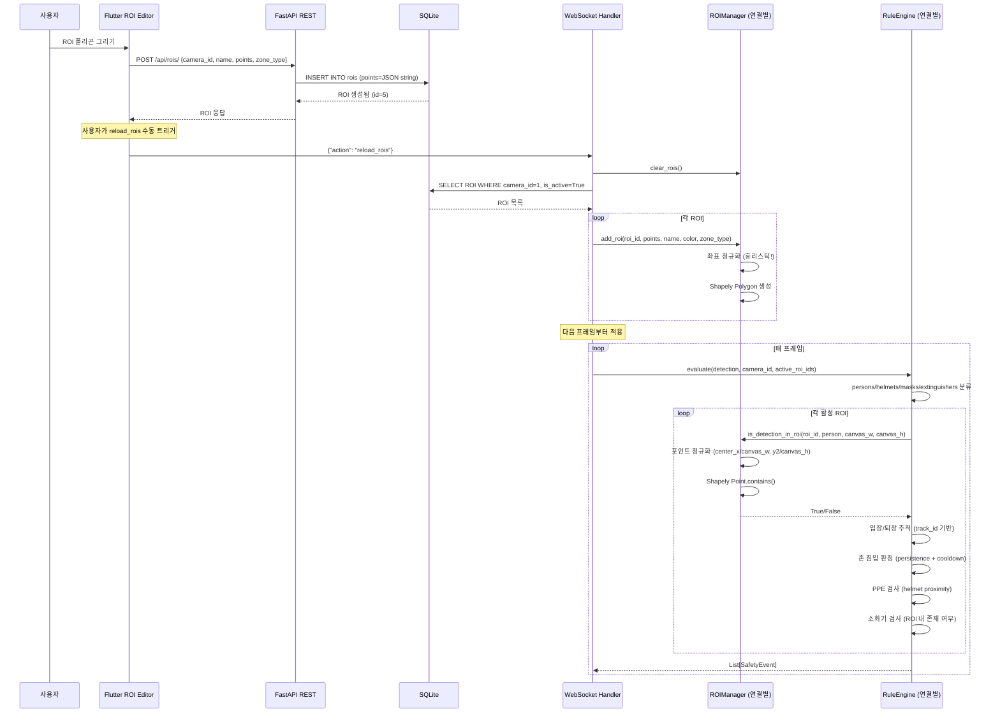
```mermaid
sequenceDiagram
    participant User as 사용자
    participant Flutter as Flutter ROI Editor
    participant API as FastAPI REST
    participant DB as SQLite
    participant WS as WebSocket Handler
    participant RM as ROIManager (연결별)
    participant RE as RuleEngine (연결별)

    User->>Flutter: ROI 폴리곤 그리기
    Flutter->>API: POST /api/rois/ {camera_id, name, points, zone_type}
    API->>DB: INSERT INTO rois (points=JSON string)
    DB-->>API: ROI 생성됨 (id=5)
    API-->>Flutter: ROI 응답

    Note over Flutter: 사용자가 reload_rois 수동 트리거
    Flutter->>WS: {"action": "reload_rois"}

    WS->>RM: clear_rois()
    WS->>DB: SELECT ROI WHERE camera_id=1, is_active=True
    DB-->>WS: ROI 목록

    loop 각 ROI
        WS->>RM: add_roi(roi_id, points, name, color, zone_type)
        RM->>RM: 좌표 정규화 (휴리스틱!)
        RM->>RM: Shapely Polygon 생성
    end

    Note over WS: 다음 프레임부터 적용

    loop 매 프레임
        WS->>RE: evaluate(detection, camera_id, active_roi_ids)
        RE->>RE: persons/helmets/masks/extinguishers 분류

        loop 각 활성 ROI
            RE->>RM: is_detection_in_roi(roi_id, person, canvas_w, canvas_h)
            RM->>RM: 포인트 정규화 (center_x/canvas_w, y2/canvas_h)
            RM->>RM: Shapely Point.contains()
            RM-->>RE: True/False

            RE->>RE: 입장/퇴장 추적 (track_id 기반)
            RE->>RE: 존 침입 판정 (persistence + cooldown)
            RE->>RE: PPE 검사 (helmet proximity)
            RE->>RE: 소화기 검사 (ROI 내 존재 여부)
        end

        RE-->>WS: List[SafetyEvent]
    end
```

#### 6.3.2 좌표 시스템 혼란

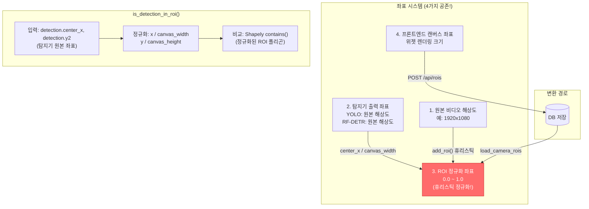
```mermaid
flowchart TB
    subgraph "좌표 시스템 (4가지 공존!)"
        CS1["1. 원본 비디오 해상도<br/>예: 1920x1080"]
        CS2["2. 탐지기 출력 좌표<br/>YOLO: 원본 해상도<br/>RF-DETR: 원본 해상도"]
        CS3["3. ROI 정규화 좌표<br/>0.0 ~ 1.0<br/>(휴리스틱 정규화!)"]
        CS4["4. 프론트엔드 캔버스 좌표<br/>위젯 렌더링 크기"]
    end

    subgraph "변환 경로"
        CS2 -->|"center_x / canvas_width"| CS3
        CS1 -->|"add_roi() 휴리스틱"| CS3
        CS4 -->|"POST /api/rois"| DB[(DB 저장)]
        DB -->|"load_camera_rois"| CS3
    end

    subgraph "is_detection_in_roi()"
        INPUT["입력: detection.center_x, detection.y2<br/>(탐지기 원본 좌표)"]
        NORM["정규화: x / canvas_width<br/>y / canvas_height"]
        COMPARE["비교: Shapely contains()<br/>(정규화된 ROI 폴리곤)"]
        INPUT --> NORM --> COMPARE
    end

    style CS3 fill:#ff6b6b,stroke:#c92a2a,color:#fff
```

**좌표 변환의 치명적 문제:**

`is_point_in_roi()`의 정규화 로직:

```python
DET_WIDTH = 640.0   # 기본값
DET_HEIGHT = 360.0  # 기본값
eff_width = canvas_width if canvas_width > 0 else DET_WIDTH
eff_height = canvas_height if canvas_height > 0 else DET_HEIGHT
norm_x = x / eff_width
norm_y = y / eff_height
```

`canvas_width`가 전달되지 않으면 640x360으로 나눈다. 그런데 YOLO/RF-DETR의 탐지 결과는
**원본 해상도 좌표**를 반환한다 (예: 1920x1080). 이 경우 정규화 결과가 1.0을 초과하여
**어떤 ROI에도 포함되지 않는다.**

WebSocket 핸들러에서 `canvas_width=processor.width, canvas_height=processor.height`를
전달하고 있으므로 정상적인 상황에서는 동작하지만, 이 매개변수가 누락될 경우 **완전히 망가지는**
취약한 설계다. 방어적 프로그래밍이 전혀 되어 있지 않다.

#### 6.3.3 RuleEngine 상태 머신 상세

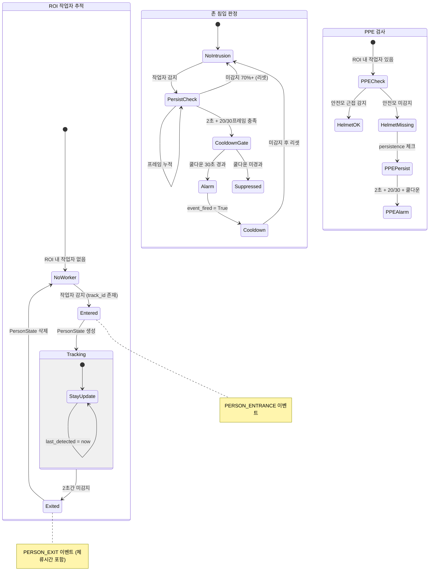
```mermaid
stateDiagram-v2
    state "ROI 작업자 추적" as TRACK {
        [*] --> NoWorker: ROI 내 작업자 없음

        NoWorker --> Entered: 작업자 감지 (track_id 존재)
        Entered --> Tracking: PersonState 생성

        state Tracking {
            [*] --> StayUpdate
            StayUpdate --> StayUpdate: stay_time += delta
            StayUpdate --> StayUpdate: last_detected = now
        }

        Tracking --> Exited: 2초간 미감지
        Exited --> NoWorker: PersonState 삭제

        note right of Entered: PERSON_ENTRANCE 이벤트
        note right of Exited: PERSON_EXIT 이벤트 (체류시간 포함)
    }

    state "존 침입 판정" as ZONE {
        [*] --> NoIntrusion

        NoIntrusion --> PersistCheck: 작업자 감지
        PersistCheck --> PersistCheck: 프레임 누적
        PersistCheck --> NoIntrusion: 미감지 70%+ (리셋)
        PersistCheck --> CooldownGate: 2초 + 20/30프레임 충족

        CooldownGate --> Alarm: 쿨다운 30초 경과
        CooldownGate --> Suppressed: 쿨다운 미경과

        Alarm --> Cooldown: event_fired = True
        Cooldown --> NoIntrusion: 미감지 후 리셋
    }

    state "PPE 검사" as PPE {
        [*] --> PPECheck: ROI 내 작업자 있음
        PPECheck --> HelmetOK: 안전모 근접 감지
        PPECheck --> HelmetMissing: 안전모 미감지
        HelmetMissing --> PPEPersist: persistence 체크
        PPEPersist --> PPEAlarm: 2초 + 20/30 + 쿨다운
    }
```

**규칙 평가의 구조적 문제:**

1. **규칙이 하드코딩되어 있다.** `_evaluate_roi()` 메서드 안에 모든 규칙이 절차적으로 나열되어 있다.
   새로운 규칙 추가 시 이 메서드를 직접 수정해야 하며, 규칙별 on/off, 파라미터 조정이 불가능하다.
   규칙 엔진이라 부르기 민망한 수준이다. Strategy 패턴이나 Rule DSL 도입이 필요하다.

2. **마스크 검사 규칙이 주석 처리되어 비활성화.**
   ```python
   # Rule 3: Mask Missing - disabled (helmet only)
   ```
   이것은 기능이 아니라 **임시 해킹**이다. 설정으로 제어해야 한다.

3. **소화기 요구 조건(`_roi_requires_extinguisher`)을 설정하는 코드가 없다.**
   `set_roi_requires_extinguisher()` 메서드는 존재하지만, WebSocket 핸들러에서
   호출하는 부분이 없다. **데드 코드**이며, 소화기 규칙은 실제로 실행되지 않는다.

4. **`_person_states` 정리 로직의 타이밍 문제.** 2초 미감지 후 삭제하는데,
   tracking 정확도가 떨어지면 ID 깜빡임이 발생하여 동일 작업자가 반복적으로
   입장/퇴장 이벤트를 발생시킬 수 있다 (phantom events).

---

## 7. 치명적 설계 결함 요약

### 7.1 결함 심각도 매트릭스

```mermaid
quadrantChart
    title 설계 결함 심각도 vs 수정 난이도
    x-axis "수정 용이" --> "수정 곤란"
    y-axis "영향 낮음" --> "영향 치명적"

    "CORS *": [0.15, 0.65]
    "인증 부재": [0.35, 0.95]
    "Base64 비효율": [0.75, 0.70]
    "싱글톤 탐지기": [0.60, 0.90]
    "SQLite 한계": [0.80, 0.75]
    "단일 프로세스": [0.90, 0.95]
    "인메모리 ID": [0.20, 0.50]
    "Windows 폰트": [0.10, 0.30]
    "이벤트 큐 누수": [0.15, 0.45]
    "좌표계 혼란": [0.55, 0.60]
    "규칙 하드코딩": [0.65, 0.40]
```

### 7.2 결함 상세 목록

#### CRITICAL-001: 인증/인가 완전 부재

- **위치:** 전체 시스템
- **설명:** REST API와 WebSocket 엔드포인트에 어떠한 인증 메커니즘도 없다.
  누구든지 API에 접근하여 카메라를 추가/삭제하고, 이벤트를 확인 처리하고,
  비디오 스트림을 수신할 수 있다.
- **위험도:** 산업안전 관제 시스템에서 **인가되지 않은 사용자가 알람을 확인 처리**하면
  실제 안전 위반이 무시될 수 있다. **인명 피해로 직결될 수 있는 치명적 결함.**
- **권장사항:** JWT 토큰 기반 인증, 역할 기반 접근 제어(RBAC) 즉시 도입.

#### CRITICAL-002: 단일 프로세스 모놀리스

- **위치:** `backend/app/main.py`, 전체 백엔드 구조
- **설명:** REST API, WebSocket 핸들러, ML 추론, 비디오 처리, 이벤트 관리가
  모두 하나의 Python 프로세스에서 실행된다. Python GIL로 인해 CPU 바운드 ML 추론이
  전체 서버의 응답성을 저하시킨다.
- **영향:** 카메라 2대 이상 동시 스트리밍 시 프레임 레이트 급격히 저하.
  REST API 응답 지연. WebSocket 메시지 지연.
- **권장사항:** ML 추론 워커를 별도 프로세스로 분리. Redis/RabbitMQ 기반
  메시지 큐 도입. 비디오 프로세서를 독립 서비스로 추출.

#### CRITICAL-003: 탐지기 싱글톤 상태 오염

- **위치:** `backend/app/core/detection.py` - `get_detector()`, `_detector_instance`
- **설명:** YOLO의 `model.track(persist=True)`는 내부적으로 추적 상태를 유지한다.
  모든 카메라 스트림이 동일한 탐지기 인스턴스를 공유하므로, 카메라 A의 추적 ID가
  카메라 B의 처리에 오염된다. RF-DETR 모드도 동일 (BoT-SORT 공유).
- **영향:** 다중 카메라 환경에서 추적 ID가 뒤섞여 **작업자 추적이 완전히 무효화**.
  입장/퇴장 이벤트, 체류시간 계산 모두 부정확해진다.
- **권장사항:** 카메라별 독립 탐지기/추적기 인스턴스. 또는 탐지(무상태)와
  추적(카메라별 상태)을 분리.

#### HIGH-001: CORS allow_origins=["*"]

- **위치:** `backend/app/main.py` 60행
- **설명:** 모든 출처에서의 요청을 허용한다. `allow_credentials=True`와 함께
  사용되면 쿠키 기반 CSRF 공격에 노출된다.
- **코드:**
  ```python
  app.add_middleware(
      CORSMiddleware,
      allow_origins=["*"],  # Allow all origins for development
      allow_credentials=True,
      ...
  )
  ```
- **권장사항:** 프로덕션에서는 특정 도메인만 허용. `# TODO` 주석이 있지만 구현되지 않음.

#### HIGH-002: SQLite 동시성 한계

- **위치:** `backend/app/config.py`, `backend/app/db/database.py`
- **설명:** SQLite는 동시 쓰기를 지원하지 않는다. WAL 모드에서도 단일 쓰기자만 허용된다.
  여러 카메라 스트림이 동시에 이벤트를 생성하면 `database is locked` 오류가 발생할 수 있다.
- **영향:** 고부하 시 이벤트 손실. 데이터 무결성 위협.
- **권장사항:** PostgreSQL + asyncpg 전환. 또는 최소한 쓰기 직렬화 큐 도입.

#### HIGH-003: Base64 JPEG 인코딩 대역폭 비효율

- **위치:** `backend/app/core/video_processor.py` - `encode_frame()`,
  `backend/app/api/websocket.py` - `send_text()`
- **설명:** 매 프레임마다:
  1. BGR numpy -> JPEG 인코딩 (CPU 집약)
  2. JPEG 바이너리 -> Base64 문자열 (+33% 용량)
  3. Base64 + 메타데이터 -> JSON 직렬화
  4. JSON 문자열 -> WebSocket 텍스트 프레임 전송

  1080p 15fps 기준 약 **2.25~4.5 MB/s** 대역폭 소비.
- **권장사항:** WebSocket 바이너리 프레임, WebRTC, 또는 MJPEG 스트리밍 전환.

#### HIGH-004: AlarmManager 인메모리 이벤트 ID

- **위치:** `backend/app/core/alarm_manager.py` - `_next_event_id`
- **설명:** 서버 재시작 시 1부터 재시작. DB의 auto-increment ID와 불일치.
  `_notify_subscribers()`가 `_save_to_db()` 이전에 호출되어
  클라이언트에 잘못된 ID가 전파될 수 있다.
- **영향:** 이벤트 확인(acknowledge) 실패. 프론트엔드/백엔드 ID 불일치.
- **권장사항:** DB 저장 먼저, DB ID 사용. 또는 UUID 기반 이벤트 ID.

#### HIGH-005: 이벤트 큐 무한 적재 (메모리 누수)

- **위치:** `backend/app/core/alarm_manager.py` - `_event_queue`
- **설명:** `asyncio.Queue`에 이벤트를 넣지만 소비하는 코드가 없다.
  `get_next_event()` 메서드가 존재하지만 호출 지점이 없다.
  장시간 운영 시 큐가 무한히 증가하여 메모리가 고갈된다.
- **권장사항:** 큐 소비자 구현 또는 큐 제거. maxsize 설정.

#### HIGH-006: Windows 전용 폰트 경로 하드코딩

- **위치:** `backend/app/core/video_processor.py` 26-29행
- **코드:**
  ```python
  font_paths = [
      "C:/Windows/Fonts/malgun.ttf",
      "C:/Windows/Fonts/gulim.ttc",
      "C:/Windows/Fonts/batang.ttc",
  ]
  ```
- **영향:** Linux, macOS, Docker 환경에서 실행 불가. 폰트 로드 실패 시
  기본 폰트(영문 전용)로 폴백하여 한글이 깨진다.
- **권장사항:** 번들 폰트 사용 또는 OS별 분기 처리.

#### MEDIUM-001: snapshot REST 엔드포인트 리소스 누수

- **위치:** `backend/app/api/routes/stream.py` - `get_snapshot()`, `get_stream_info()`
- **설명:** 요청마다 `VideoProcessor`를 새로 생성하여 `open()` -> 프레임 읽기 -> `close()`.
  동시 요청이 많으면 `cv2.VideoCapture` 핸들이 과도하게 생성된다. `get_snapshot()`에서
  `with_detection=True`이면 **글로벌 싱글톤 탐지기를 호출**하므로 스트리밍 중인
  탐지기와 상태 충돌이 발생할 수 있다.
- **권장사항:** 카메라별 VideoProcessor 풀 또는 스트리밍 프로세서에서 스냅샷 추출.

#### MEDIUM-002: RuleEngine 연결별 독립 인스턴스

- **위치:** `backend/app/api/websocket.py` 164행
- **코드:** `rule_engine = create_rule_engine(roi_manager)`
- **설명:** 같은 카메라에 여러 클라이언트가 연결되면 각각 독립적인 RuleEngine을 가진다.
  클라이언트 A에서 발생한 이벤트 이력(cooldown, persistence)이 클라이언트 B와 공유되지 않는다.
  같은 위반에 대해 클라이언트별로 중복 이벤트가 생성된다.
- **권장사항:** 카메라별 단일 RuleEngine 공유.

#### MEDIUM-003: 헬스체크 부실

- **위치:** `backend/app/main.py` 91-94행
- **코드:**
  ```python
  @app.get("/health")
  async def health_check():
      return {"status": "healthy"}
  ```
- **설명:** DB 연결 상태, 모델 로딩 상태, 메모리 사용량, GPU 상태 등
  아무것도 확인하지 않고 항상 "healthy"를 반환한다. 의미없는 헬스체크.
- **권장사항:** DB ping, 모델 로딩 상태, 메모리/GPU 사용량 포함.

#### MEDIUM-004: 프론트엔드 하드코딩 서버 주소

- **위치:** `frontend/lib/services/api_service.dart` 9행,
  `frontend/lib/services/websocket_service.dart` 19행
- **코드:**
  ```dart
  ApiService({this.baseUrl = 'http://localhost:8001'})
  WebSocketService({this.baseUrl = 'ws://localhost:8001'})
  ```
- **영향:** 원격 서버 연결 불가. 매번 코드 수정 후 재빌드 필요.
- **권장사항:** 환경 설정 파일 또는 앱 내 서버 주소 설정 UI.

#### MEDIUM-005: ROI 좌표 정규화 휴리스틱

- **위치:** `backend/app/core/roi_manager.py` - `add_roi()` 36-49행
- **설명:** ROI 포인트 좌표가 픽셀인지 정규화된 값인지 **추측**하여 변환한다.
  `px_maxx > 1.1`이면 픽셀 좌표로 판단하고, 1300 초과면 1920으로,
  아니면 1280으로 나눈다. 이 휴리스틱은 비표준 해상도에서 완전히 실패한다.
- **권장사항:** ROI 저장 시 원본 해상도를 함께 저장. 명시적 좌표 체계 통일.

#### LOW-001: 프론트엔드 State rebuild 과다

- **위치:** `frontend/lib/providers/stream_provider.dart`
- **설명:** `StreamState`가 매 프레임마다 `copyWith(currentFrame: frame)`으로 갱신.
  `streamProvider`를 watch하는 모든 위젯이 초당 15회 rebuild.
- **권장사항:** 프레임 데이터와 연결 상태를 별도 Provider로 분리.
  `ValueNotifier` 또는 `StreamController`로 프레임 전달.

#### LOW-002: 미사용 글로벌 ROIManager

- **위치:** `backend/app/core/roi_manager.py` - `_roi_manager_instance`, `get_roi_manager()`
- **설명:** 글로벌 ROIManager 인스턴스가 정의되어 있지만 어디에서도 사용되지 않는다.
  WebSocket 핸들러는 연결별로 `ROIManager()`를 직접 생성한다. 데드 코드.

#### LOW-003: 에러 핸들링 부실

- **위치:** 전체 코드베이스
- **설명:** 대부분의 예외 처리가 `except Exception as e: logger.error(...)` 패턴.
  에러 복구 전략이 없다. WebSocket 연결 중 탐지기 오류 발생 시 스트림이 침묵 속에 종료된다.
  프론트엔드의 `try/catch`도 대부분 에러를 무시한다 (`// parse error ignored`).

### 7.3 보안 취약점 요약

```mermaid
flowchart TB
    subgraph "보안 공격 벡터"
        A1["1. CORS * + credentials<br/>CSRF 공격 가능"]
        A2["2. 인증 없는 API<br/>무단 카메라 제어"]
        A3["3. 인증 없는 WebSocket<br/>비디오 스트림 도청"]
        A4["4. 파일 경로 노출<br/>카메라 source 필드"]
        A5["5. SQL Injection<br/>ORM 사용으로 완화되나<br/>Raw SQL 사용 가능성"]
        A6["6. DoS 가능<br/>연결 수 제한 없음"]
        A7["7. 스냅샷 파일 접근<br/>인증 없는 StaticFiles"]
    end

    A1 --> IMPACT1["관제 데이터 조작"]
    A2 --> IMPACT2["카메라 삭제/비활성화"]
    A3 --> IMPACT3["영상 정보 유출"]
    A6 --> IMPACT4["서비스 중단"]
    A7 --> IMPACT5["이벤트 스냅샷 유출"]

    style A1 fill:#ff6b6b,stroke:#c92a2a,color:#fff
    style A2 fill:#ff6b6b,stroke:#c92a2a,color:#fff
    style A3 fill:#ff6b6b,stroke:#c92a2a,color:#fff
    style A6 fill:#ffa94d,stroke:#e8590c,color:#000
    style A7 fill:#ffa94d,stroke:#e8590c,color:#000
```

### 7.4 기술 부채 우선순위 로드맵

```mermaid
gantt
    title 기술 부채 해소 로드맵 (권장)
    dateFormat  YYYY-MM-DD
    section Phase 1: 긴급 (1-2주)
    인증/인가 도입 (JWT + RBAC)         :crit, p1a, 2026-02-12, 7d
    CORS 제한                           :p1b, 2026-02-12, 1d
    이벤트 ID 수정 (DB 우선)            :p1c, 2026-02-13, 2d
    이벤트 큐 메모리 누수 수정          :p1d, 2026-02-13, 1d
    헬스체크 실질화                      :p1e, 2026-02-14, 1d

    section Phase 2: 높음 (2-4주)
    탐지기 카메라별 인스턴스 분리        :crit, p2a, 2026-02-19, 5d
    ML 추론 프로세스 분리               :crit, p2b, 2026-02-24, 7d
    SQLite -> PostgreSQL 마이그레이션   :p2c, 2026-02-26, 5d
    서버 주소 설정 외부화               :p2d, 2026-02-19, 2d

    section Phase 3: 중간 (4-8주)
    WebSocket 바이너리 프레임 전환       :p3a, 2026-03-05, 7d
    ROI 좌표 체계 정규화                :p3b, 2026-03-05, 3d
    RuleEngine 카메라별 공유            :p3c, 2026-03-10, 3d
    규칙 설정 동적화 (Strategy 패턴)     :p3d, 2026-03-12, 5d
    Windows 폰트 의존성 제거            :p3e, 2026-03-12, 2d

    section Phase 4: 개선 (8-12주)
    WebRTC 스트리밍 전환                :p4a, 2026-03-19, 14d
    메시지 큐 도입 (Redis/RabbitMQ)     :p4b, 2026-03-19, 7d
    프론트엔드 State 분리 최적화         :p4c, 2026-03-26, 5d
    Circuit Breaker 패턴 도입           :p4d, 2026-04-02, 5d
    통합 테스트 스위트 구축              :p4e, 2026-04-02, 10d
```

### 7.5 최종 평가

이 시스템은 **기능적으로는 동작하는 프로토타입**이다. 단일 카메라, 소수 사용자,
비프로덕션 환경에서 데모 목적으로는 사용 가능하다.

그러나 **산업안전 관제 시스템**이라는 도메인 특성을 고려하면, 현재 상태로 프로덕션에
배포하는 것은 **무책임**하다. 인증 부재로 인한 보안 위협, 단일 프로세스 아키텍처로 인한
가용성 부족, 싱글톤 탐지기 상태 오염으로 인한 데이터 정합성 파괴는
각각이 단독으로도 배포 차단 사유(blocking issue)에 해당한다.

30년간 수많은 시스템을 보아왔지만, 안전 관련 시스템에서 인증이 없는 것을 본 적은 없다.
이 시스템의 근본적인 문제는 기술적 결함이 아니라, **"빠르게 동작하게 만들자"는 접근 방식이
아키텍처 전체에 스며든 것**이다. 기술 부채는 누적 이자가 붙는다. 지금 갚지 않으면
시스템이 성장할수록 비용은 기하급수적으로 증가한다.

즉시 Phase 1의 긴급 항목을 해결하고, Phase 2를 병행하여 구조적 리팩토링을 시작해야 한다.
Phase 3-4는 시스템이 안정화된 후 순차적으로 진행할 수 있다.

---

> **문서 끝. 이 문서에 기술된 모든 결함은 2026-02-11 기준 코드 분석을 기반으로 한다.
> 코드 변경 시 재분석이 필요하다.**
