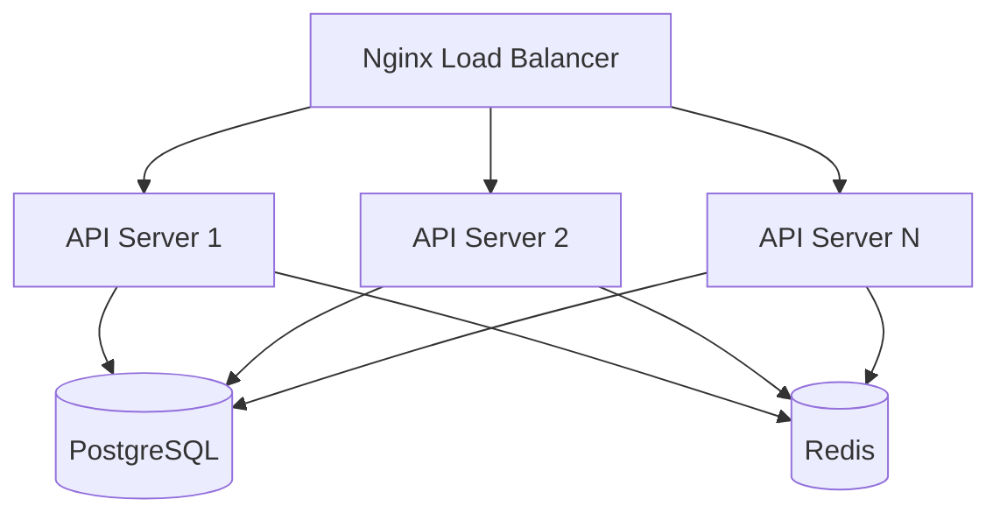
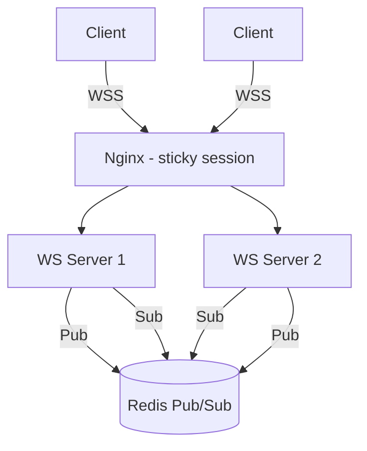
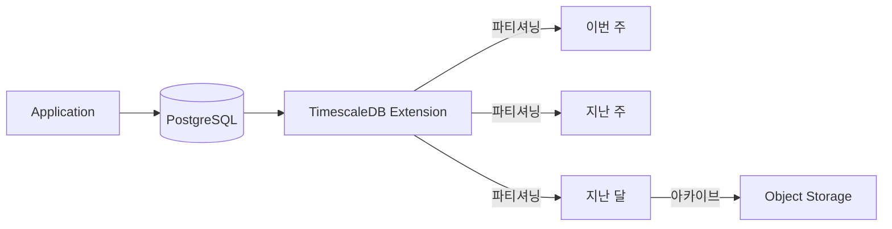
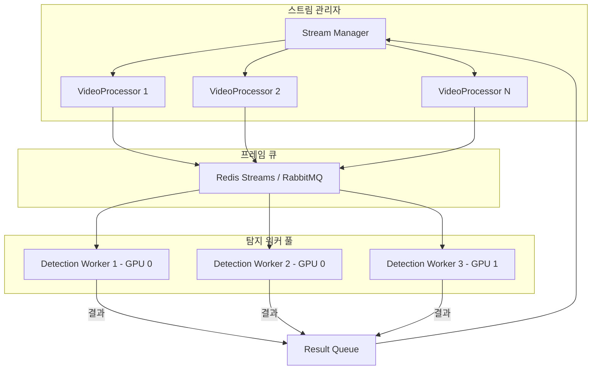
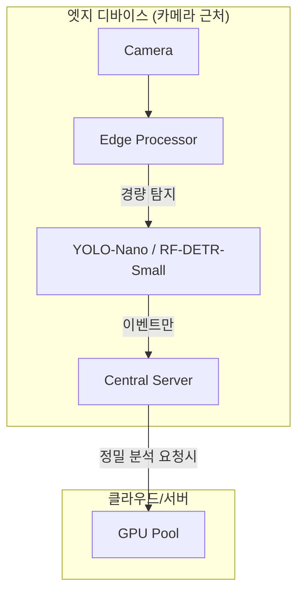
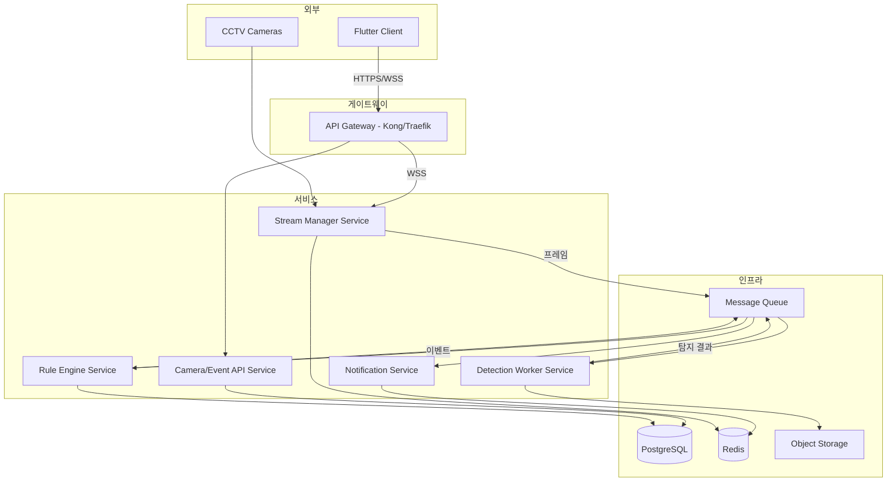
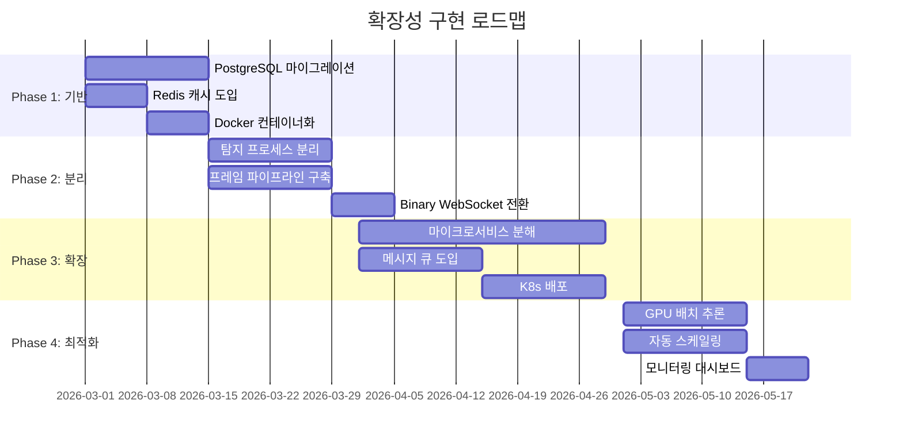
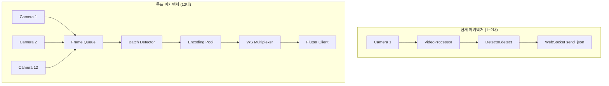

# H. 확장성 계획 (Scalability Plan)

> 작성 기준: 30년 경력 시니어 아키텍트
> 대상 시스템: CCTV SAFE-YOLO Industrial Monitoring System
> 작성일: 2026-02-11

---

## 확장 목표

| 지표 | 현재 | 10x 트래픽 | 50x 데이터 | 20x 처리량 |
|------|------|-----------|-----------|-----------|
| 동시 WebSocket 연결 | ~5 | 50+ | - | - |
| 일일 이벤트 수 | ~100 | ~1,000 | ~5,000 | - |
| 일일 프레임 처리량 | ~1.3M | - | ~65M | ~26M |
| 동시 카메라 | 1~2 | - | - | 20~40 |
| 스냅샷 저장량 | ~1GB/월 | - | ~50GB/월 | - |
| API 요청/초 | ~10 | ~100 | - | - |

---

## 1. 현재 시스템 한계 분석

### 1.1 프로세스 한계

```
단일 Python 프로세스
├── GIL: CPU-bound 작업의 진정한 병렬 처리 불가
├── 공유 메모리: 전역 싱글턴으로 상태 오염 위험
├── 단일 이벤트 루프: 블로킹 호출이 모든 연결에 영향
└── 장애 전파: 한 컴포넌트 크래시 → 전체 서비스 중단
```

**한계: 동시 카메라 2~3대에서 프레임 드롭 발생 예상**

### 1.2 데이터베이스 한계

```
SQLite
├── 단일 쓰기자: 동시 쓰기 불가 (WAL 모드에서도 단일 쓰기)
├── 파일 기반: 네트워크 공유 불가
├── 트랜잭션 격리: 동시성 제한
├── 인덱스: 기본적인 B-tree만 지원
└── 백업: 실행 중 일관성 있는 백업 어려움
```

**한계: 동시 이벤트 쓰기 10건/초 이상에서 락 경합**

### 1.3 GPU 한계

```
단일 모델 인스턴스
├── 배치 처리 없음: 프레임 1개씩 순차 추론
├── 메모리 관리 없음: OOM 핸들링 부재
├── 다중 GPU 미지원
└── 모델 최적화 없음: FP16/INT8 양자화 미적용
```

**한계: RF-DETR Medium 기준 ~30fps (단일 카메라)**

### 1.4 네트워크 한계

```
Base64 JSON WebSocket
├── 33% 대역폭 오버헤드 (base64)
├── JSON 직렬화 오버헤드
├── 압축 없음
└── 순차 브로드캐스트 (팬아웃 병목)
```

**한계: 1080p 15fps 기준 카메라당 ~30Mbps (base64 포함)**

---

## 2. 10x 트래픽 확장 계획

### 2.1 API 서버 수평 확장



**구현 사항:**
- Gunicorn + Uvicorn Workers (CPU 코어 수 × 2)
- Nginx 로드 밸런서 (라운드 로빈 + 헬스체크)
- PostgreSQL로 마이그레이션 (동시 쓰기 지원)
- Redis로 세션/캐시 공유

### 2.2 WebSocket 확장



**핵심 구현:**
- Nginx의 `ip_hash` 또는 sticky session으로 WebSocket 유지
- Redis Pub/Sub로 서버 간 프레임 배포
- 연결당 전용 채널 대신 카메라별 채널 사용

### 2.3 캐시 전략

```
Redis 캐시 계층
├── 카메라 목록: TTL 60초
├── ROI 설정: TTL 30초 (변경 시 무효화)
├── 최근 프레임: 카메라별 마지막 프레임 캐시
├── 이벤트 통계: TTL 300초
└── 세션 토큰: TTL 3600초
```

---

## 3. 50x 데이터 확장 계획

### 3.1 이벤트 데이터 아키텍처



**구현 사항:**
- TimescaleDB 하이퍼테이블로 이벤트 시계열 최적화
- 주 단위 파티셔닝
- 90일 이후 데이터 → Object Storage 아카이브
- 연속 집계(continuous aggregates)로 통계 쿼리 최적화

### 3.2 스냅샷 저장소

```
현재: 로컬 파일시스템 (snapshots/ 디렉토리)
목표: MinIO/S3 Object Storage

이점:
├── 무제한 확장
├── 복제/내구성
├── CDN 통합 가능
├── 접근 제어 (Pre-signed URL)
└── 라이프사이클 정책 (자동 만료/아카이브)
```

### 3.3 데이터 보존 정책

| 데이터 유형 | Hot (SSD) | Warm (HDD) | Cold (Object Storage) | 삭제 |
|------------|----------|-----------|---------------------|------|
| 실시간 프레임 | 메모리 (현재만) | - | - | 즉시 |
| 이벤트 | 7일 | 90일 | 1년 | 3년 후 |
| 스냅샷 | 7일 | 30일 | 1년 | 3년 후 |
| 통계 집계 | 30일 | 1년 | 무기한 | - |
| 감사 로그 | 30일 | 1년 | 무기한 | - |

---

## 4. 20x 처리량 확장 계획

### 4.1 탐지 워커 분리



**핵심 구현:**
- VideoProcessor는 프레임 캡처만 담당
- 프레임을 메시지 큐에 전송 (공유 메모리 또는 직렬화)
- 탐지 워커가 큐에서 소비 → 추론 → 결과 반환
- GPU당 2~3개 워커 (파이프라인 오버랩)

### 4.2 GPU 배치 추론

```python
# 목표 구현 (개념)
class BatchDetectionWorker:
    def __init__(self, batch_size=4, max_wait_ms=50):
        self.batch_size = batch_size
        self.max_wait_ms = max_wait_ms
        self.buffer = []

    async def process(self):
        """배치가 차거나 타임아웃이면 추론 실행"""
        while True:
            frame = await self.queue.get()
            self.buffer.append(frame)

            if len(self.buffer) >= self.batch_size or timeout:
                batch = np.stack([f.data for f in self.buffer])
                results = self.model.predict(batch)  # 배치 추론
                for frame, result in zip(self.buffer, results):
                    await frame.result_future.set(result)
                self.buffer.clear()
```

**예상 성능 향상:**
- 단일 프레임: ~33ms/frame → 배치 4: ~50ms/4frames = ~12.5ms/frame
- GPU 활용률: ~40% → ~85%

### 4.3 다중 GPU 지원

```
GPU 할당 전략:
├── GPU 0: 카메라 1~10 (RF-DETR Medium)
├── GPU 1: 카메라 11~20 (RF-DETR Medium)
├── GPU 2: 카메라 21~30 (RF-DETR Small - 속도 우선)
└── GPU 3: 예비 / 피크 시간 오버플로우
```

### 4.4 엣지 처리 (장기)



---

## 5. 마이크로서비스 분해 계획

### 5.1 서비스 아키텍처



### 5.2 서비스 책임 분리

| 서비스 | 책임 | 기술 스택 | 확장 단위 |
|--------|------|----------|----------|
| API Gateway | 인증, 라우팅, 레이트 리밋 | Kong/Traefik | 수평 확장 |
| Camera/Event API | CRUD 작업, 필터, 통계 | FastAPI + PostgreSQL | CPU 기반 수평 확장 |
| Stream Manager | 비디오 캡처, 프레임 분배, WS 관리 | FastAPI + Redis | 카메라 수 기반 |
| Detection Worker | GPU 추론, 배치 처리 | 독립 프로세스 + PyTorch | GPU 수 기반 |
| Rule Engine | 규칙 평가, 이벤트 생성 | FastAPI + Redis | CPU 기반 수평 확장 |
| Notification | 알람 전송, 이메일/SMS, 구독 관리 | FastAPI + Redis | 이벤트 볼륨 기반 |

### 5.3 서비스 간 통신

- **동기**: gRPC (프레임 데이터), REST (관리 API)
- **비동기**: Redis Streams 또는 RabbitMQ (이벤트, 탐지 결과)
- **실시간**: WebSocket (클라이언트 스트리밍), Redis Pub/Sub (서버 간)

---

## 6. 인프라 계획

### 6.1 Kubernetes 배포

```yaml
# 개념적 배포 구조
apiVersion: apps/v1
kind: Deployment
metadata:
  name: detection-worker
spec:
  replicas: 2
  template:
    spec:
      containers:
      - name: detection-worker
        resources:
          limits:
            nvidia.com/gpu: 1
            memory: "4Gi"
          requests:
            cpu: "2"
            memory: "2Gi"
```

### 6.2 자동 스케일링

| 서비스 | 스케일링 기준 | Min | Max | 목표 |
|--------|-------------|-----|-----|------|
| API Server | CPU 70% | 2 | 10 | 응답 시간 < 200ms |
| Stream Manager | WebSocket 연결 수 | 2 | 20 | 카메라당 1 인스턴스 |
| Detection Worker | GPU 사용률 80% | 1 | GPU 수 | 추론 시간 < 50ms |
| Rule Engine | 큐 깊이 | 1 | 5 | 지연 < 100ms |

### 6.3 모니터링

```
Prometheus + Grafana 대시보드
├── 서비스별 RED 메트릭 (Rate, Error, Duration)
├── GPU 사용률/온도/메모리
├── 큐 깊이/처리 속도
├── 카메라별 프레임 처리율
├── WebSocket 연결 수/상태
├── DB 쿼리 성능
└── 알림 규칙 (Alertmanager)
```

---

## 확장성 로드맵 요약



---

## 최종 평가

**현재 아키텍처는 "카메라 2~3대" 규모에서만 동작하는 프로토타입이다.**

20배 처리량 확장은 단순한 서버 증설로 불가능하며, 아키텍처의 근본적 재설계가 필요하다. 특히 **탐지 워커 분리**와 **프레임 파이프라인 구축**은 확장의 필수 전제 조건이며, 이것 없이는 카메라 5대 이상 동시 처리가 물리적으로 불가능하다.

---

## 8. 12대 카메라 동시 스트리밍 확장 시나리오

> **운영 요구사항:** 카메라 12대 화면을 동시에 표시하며 실시간 탐지 수행

### 8.1 12대 동시 처리 시 리소스 예측

| 리소스 | 현재 (1대) | 12대 선형 확장 | 최적화 후 목표 |
|--------|-----------|---------------|--------------|
| GPU VRAM | ~2GB | ~24GB (불가) | ~6GB (배치 추론) |
| GPU 추론 시간 | ~30ms/프레임 | ~360ms (1fps) | ~50ms (배치 12) |
| CPU (인코딩) | ~15% | ~180% (불가) | ~60% (스레드풀 + 적응형 해상도) |
| 서버 RAM | ~500MB | ~6GB | ~3GB (프레임 풀링) |
| 클라이언트 RAM | ~200MB | ~2.4GB | ~800MB (선택적 고화질) |
| 네트워크 (base64) | ~3MB/s | ~36MB/s | ~12MB/s (binary + 적응형) |
| WebSocket 메시지/초 | 15 | 180 | 120 (적응형 FPS) |

### 8.2 12대 달성을 위한 아키텍처 변경



**핵심 변경 4가지:**

1. **배치 추론 (Batch Inference)**
   - 12개 카메라 프레임을 모아 GPU에 한 번에 전달
   - YOLO의 batch 파라미터 활용: `model(batch_frames, batch=True)`
   - 12개 개별 추론(12×30ms=360ms) → 1개 배치 추론(~50ms)
   - **GPU VRAM 4배 절감 (공유 모델 가중치)**

2. **적응형 프레임레이트 (Adaptive FPS)**
   ```
   카메라 1~4대:  30fps (전체 고화질)
   카메라 5~8대:  15fps (선택 1대 고화질 + 나머지 저화질)
   카메라 9~12대: 10fps (선택 1대 고화질 + 나머지 썸네일)
   ```

3. **선택적 해상도 (Focus Mode)**
   - 사용자가 선택한 카메라: 1280×720, quality=85
   - 나머지 11대: 320×240, quality=50
   - 선택 카메라 변경 시 즉시 해상도 스위칭

4. **Binary WebSocket 멀티플렉싱**
   - 12개 개별 WebSocket → 1개 멀티플렉스 WebSocket
   - 프레임 헤더: `[camera_id:2B][frame_len:4B][jpeg_bytes][metadata_json]`
   - base64 오버헤드 제거로 대역폭 33% 절감

### 8.3 구현 우선순위

| 순서 | 작업 | 효과 | 복잡도 | 선행 조건 |
|------|------|------|--------|----------|
| 1 | 적응형 FPS | 즉시 12대 가능 (저화질) | LOW | 없음 |
| 2 | 선택적 해상도 | 대역폭 70% 감소 | MEDIUM | 없음 |
| 3 | Binary WebSocket | 대역폭 33% 추가 감소 | HIGH | Phase 2 완료 |
| 4 | 배치 추론 | GPU 효율 6배 향상 | HIGH | 싱글턴 제거 |
| 5 | WS 멀티플렉싱 | 연결 수 12→1 | MEDIUM | Binary WS 완료 |

**순서 1~2만 구현해도 12대 동시 표시가 가능하다** (다만 탐지 지연이 증가). 순서 3~5까지 완료하면 12대 모두 실시간 탐지 가능.
