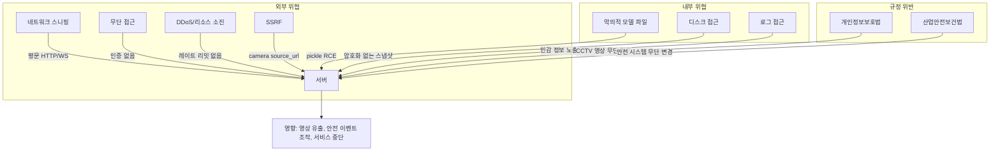

# M. 보안 검토 (Security Review)

> 작성 기준: 30년 경력 시니어 아키텍트 — CCTV 시스템 보안 관점
> 대상 시스템: CCTV SAFE-YOLO Industrial Monitoring System
> 작성일: 2026-02-11

---

## 종합 보안 등급: F (불합격)

**CCTV 영상을 다루는 시스템에 인증이 없다.** 이것 하나만으로 이 시스템은 프로덕션 배포 자격이 없다.

---

## 1. 인증/인가 분석 (Authentication/Authorization)

### 1.1 현황: 완전 무방비

| 기능 | 인증 필요 | 현재 상태 |
|------|----------|----------|
| 카메라 목록 조회 | ✅ | ❌ 인증 없음 |
| 카메라 생성/삭제 | ✅ | ❌ 인증 없음 |
| CCTV 영상 스트리밍 | ✅ | ❌ 인증 없음 |
| ROI 생성/수정/삭제 | ✅ | ❌ 인증 없음 |
| 안전 이벤트 조회 | ✅ | ❌ 인증 없음 |
| 이벤트 인정(acknowledge) | ✅ | ❌ 인증 없음 |
| 스냅샷 이미지 접근 | ✅ | ❌ 인증 없음 |
| WebSocket 명령 전송 | ✅ | ❌ 인증 없음 |

**영향:**
- 같은 네트워크의 누구든 모든 CCTV 영상을 볼 수 있다
- 악의적 사용자가 카메라를 삭제하거나 ROI를 변경할 수 있다
- 안전 이벤트를 확인하지 않고 "인정"처리할 수 있다
- 산업 현장에서 이는 개인정보보호법, 산업안전법 위반 가능

### 1.2 필요한 인증/인가 체계

```
역할 기반 접근 제어 (RBAC):
├── admin: 전체 접근, 시스템 설정
├── operator: 카메라 관리, ROI 설정, 이벤트 관리
├── viewer: 영상 조회, 이벤트 조회 (읽기 전용)
└── system: 내부 서비스 간 통신

인증 방식:
├── API: JWT Bearer Token
├── WebSocket: 연결 시 토큰 검증
└── Static Files: Pre-signed URL 또는 인증 미들웨어
```

---

## 2. 입력 검증 분석 (Input Validation)

### 2.1 WebSocket 명령 검증 부재

```python
# websocket.py - 현재
data = await websocket.receive_json()
action = data.get('action')
# ❌ action 값 범위 미검증
# ❌ 추가 필드 미검증
# ❌ 크기 제한 없음

if action == 'seek':
    position_ms = data.get('position_ms', 0)
    # ❌ position_ms가 음수, 극단적 큰 값, 문자열일 수 있음
```

**공격 벡터:** 악의적 JSON 페이로드로 서버 상태 조작 가능

### 2.2 카메라 소스 경로 미검증

```python
# cameras.py - 카메라 생성 시
class CameraCreate(BaseModel):
    source_url: str  # ❌ 어떤 문자열이든 허용

# 사용 시
cap = cv2.VideoCapture(camera.source_url)
# 경로 예시: "../../../../etc/passwd" (경로 탐색)
# 경로 예시: "rtsp://malicious-server/inject" (SSRF)
```

### 2.3 ROI 좌표 검증 불완전

```python
class ROICreate(BaseModel):
    points: str  # JSON 문자열로 전달
    # ❌ 좌표 범위 미검증 (음수, 1보다 큰 값)
    # ❌ 최소 포인트 수 미검증
    # ❌ 유효한 폴리곤인지 미검증 (자기 교차 등)
```

---

## 3. 네트워크 보안

### 3.1 CORS 설정

```python
# main.py
app.add_middleware(
    CORSMiddleware,
    allow_origins=["*"],       # ❌ 모든 오리진 허용
    allow_credentials=True,
    allow_methods=["*"],       # ❌ 모든 메서드 허용
    allow_headers=["*"],       # ❌ 모든 헤더 허용
)
```

**영향:** 악성 웹사이트가 사용자 브라우저를 통해 이 API를 호출할 수 있다 (CSRF 공격).

### 3.2 전송 암호화 부재

```python
# main.py
uvicorn.run(app, host="0.0.0.0", port=8001)
# ❌ HTTP only, HTTPS 미지원
# ❌ WebSocket ws://, wss:// 미지원
```

CCTV 영상이 평문으로 전송된다. 네트워크 스니핑으로 영상 데이터 탈취 가능.

### 3.3 레이트 리밋 부재

| 엔드포인트 | 현재 제한 | 필요한 제한 |
|-----------|----------|-----------|
| 전체 API | 없음 | 100 req/min/IP |
| WebSocket 연결 | 없음 | 5 연결/IP |
| 카메라 생성 | 없음 | 10 req/min |
| 이벤트 조회 | 없음 | 60 req/min |
| 스냅샷 접근 | 없음 | 30 req/min |

---

## 4. 데이터 보안

### 4.1 CCTV 영상 데이터 (개인정보)

```
현재 영상 데이터 처리:
├── 전송: 평문 HTTP/WS (암호화 없음)
├── 저장: 스냅샷 파일 (암호화 없음, 접근 제어 없음)
├── 처리: base64 인코딩 (보안 아님, 인코딩일 뿐)
└── 삭제: 삭제 정책 없음 (무한 보관)

개인정보보호법 위반 가능 항목:
├── 영상정보 수집 고지 의무
├── 영상정보 보관 기간 제한 (목적 달성 시 즉시 파기)
├── 영상정보 접근 기록 관리
├── 영상정보 암호화 저장
└── 영상정보 접근 권한 관리
```

### 4.2 민감 데이터 노출

```
리포지토리에 커밋된 민감 데이터:
├── safety_monitor.db         # ❌ 전체 이벤트/카메라 DB
├── server.log               # ❌ 에러 정보, 경로 정보
├── seek_debug.log            # ❌ 디버그 정보
├── snapshots/                # ❌ CCTV 스냅샷 이미지
├── models/checkpoint_best_ema.pth  # ❌ 학습된 AI 모델 (IP)
├── models/yolo_best.pt       # ❌ 학습된 AI 모델 (IP)
└── rf-detr-medium.pth        # ❌ 학습된 AI 모델 (IP)
```

### 4.3 감사 로그 (Audit Log) 부재

누가 언제 어떤 카메라를 봤는지, 누가 ROI를 수정했는지, 누가 이벤트를 인정했는지에 대한 기록이 **전혀 없다**.

---

## 5. OWASP Top 10 매핑

| # | OWASP 2021 | 해당 여부 | 위치 | 심각도 |
|---|-----------|----------|------|--------|
| A01 | Broken Access Control | ✅ | 전체 API/WebSocket | CRITICAL |
| A02 | Cryptographic Failures | ✅ | HTTP/WS 평문 전송, 암호화 없는 저장 | HIGH |
| A03 | Injection | △ | SQLAlchemy ORM 사용으로 SQL 인젝션은 낮음, 경로 탐색 위험 | MEDIUM |
| A04 | Insecure Design | ✅ | 인증 미설계, 에러 삼킴 설계 | CRITICAL |
| A05 | Security Misconfiguration | ✅ | CORS *, 기본 설정 그대로 사용 | HIGH |
| A06 | Vulnerable Components | △ | 의존성 버전 고정되어 있으나 취약점 스캔 없음 | MEDIUM |
| A07 | Auth Failures | ✅ | 인증 자체가 없음 | CRITICAL |
| A08 | Software/Data Integrity | △ | ML 모델 무결성 검증 없음 | LOW |
| A09 | Logging/Monitoring Failures | ✅ | 보안 이벤트 로깅 없음 | HIGH |
| A10 | SSRF | △ | camera source_url로 SSRF 가능 | MEDIUM |

---

## 6. 보안 강화 로드맵

### Phase 1: 긴급 (1~2주)

| # | 작업 | 상세 |
|---|------|------|
| 1 | JWT 인증 도입 | fastapi-jwt-auth 또는 python-jose 사용 |
| 2 | CORS 화이트리스트 | allow_origins를 실제 프론트엔드 도메인으로 제한 |
| 3 | HTTPS 강제 | uvicorn --ssl-keyfile, --ssl-certfile |
| 4 | .gitignore 추가 | DB, 로그, 모델, 스냅샷 제외 |
| 5 | 민감 파일 git 히스토리 제거 | git filter-branch 또는 BFG |

### Phase 2: 필수 (2~4주)

| # | 작업 | 상세 |
|---|------|------|
| 6 | WebSocket 인증 | 연결 시 토큰 검증 미들웨어 |
| 7 | 입력 검증 강화 | Pydantic strict mode + 커스텀 밸리데이터 |
| 8 | 경로 탐색 방지 | camera source_url 화이트리스트/샌드박싱 |
| 9 | 레이트 리밋 | slowapi 또는 nginx rate limiting |
| 10 | 감사 로그 | 모든 변경 작업 기록 (who, when, what) |

### Phase 3: 강화 (1~2개월)

| # | 작업 | 상세 |
|---|------|------|
| 11 | 스냅샷 접근 제어 | Pre-signed URL, 유효기간 1시간 |
| 12 | 데이터 암호화 | 저장 시 AES-256, 전송 시 TLS 1.3 |
| 13 | 취약점 스캔 자동화 | Snyk/Safety 의존성 스캔 CI 통합 |
| 14 | 데이터 보존 정책 | 스냅샷 30일 자동 삭제, 이벤트 1년 아카이브 |
| 15 | 보안 헤더 | X-Content-Type-Options, X-Frame-Options, CSP |

---

## 최종 평가

**이 시스템을 현재 상태로 네트워크에 배포하면, 법적 책임 문제가 발생할 수 있다.**

CCTV 영상은 개인정보이며, 인증 없이 접근 가능한 CCTV 스트리밍 시스템은 개인정보보호법 위반이다. 또한, 산업 현장의 안전 모니터링 시스템에 대한 무단 접근은 안전사고와 직결될 수 있다.

**보안은 "나중에 추가할 기능"이 아니라 "처음부터 있어야 하는 기반"이다. Phase 1 완료 전까지 외부 네트워크 노출을 절대 금지해야 한다.**

---

## 7. 하드코딩된 값 및 설정 노출

### 7.1 네트워크 주소 하드코딩

| 파일 | 하드코딩된 값 | 위험 |
|------|-------------|------|
| `frontend/lib/services/api_service.dart` | `http://localhost:8001` | 배포 환경에서 작동 불가. 변경 시 재빌드 필요. |
| `frontend/lib/services/websocket_service.dart` | `ws://localhost:8001` | 동일 문제. |
| `frontend/lib/providers/providers.dart` | `ws://localhost:8001` | 동일 문제 3중 반복. |
| `backend/app/main.py` | `host="0.0.0.0", port=8001` | 모든 인터페이스에 바인딩 — 의도적이나 위험. |
| `backend/app/config.py` | `DATABASE_URL = "sqlite+aiosqlite:///./safety_monitor.db"` | DB 경로 하드코딩. |

### 7.2 모델 파일 경로 노출
```python
# config.py
YOLO_MODEL_PATH: str = "models/yolo_best.pt"
RFDETR_MODEL_PATH: str = "models/checkpoint_best_ema.pth"
RFDETR_PRETRAINED_PATH: str = "rf-detr-medium.pth"
```
모델 파일 경로가 설정 파일에 노출되어 있으며, 파일 접근 제어가 없다. 학습된 AI 모델은 지적 재산(IP)이며, 무단 접근/복제 방지가 필요하다.

### 7.3 스냅샷 경로 직접 노출
```python
# alarm_manager.py
snapshot_path = f"snapshots/{camera_id}_{timestamp}.jpg"
# → 이 경로가 Event 테이블에 저장되고 API 응답으로 반환됨
# → 클라이언트가 이 경로로 직접 파일 접근 가능
```

---

## 8. WebSocket 보안 심층 분석

### 8.1 명령 인젝션 가능성

```python
# websocket.py — 현재 WebSocket 명령 처리
data = await websocket.receive_json()
action = data.get('action')

if action == 'seek':
    position_ms = data.get('position_ms', 0)
    processor.seek(position_ms)
elif action == 'pause':
    processor.pause()
elif action == 'play':
    processor.play()
```

**공격 시나리오:**
```json
// 정상 요청
{"action": "seek", "position_ms": 5000}

// 악의적 요청 1: 비정상적 큰 값
{"action": "seek", "position_ms": 999999999999}
// → cv2.VideoCapture.set() 실패 가능, 에러 핸들링 없음

// 악의적 요청 2: 타입 혼동
{"action": "seek", "position_ms": "DROP TABLE events"}
// → Python이 str을 float로 변환 시도 → 예외 → except: continue

// 악의적 요청 3: 알 수 없는 액션
{"action": "__import__('os').system('rm -rf /')"}
// → action 매칭 실패, 무시됨 (이 경우는 안전하지만 로깅 없음)

// 악의적 요청 4: 대량 메시지
// 초당 10,000개의 WebSocket 메시지 전송 → 서버 리소스 소진
```

### 8.2 WebSocket 연결 수 제한 없음

```python
# websocket.py
@router.websocket("/ws/stream/{camera_id}")
async def websocket_stream(websocket: WebSocket, camera_id: int):
    await websocket.accept()  # ❌ 무조건 수락
    # 연결 수 제한 없음 → 리소스 소진 공격 가능
```

**하나의 카메라에 100개의 WebSocket 연결을 열면:**
- 100개의 VideoProcessor 인스턴스 생성 가능 (또는 공유 상태 충돌)
- 100배의 프레임 인코딩/전송 부하
- GPU 메모리 소진 → 전체 서비스 중단

---

## 9. 공급망 보안 (Supply Chain)

### 9.1 의존성 취약점 위험

| 패키지 | 역할 | 보안 영향 |
|--------|------|----------|
| `ultralytics` | YOLO 모델 | 모델 로딩 시 pickle 역직렬화 → **임의 코드 실행 가능** |
| `torch` | PyTorch | GPU 접근, 네이티브 코드 실행 |
| `Pillow` | 이미지 처리 | 이미지 파서 취약점 이력 다수 |
| `opencv-python` | 비디오 처리 | 코덱 취약점, 버퍼 오버플로우 이력 |
| `aiosqlite` | DB 드라이버 | SQL 인젝션은 ORM으로 방어, 파일 레벨 접근 위험 |

**특히 위험한 것:**
```python
# ultralytics 모델 로딩은 내부적으로 pickle.load() 사용
self.model = YOLO(model_path)
# → 악의적 .pt 파일을 로딩하면 임의 코드 실행 가능
# → 모델 파일의 무결성 검증(해시 체크) 필요
```

### 9.2 취약점 스캔 체계 부재

현재 상태:
- `requirements.txt`에 버전 고정 없음 (pip install 시 최신 버전 설치)
- Safety/Snyk/pip-audit 등 취약점 스캔 도구 미사용
- CI/CD에 보안 스캔 미통합
- 의존성 업데이트 정책 없음

---

## 10. 보안 위협 모델 (Threat Model)



### 보안 등급 상세

| 영역 | 등급 | 근거 |
|------|------|------|
| 인증/인가 | F | 완전 부재 |
| 전송 암호화 | F | HTTP/WS 평문 |
| 입력 검증 | D | Pydantic 기본만 사용, WebSocket 미검증 |
| 데이터 보호 | F | 암호화 없음, 접근 제어 없음, 삭제 정책 없음 |
| 네트워크 보안 | F | CORS *, 레이트 리밋 없음, 방화벽 설정 없음 |
| 공급망 보안 | D | 버전 미고정, 취약점 스캔 없음 |
| 감사/로깅 | F | 보안 이벤트 로깅 완전 부재 |
| **종합** | **F** | **즉시 외부 네트워크 격리 필요** |
